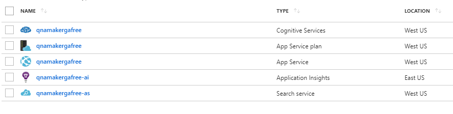
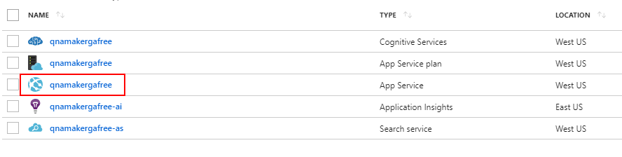
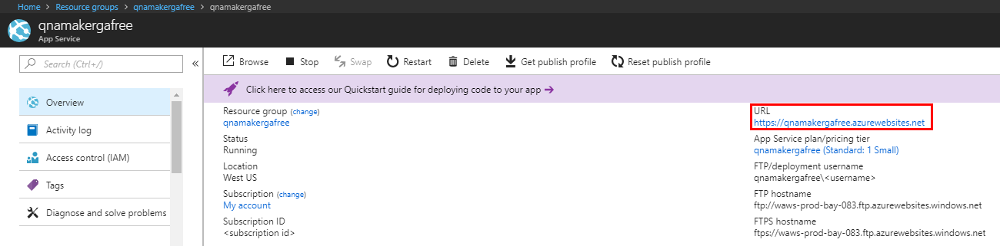

# QnAMaker Troubleshooting
QnAMaker comprises of components hosted in the user's Azure account. Debugging may require users to manipulate their QnAMaker Azure resources or provide QnAMaker support team with additional information about their setup.

## How to get latest QnAMaker runtime updates
QnAMaker runtime is part of the Azure App Service deployed when you [create a QnAMaker service](./set-up-qnamaker-service-azure.md) in Azure portal. Updates are made periodically to the runtime. To apply the latest updates to apply to your QnAMaker setup, you must restart the App Service.
1. Go to your QnAMaker service (resource group) in the [Azure portal](https://portal.azure.com)

    

2. Click on the App Service and open the Overview section

     

3. Restart the App service. It should complete within a couple of seconds. Note that your downstream applications/bots build on this QnAMaker service will be unavailable to end-users during this restart period.

    

## How to get the QnAMaker service hostname
QnAMaker service hostname is useful for debugging purposes when you contact QnAMaker Support or UserVoice. The hostname is a URL of this form: https://*{hostname}*.azurewebsites.net.
	
1. Go to your QnAMaker service (resource group) in the [Azure portal](https://portal.azure.com)

    

2. Click on the App Service

     

3. The hostname URL is available in the Overview section

    
    

## Next steps

> [!div class="nextstepaction"]
> [Use QnAMaker API](./upgrade-qnamaker-service.md)
