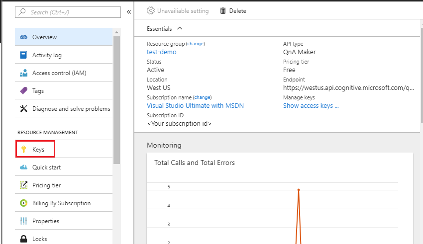
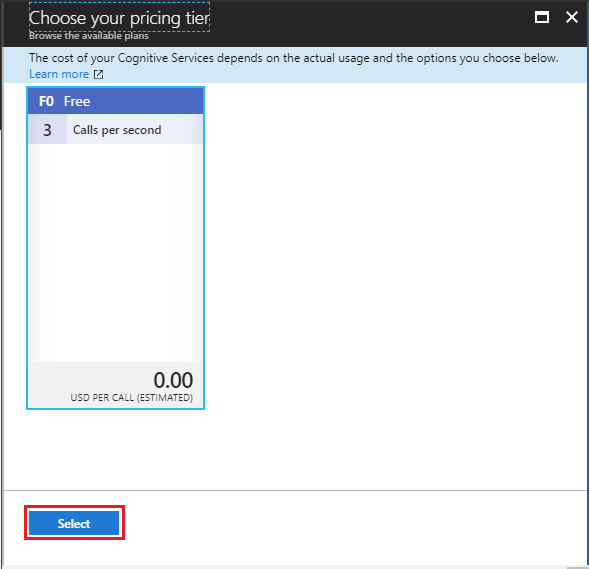
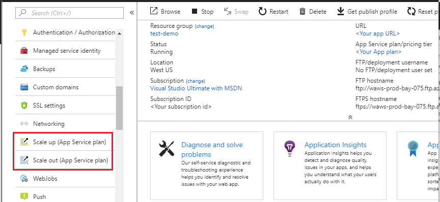
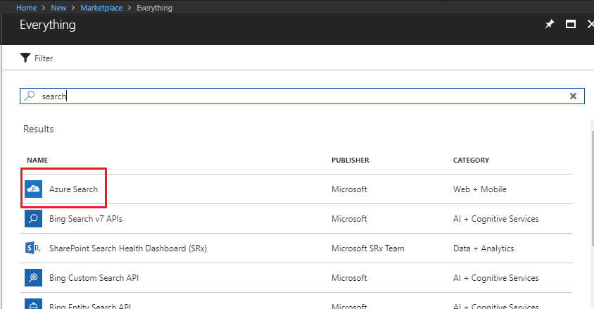
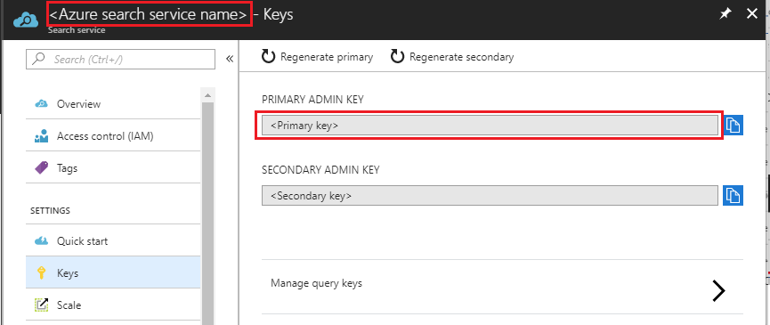
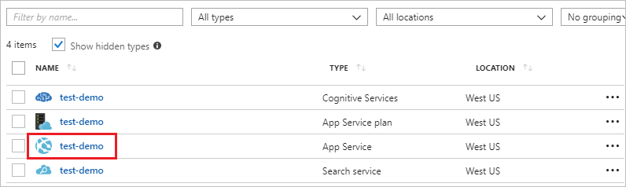
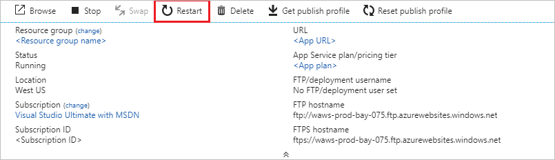

# Share or upgrade your QnA Maker service
Share or upgrade your QnA Maker services in order to manage the resources better. 

You can choose to upgrade individual components of the QnA Maker stack after the initial creation. See the details of the dependent components and SKU selection [here](https://aka.ms/qnamaker-docs-capacity).

## Share existing services with QnA Maker

QnA Maker creates several Azure resources. In order to reduce management and benefit from cost sharing, use the following table to understand what you can and can't share:

|Service|Share|
|--|--|
|Cognitive Services|X|
|App service plan|✔|
|App service|X|
|Application Insights|✔|
|Search service|✔|

## Upgrade QnA Maker Management SKU

When you need to have more questions and answers in your knowledge base, beyond your current tier, upgrade your QnA Maker service pricing tier. 

To upgrade the QnA Maker management SKU:

1. Go to your QnA Maker resource in the Azure portal, and select **Pricing tier**.

    

2. Choose the appropriate SKU and press **Select**.

    

## Upgrade App service

 When your knowledge base needs to serve more requests from your client app, upgrade your app service pricing tier.

You can [scale up](https://docs.microsoft.com/azure/app-service/web-sites-scale) or scale down the App service.

1. Go to the App service resource in the Azure portal, and select **scale up** or **scale down** options as required.

    

## Upgrade Azure Search service

When you plan to have many knowledge bases, upgrade your Azure Search service pricing tier. 

Currently it is not possible to perform an in place upgrade of the Azure search SKU. However, you can create a new Azure search resource with the desired SKU, restore the data to the new resource, and then link it to the QnA Maker stack.

1. Create a new Azure search resource in the Azure portal, and choose the desired SKU.

    

2. Restore the indexes from your original Azure search resource to the new one. See the backup restore sample code [here](https://github.com/pchoudhari/QnAMakerBackupRestore).

3. Once the data is restored, go to your new Azure search resource, select **Keys**, and note down the **Name** and the **Admin key**.

    

4. To link the new Azure search resource to the QnA Maker stack, go to the QnA Maker App service.

    

5. Select **Application settings** and replace the **AzureSearchName** and **AzureSearchAdminKey** fields from step 3.

    

6. Restart the App service.

    

## Next steps

> [!div class="nextstepaction"]
> [Use QnA Maker API](../Quickstarts/csharp.md)
