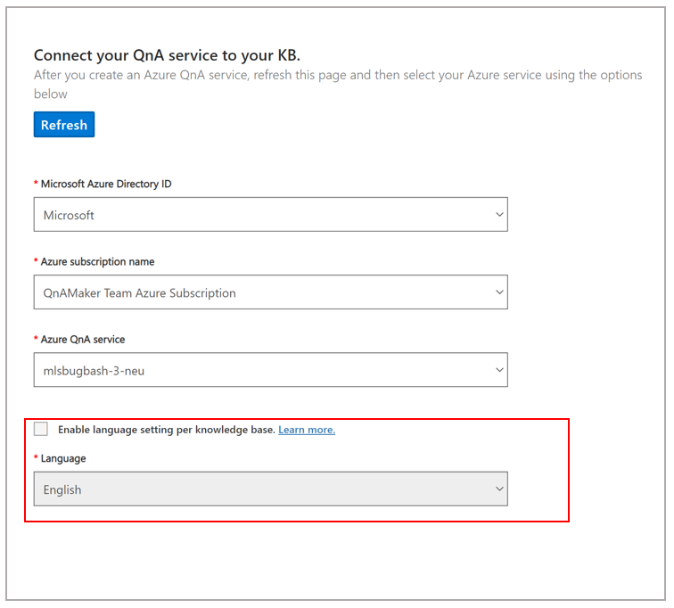

# Language support for a QnA Maker resource and knowledge bases

This article describes the language support options for QnA Maker resources and knowledge bases. 

# [QnA Maker GA (stable release)](#tab/v1)

Language for the service is selected when you create the first knowledge base in the resource. All additional knowledge bases in the resource must be in the same language. 

The language determines the relevance of the results QnA Maker provides in response to user queries. The QnA Maker resource, and all the knowledge bases inside that resource, support a single language. The single language is necessary to provide the best answer results for a query.

# [QnA Maker managed (preview release)](#tab/v2))

In QnA Maker managed, you get the choice to make language settings at the individual knowledge-base level. This setting can be enabled only with the knowledge-base of the service. Once set, language settings cannot be changed for the service. 

If you select language settings to be knowledge-base specific, then you are allowed to create knowledge-bases of different languages in the service itself. 

---

## Single language per resource

# [QnA Maker GA (stable release)](#tab/v1)

Consider the following:

* A QnA Maker service, and all its knowledge bases, support one language only.
* The language is explicitly set when the first knowledge base of the service is created.
* The language is determined from the files and URLs added when the knowledge base is created.
* The language can't be changed for any other knowledge bases in the service.
* The language is used by the Cognitive Search service (ranker #1) and the QnA Maker service (ranker #2) to generate the best answer to a query.

# [QnAMaker managed (Preview)](#tab/v2)

If you **don't select the checkbox to enable language setting per knowledge-base**, consider the following: 
* A QnA Maker service, and all its knowledge bases, will support one language only.
* The language is explicitly set when the first knowledge base of the service is created
* The language is determined from the files and URLs added when the knowledge base is created
* The language can't be changed for any other knowledge bases in the service
* The language is used by the Cognitive Search service (ranker #1) and the QnA Maker service (ranker #2) to generate the best answer to a query

---

## Supporting multiple languages in one QnA Maker resource

# [QnA Maker GA (stable release)](#tab/v1)
This functionality is not supported in our current Generally Available (GA) stable release. Check out QnA Maker managed to test out this functionality. 

# [QnA Maker managed (preview release)](#tab/v2)
* When you are creating the first knowledge base in your service, you get a choice to enable the language setting per knowledge base. Select the checkbox, to create knowledge bases belonging to different languages within one service.
* Language setting option cannot be modified for the service, once the first knowledge base is created.
* If you enable language setting specific to every knowledge base, then instead of having one test index for the service you will have one test index per knowledge base. 

---

## Supporting multiple languages in one knowledge base

If you need to support a knowledge base system, which includes several languages, you can:

* Use the [Translator service](../../translator/translator-info-overview.md) to translate a question into a single language before sending the question to your knowledge base. This allows you to focus on the quality of a single language and the quality of the alternate questions and answers.
* Create a QnA Maker resource, and a knowledge base inside that resource, for every language. This allows you to manage separate alternate questions and answer text that is more nuanced for each language. This gives you much more flexibility but requires a much higher maintenance cost when the questions or answers change across all languages.

## Languages supported

The following list contains the languages supported for a QnA Maker resource. 

|Language|
|--|
|Arabic|
|Armenian|
|Bangla|
|Basque|
|Bulgarian|
|Catalan|
|Chinese_Simplified|
|Chinese_Traditional|
|Croatian|
|Czech|
|Danish|
|Dutch|
|English|
|Estonian|
|Finnish|
|French|
|Galician|
|German|
|Greek|
|Gujarati|
|Hebrew|
|Hindi|
|Hungarian|
|Icelandic|
|Indonesian|
|Irish|
|Italian|
|Japanese|
|Kannada|
|Korean|
|Latvian|
|Lithuanian|
|Malayalam|
|Malay|
|Norwegian|
|Polish|
|Portuguese|
|Punjabi|
|Romanian|
|Russian|
|Serbian_Cyrillic|
|Serbian_Latin|
|Slovak|
|Slovenian|
|Spanish|
|Swedish|
|Tamil|
|Telugu|
|Thai|
|Turkish|
|Ukrainian|
|Urdu|
|Vietnamese|

## Query matching and relevance
QnA Maker depends on [Azure Cognitive Search language analyzers](https://docs.microsoft.com/rest/api/searchservice/language-support) for providing results.

While the Azure Cognitive Search capabilities are on par for supported languages, QnA Maker has an additional ranker that sits above the Azure search results. In this ranker model, we use some special semantic and word-based features in the following languages.

|Languages with additional ranker|
|--|
|Chinese|
|Czech|
|Dutch|
|English|
|French|
|German|
|Hungarian|
|Italian|
|Japanese|
|Korean|
|Polish|
|Portuguese|
|Spanish|
|Swedish|

This additional ranking is an internal working of the QnA Maker's ranker.

## Next steps

> [!div class="nextstepaction"]
> [Language selection](../how-to/language-knowledge-base.md)