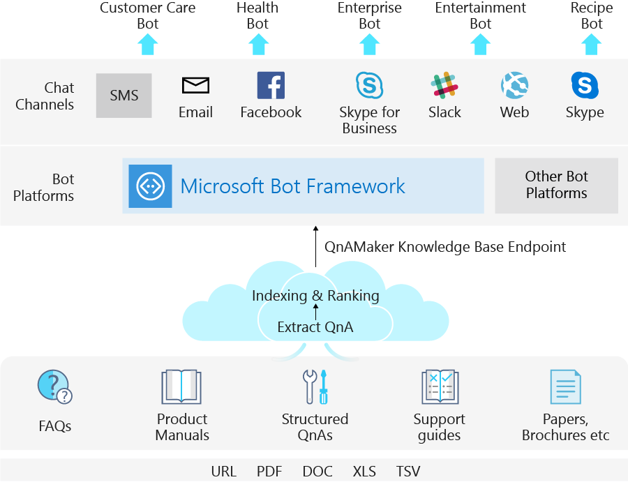
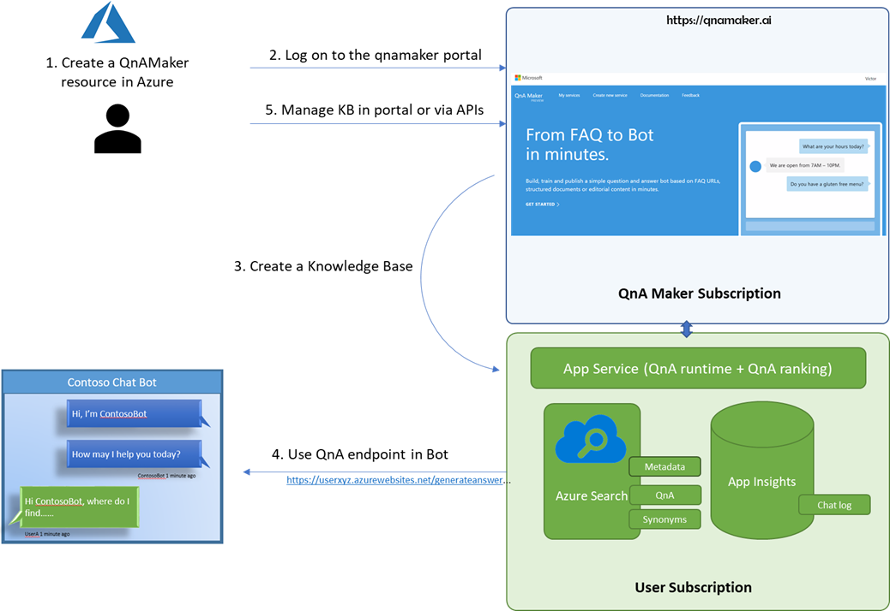

# What is QnA Maker?

QnA Maker is a question and answer knowledge base (KB) service that applies custom machine-learning intelligence to a user's natural language question to determine the best answer.

QnA Maker enables you to power the cloud-based service from your semi-structured content such as Frequently Asked Question (FAQs) documents, URLs, product manuals and custom questions and answers. 
The easy-to-use [web portal](https://qnamaker.ai) enables you to create, manage, train and publish your service without any developer experience. Once the service is published to an endpoint, a client application such as a chat bot can manage the conversation with a user to get questions and respond with the answers. 



## Key QnA Maker processes

A QnA Maker provides two key services for your data:

* **Extraction**: Structured question-answer data is extracted from semi-structured [data sources](../Concepts/data-sources-supported.md) like FAQs and product manuals. This extraction can be done as part of the KB [creation](https://aka.ms/qnamaker-docs-createkb) or later, as part of the editing process.

* **Matching**: Once your knowledge base has been [trained and tested](https://aka.ms/qnamaker-docs-trainkb), you [publish](https://aka.ms/qnamaker-docs-publishkb) it. This enables an endpoint to your QnA Maker knowledge base, which you can then use in your bot or client app. This endpoint accepts a user question and responds with the best answer in the knowledge base, along with a confidence score for the match.

```JSON
{
    "answers": [
        {
            "questions": [
                "How do I share a knowledge base with other?"
            ],
            "answer": "Sharing works at the level of a QnA Maker service, i.e. all knowledge bases in the services will be shared. Read [here](https://docs.microsoft.com/azure/cognitive-services/qnamaker/how-to/collaborate-knowledge-base)how to collaborate on a knowledge base.",
            "score": 70.95,
            "id": 4,
            "source": "https://docs.microsoft.com/azure/cognitive-services/qnamaker/faqs",
            "metadata": []
        }
    ]
}

```

## QnA Maker architecture

QnA Maker consists of the following API services:

1. **QnA Maker management services**: The management experience for a QnA Maker knowledge base, which includes the initial creation, updating, training, and publishing. These activities can be done through the [portal](https://qnamaker.ai) or the [management APIs](https://aka.ms/qnamaker-v4-apis). 

2. **QnA Maker prediction service**: This is deployed in your Azure subscription in your specified region. Customer KB content is stored in [Azure Search](https://azure.microsoft.com/services/search/), and the endpoint deployed as an [App service](https://azure.microsoft.com/services/app-service/). You can also choose to deploy an [Application insights](https://azure.microsoft.com/services/application-insights/) resource for analytics.




## Service highlights

- A complete **no-code** experience to [create a FAQ bot](https://aka.ms/qnamaker-docs-create-faqbot).
- **No network throttling for predictions**. Pay for hosting the service and not for the number of transactions. See the [pricing page](https://aka.ms/qnamaker-docs-pricing) for more details.
- **Scale as needed**. Choose the appropriate SKUs of the individual components that suit your scenario. See how to [choose capacity](https://aka.ms/qnamaker-docs-capacity) for your QnA Maker service.
- **Full data compliance**. The prediction service components are deployed in your Azure subscription and within the compliance boundary.


## Next steps

> [!div class="nextstepaction"]
> [Create a QnA Maker service](../how-to/set-up-qnamaker-service-azure.md)
