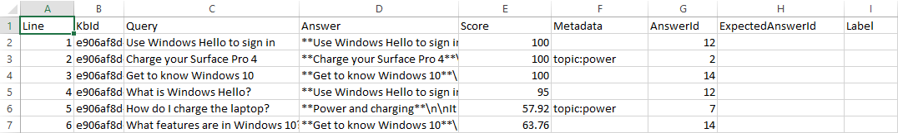
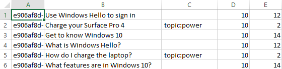
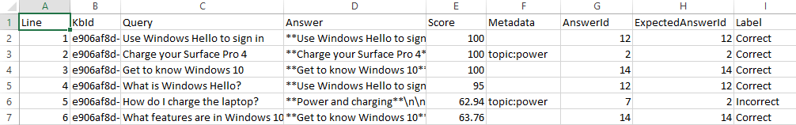

# Quickstart: Test knowledge base with batch questions and expected answers

Use the QnA Maker batch testing tool to test your knowledge base for expected answers, confidence scores, and multi-turn prompts.

## Prerequisites

* Azure subscription - [create one for free](https://azure.microsoft.com/free/?WT.mc_id=A261C142F)
* Either [create a QnA Maker service](create-publish-knowledge-base.md#create-a-new-qna-maker-knowledge-base) or use an existing service which uses the English language for the sample doc used in this quickstart.
* Download the [multi-turn sample `.docx` file](https://github.com/Azure-Samples/cognitive-services-sample-data-files/blob/master/qna-maker/data-source-formats/multi-turn.docx)
* Download the [batch testing tool](https://aka.ms/qnamakerbatchtestingtool), extract the executable file from the `.zip` file.

## Sign into QnA Maker portal

[Sign in](https://www.qnamaker.ai/) to the QnA Maker portal.

## Create a new knowledge base from the multi-turn .docx file

1. Select **Create a knowledge base** from the tool bar.
1. Skip **Step 1** because you should already have a QnA Maker resource, moving on to **Step 2** to select your existing resource information:
    * Azure Active Directory ID
    * Azure Subscription Name
    * Azure QnA Service Name
    * Language - the English language
1. Enter the name `Multi-turn batch test quickstart` as the name of your knowledge base.
1. In **Step 4**, check **Enable multi-turn extraction from URLs, .pdf or .docx files**.
1. Enter the **Default answer text** of `Quickstart - can't find answer`. In a production knowledge base, this information should be more instructive to the user but for this quickstart, a simple response works.
1. Still in **Step 4**, select **+ Add file** then select the downloaded `.docx` file listing in the prerequisites.
1. In **Step 5**, select **Create your KB**.

    When the creation process finishes, the portal displays the editable knowledge base.

## Save, train, and publish knowledge base

1. Select **Save and train** from the toolbar to save the knowledge base.
1. Select **Publish** from the toolbar then select **Publish** again to publish the knowledge base. Publishing makes the knowledge base available for queries from a public URL endpoint. Once the publish is completed, save the host URL and endpoint key information shown on the publish page.

    |Required data| Example|
    |--|--|
    |Published Host|`https://YOUR-RESOURCE-NAME.azurewebsites.net`|
    |Published Key|`XXXXXXXXXXXXXXXXXXXXXXXXXXXXXXXX` (32 character string shown after `Endpoint` )|
    |App ID|`e906af8d-YYYY-YYYY-YYYY-2c0ea7b1376e` (36 character string shown as part of `POST`) |

## Create batch test file with question IDs

In order to use the batch test tool, create a file named `batch-test-data-1.tsv` with a text editor. The file needs to have the following columns

|TSV input file fields|Notes|Example|
|--|--|--|
|KBID|Your KB ID found on the Publish page.|`e906af8d-YYYY-YYYY-YYYY-2c0ea7b1376e` (36 character string shown as part of `POST`) |
|Question|The question text a user would enter.|`How do I sign out?`|
|Metadata tags|optional|`topic:power`|
|Top parameter|optional|`25`|
|Expected answer ID|optional|`13`|

For the multi-turn knowledge base, add 3 rows to the file. The first column is your knowledge base ID and the second column should be the following list of questions:

|Column 2 - questions|
|--|
|`Use Windows Hello to sign in`|
|`Charge your Surface Pro 4`|
|`Get to know Windows 10`|

These questions are the exact wording from the knowledge base and should return 100 as the confidence score. Next, add a few questions, similar to these questions but not exactly the same:

|Column 2 - questions|
|--|
|`What is Windows Hello?`|
|`How do I charge the laptop?`|
|`What features are in Windows 10?`|

> [!CAUTION]
> Make sure that each column is separated by a tab delimiter only. Leading or trailing spaces are added to column data and will cause the program to throw exceptions when the type or size is incorrect.

The batch test file, when opened in Excel, looks like the following image.

> [!div class="mx-imgBorder"]
> 

## Run the test against the batch file

Run the batch testing using the following format at the command line with your published host and key, found on the **Settings** page.

The published host includes your resource name. The published key **is not** the same as your QnA Maker resource key.

```console
batchtesting.exe batch-test-data-1 https://YOUR-RESOURCE-NAME.azurewebsites.net ENDPOINT-KEY out.tsv
```

The test completes and generates the `out.tsv` file:

> [!div class="mx-imgBorder"]
> 


## Using optional fields in the input batch test file

Use the following chart to understand how to find the field values for optional data.

|Column number|Optional column|Data location|
|--|--|--|
|3|metadata|Export existing knowledge base for values.|
|4|top|Default value of `25` is recommended.|
|5|Question and answer set ID|Export existing knowledge base for values.|

## Add metadata to the knowledge base

1. In the QnA portal, on the **Edit** page, add metadata of `topic:power` to the following questions:

    |Questions|
    |--|
    |Charge your Surface Pro 4|
    |Check the battery level|

1. Select **Save and train**, then select the **Publish** page, then select the **Publish** button.
1. Select the **Settings** page, then select **Export** as a `.xls` file.
1. Find this downloaded file and open with Excel.

    The downloaded file has the correct format for the metadata and the correct question and answer set ID.

    > [!div class="mx-imgBorder"]
    > 

1. Edit the `batch-test-data-1.tsv` file to add the metadata, top, and qna set ID.

    > [!div class="mx-imgBorder"]
    > 

1. Rerun the batch test with the same command. The output now includes matches.

    > [!div class="mx-imgBorder"]
    > 

## Clean up resources

If you're not going to continue to use this knowledge base, delete the knowledge base
with the following steps:

1. In the QnA Maker portal, select **My Knowledge bases** from the top menu.
1. In the list of knowledge bases, select the **Delete** icon on the row of the knowledge base of this quickstart.

## Next steps

> [!div class="nextstepaction"]
> [QnA Maker (V4) REST API Reference](https://go.microsoft.com/fwlink/?linkid=2092179)
