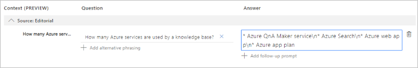
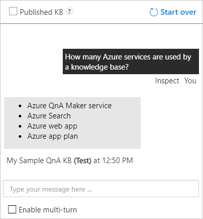
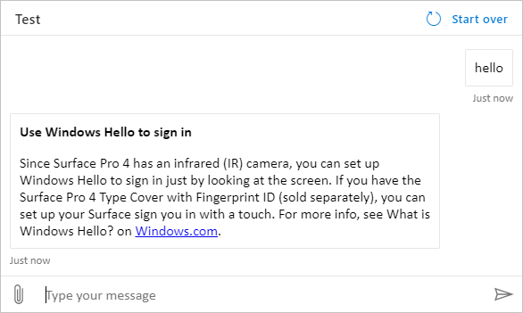

# Quickstart: Create, train, and publish your QnA Maker knowledge base

You can create a QnA Maker knowledge base (KB) from your own content, such as FAQs or product manuals. This article includes an example of creating a QnA Maker knowledge base from a simple FAQ webpage, to answer questions on BitLocker key recovery.

Include a chit-chat personality to make your knowledge more engaging with your users.

[!INCLUDE [Custom subdomains notice](../../../../includes/cognitive-services-custom-subdomains-note.md)]

## Prerequisite

> [!div class="checklist"]
> * If you don't have an Azure subscription, create a [free account](https://azure.microsoft.com/free/?WT.mc_id=A261C142F) before you begin.

## Create a new QnA Maker knowledge base

1. Sign in to the [QnAMaker.ai](https://QnAMaker.ai) portal with your Azure credentials.

1. On the QnA Maker portal, select **Create a knowledge base**.

1. On the **Create** page, select **Create a QnA service**. You are directed to the [Azure portal](https://ms.portal.azure.com/#create/Microsoft.CognitiveServicesQnAMaker) to set up a QnA Maker service in your subscription.

1. In the Azure portal, create the resource. Remember your Azure Active Directory ID, Subscription, QnA resource name you selected when creating the resource.
1. Return to the QnA Maker portal, refresh the web page in the portal, to continue creating your knowledge base. Select an existing tenant, subscription, and the new resource. Select the language. This will be the language used for all knowledge bases in this QnA Maker service.

   

1. Name your knowledge base **My Sample QnA KB**.

1. Add a sample word document as a URL:

    `https://docs.microsoft.com/azure/cognitive-services/qnamaker/troubleshooting`

1. Select `+ Add URL`.

1. Add **_professional_ Chit-chat** to your KB.

1. Select **Create your KB**.

    The extraction process takes a few minutes to read the document and identify questions and answers.

    After QnA Maker successfully creates the knowledge base, the **Knowledge base** page opens. You can edit the contents of the knowledge base on this page.

## Add a new question and answer set

1. In the QnA Maker portal, on the **Edit** page, select **+ Add QnA pair** from the context toolbar.
1. Add the following question:

    `How many Azure services are used by a knowledge base?`

1. Add the answer formatted with _markdown_:

    ` * Azure QnA Maker service\n* Azure Cognitive Search\n* Azure web app\n* Azure app plan`

    

    The markdown symbol, `*`, is used for bullet points. The `\n` is used for a new line.

    The **Edit** page shows the markdown. When you use the **Test** panel later, you will see the markdown displayed properly.

## Save and train

In the upper right, select **Save and train** to save your edits and train the QnA Maker model. Edits aren't kept unless they're saved.

## Test the knowledge base

1. In the QnA Maker portal, in the upper right, select **Test** to test that the changes you made took effect.
1. Enter an example user query in the textbox.

    `How many Azure services are used by a knowledge base?`

    

1. Select **Inspect** to examine the response in more detail. The test window is used to test your changes to the knowledge base before publishing your knowledge base.

1. Select **Test** again to close the **Test** panel.

## Publish the knowledge base

When you publish a knowledge base, the contents of your knowledge base moves from the `test` index to a `prod` index in Azure search.

1. In the QnA Maker portal, select **Publish**. Then to confirm, select **Publish** on the page.

    The QnA Maker service is now successfully published. You can use the endpoint in your application or bot code.

    

## Create a bot

After publishing, you can create a bot from the **Publish** page:

* You can create several bots quickly, all pointing to the same knowledge base for different regions or pricing plans for the individual bots.
* If you want only one bot for the knowledge base, use the **View all your bots on the Azure portal** link to view a list of your current bots.

When you make changes to the knowledge base and republish, you don't need to take further action with the bot. It's already configured to work with the knowledge base, and works with all future changes to the knowledge base. Every time you publish a knowledge base, all the bots connected to it are automatically updated.

1. In the QnA Maker portal, on the **Publish** page, select **Create bot**. This button appears only after you've published the knowledge base.

    

1. A new browser tab opens for the Azure portal, with the Azure Bot Service's creation page. Configure the Azure bot service. The bot and QnA Maker can share the web app service plan, but can't share the web app. This means the **app name** for the bot must be different from the app name for the QnA Maker service.

    * **Do**
        * Change bot handle - if it is not unique.
        * Select SDK Language. Once the bot is created, you can download the code to your local development environment and continue the development process.
    * **Don't**
        * change the following settings in the Azure portal when creating the bot. They are pre-populated for your existing knowledge base:
           * QnA Auth Key
           * App service plan and location

1. After the bot is created, open the **Bot service** resource.
1. Under **Bot Management**, select **Test in Web Chat**.
1. At the chat prompt of **Type your message**, enter:

    `Azure services?`

    The chat bot responds with an answer from your knowledge base.

    

## What did you accomplish?

You created a new knowledge base, added a public URL to the knowledge base, added your own QnA set, trained, tested, and published the knowledge base.

After publishing the knowledge base, you created a bot, and tested the bot.

This was all accomplished in a few minutes without having to write any code and clean the content.

## Clean up resources

Clean up the QnA Maker and Bot framework resources in the Azure portal.

## Next steps

For more information:

* [Markdown format in answers](../reference-markdown-format.md)
* QnA Maker [data sources](../concepts/knowledge-base.md).
* [Bot resource configuration settings](../tutorials/create-qna-bot.md).

> [!div class="nextstepaction"]
> [Add questions with metadata](add-question-metadata-portal.md)
