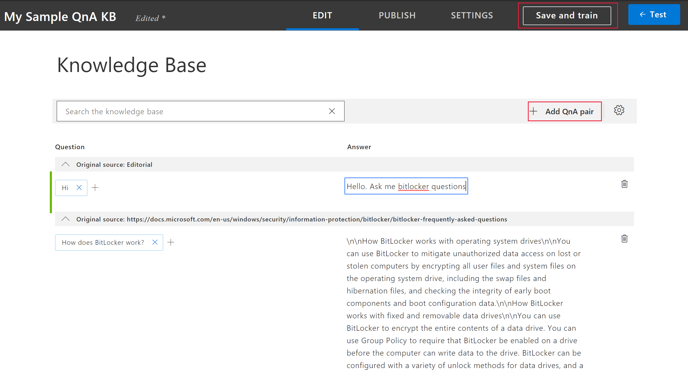
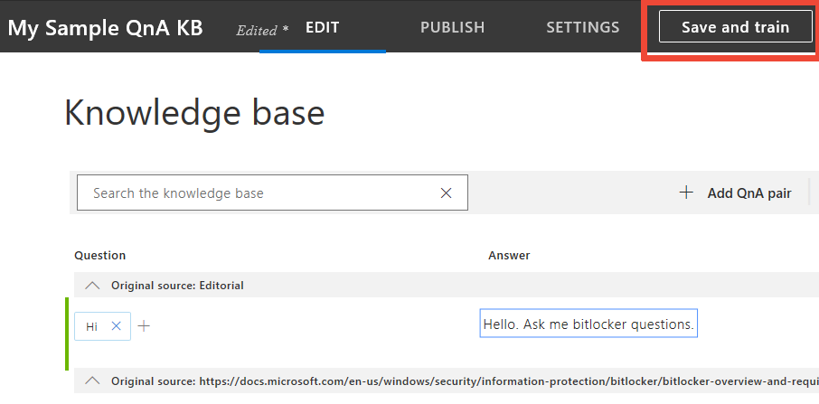
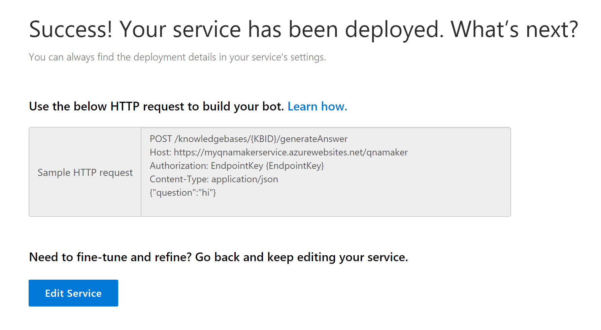

# Quickstart: Create, train, and publish your knowledge base

You can create a QnA Maker knowledge base (KB) from your own content, such as FAQs or product manuals. The QnA Maker KB in this example is created from a simple FAQ webpage to answer questions on BitLocker key recovery.

## Prerequisite

> [!div class="checklist"]
> * If you don't have an Azure subscription, create a [free account](https://azure.microsoft.com/free/?WT.mc_id=A261C142F) before you begin.

## Create a QnA Maker knowledge base

1. Sign in to QnAMaker.ai with your Azure credentials.

2. On the QnA Maker website, select **Create a knowledge base**.

   

3. On the **Create** page, in step 1, select **Create a QnA service**. You are directed to the [Azure portal](https://ms.portal.azure.com/#create/Microsoft.CognitiveServicesQnAMaker) to set up a QnA Maker service in your subscription. If the Azure portal times out, select **Try again** on the site. After you connect, your Azure dashboard appears.

4. After you successfully create a new QnA Maker service in Azure, return to qnamaker.ai/create. Select your QnA service from the drop-down lists in step 2. If you created a new QnA service, be sure to refresh the page.

   

5. In step 3, name your KB **My Sample QnA KB**.

6. To add content to your KB, select three types of data sources. In step 4, under **Populate your KB**, add the 
[BitLocker Recovery FAQ](https://docs.microsoft.com/en-us/windows/security/information-protection/bitlocker/bitlocker-overview-and-requirements-faq) URL in the **URL** box.

   

7. In step 5, select **Create your KB**.

8. While the KB is being created, a pop-up window appears. The extraction process takes a few minutes to read the HTML page and identify questions and answers.

9. After the KB is successfully created, the **Knowledge base** page opens. You can edit the contents of the KB on this page.

10. In the upper right, select **Add QnA pair** to add a new row in the **Editorial** section of the KB. Under **Question**, enter **Hi.** Under **Answer**, enter **Hello. Ask me bitlocker questions.**

   

11. In the upper right, select **Save and train** to save your edits and train the QnA Maker model. Edits aren't kept unless they're saved.

   

12. In the upper right, select **Test** to test that the changes you made took effect. Enter **hi there** in the box, and select Enter. You should see the answer you created as a response.

13. Select **Inspect** to examine the response in more detail. The test window is used to test your changes to the KB before they're published.

   

14. Select **Test** again to close the **Test** pop-up.

15. In the menu next to **Edit**, select **Publish**. Then to confirm, select **Publish** on the page.

16. The QnA Maker service is now successfully published. You can use the endpoint in your application or bot code.

   

## Next steps

> [!div class="nextstepaction"]
> [Create a knowledge base](../How-To/create-knowledge-base.md)
