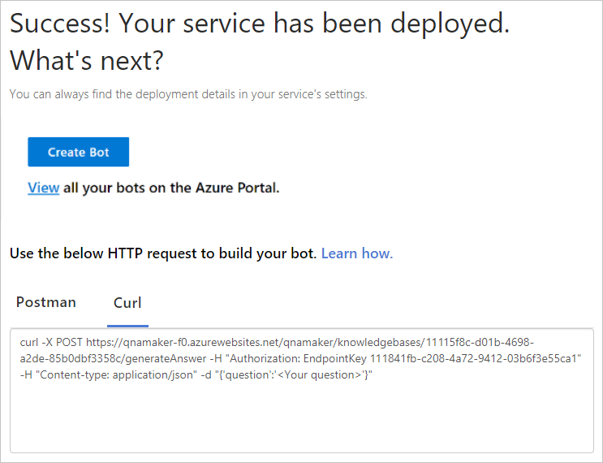

# Quickstart: Get answer from knowledge base using cURL

This cURL-based quickstart walks you through getting an answer from your knowledge base.

## Prerequisites

* Latest [**cURL**](https://curl.haxx.se/).
* You must have a [QnA Maker service](../How-To/set-up-qnamaker-service-azure.md) and have a [knowledge base with questions and answers](../Tutorials/create-publish-query-in-portal.md).

## Publish to get endpoint

When you are ready to generate an answer to a question from your knowledge base, [publish](../Quickstarts/create-publish-knowledge-base.md#publish-the-knowledge-base) your knowledge base.

## Use production endpoint with cURL

When your knowledge base is published, the **Publish** page displays the HTTP request settings to generate an answer. The **CURL** tab shows the settings required to generate an answer from the command-line tool, [CURL](https://www.getpostman.com).

[](../media/qnamaker-use-to-generate-answer/curl-command-on-publish-page.png#lightbox)

To generate an answer with CURL, complete the following steps:

1. Copy the text in the CURL tab. 
1. Open a command-line or terminal and paste the text.
1. Edit the question to be relevant to your knowledge base. Be careful not to remove the containing JSON surrounding the question.
1. Enter the command. 
1. The response includes the relevant information about the answer. 

    ```bash
    > curl -X POST https://qnamaker-f0.azurewebsites.net/qnamaker/knowledgebases/1111f8c-d01b-4698-a2de-85b0dbf3358c/generateAnswer -H "Authorization: EndpointKey 111841fb-c208-4a72-9412-03b6f3e55ca1" -H "Content-type: application/json" -d "{'question':'How do I programmatically update my Knowledge Base?'}"
    {
      "answers": [
        {
          "questions": [
            "How do I programmatically update my Knowledge Base?"
          ],
          "answer": "You can use our REST APIs to manage your Knowledge Base. See here for details: https://docs.microsoft.com/rest/api/cognitiveservices/qnamaker/knowledgebase/update",
          "score": 100.0,
          "id": 18,
          "source": "Custom Editorial",
          "metadata": [
            {
              "name": "category",
              "value": "api"
            }
          ]
        }
      ]
    }
    ```

## Use staging endpoint with cURL

If you want to get an answer from the staging endpoint, use the `isTest` body property.

```json
isTest:true
```

## Next steps

The publish page also provides information to [generate an answer](get-answer-from-kb-using-postman.md) with Postman. 

> [!div class="nextstepaction"]
> [Use metadata while generating an answer](../How-to/metadata-generateanswer-usage.md)
