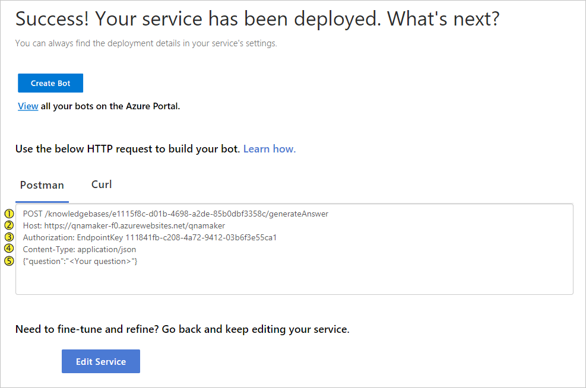
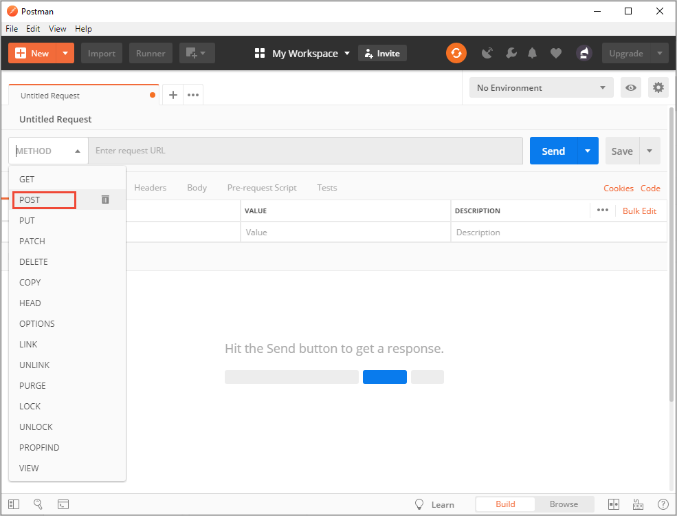
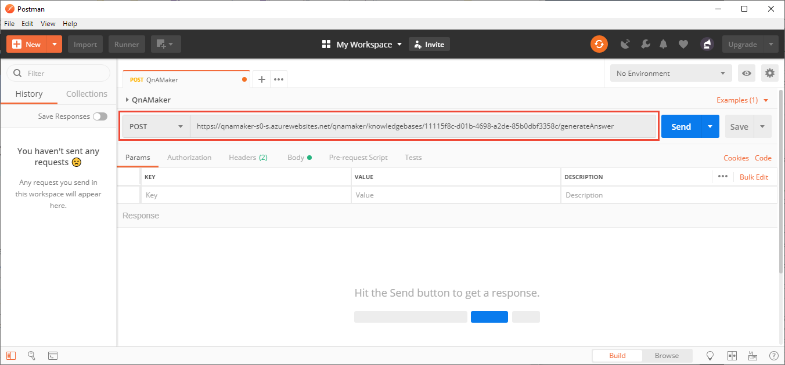
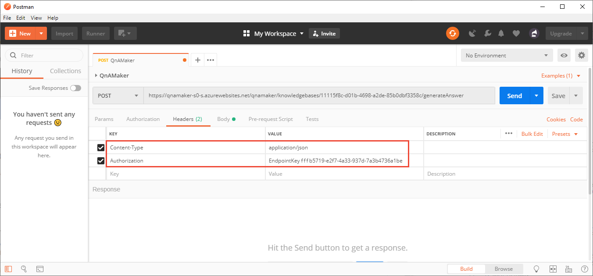
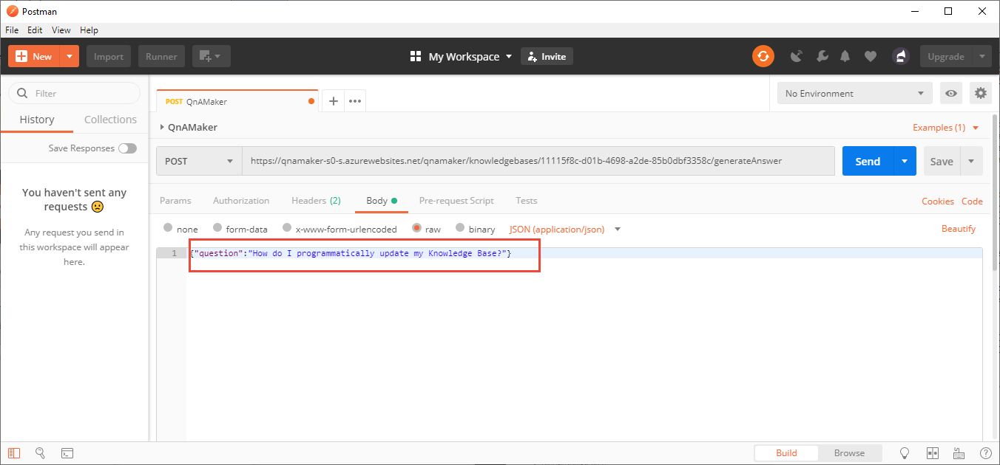

# Quickstart: Get an answer from knowledge base using Postman

This Postman-based quickstart walks you through getting an answer from your knowledge base.

## Prerequisites

* Latest [**Postman**](https://www.getpostman.com/).
* You must have a [QnA Maker service](../How-To/set-up-qnamaker-service-azure.md) and have a [knowledge base with questions and answers](../Tutorials/create-publish-query-in-portal.md). 

## Publish to get endpoint

When you are ready to generate an answer to a question from your knowledge base, [publish](../Quickstarts/create-publish-knowledge-base.md#publish-the-knowledge-base) your knowledge base.

## Use production endpoint with Postman

When your knowledge base is published, the **Publish** page displays the HTTP request settings to generate an answer. The default view shows the settings required to generate an answer from [Postman](https://www.getpostman.com).

The yellow numbers in the following image indicate which name/value pairs to use in the following steps.

To generate an answer with Postman, complete the following steps:

1. Open Postman. If you're asked to choose a building block, select the **Basic Request** building block. Set the **Request name** as `Generate QnA Maker answer`and the **collection** as `Generate QnA Maker answers`. If you don't want to save to a collection, select the **Cancel** button.
1. In the workspace, select the HTTP method of **POST**.

    

1. For the URL, concatenate the HOST value (#2 from image) and the Post value (#1 from image) to create the complete URL. A complete example URL looks like: 

    `https://qnamaker-f0.azurewebsites.net/qnamaker/knowledgebases/e1115f8c-d01b-4698-a2ed-85b0dbf3348c/generateAnswer`

    

1. Select the **Headers** tab under the URL, then select **Bulk Edit**. 

1. Copy the headers (#3 and #4 from image) into the text area.

    

1. Select the **Body** tab.
1. Select the **raw** format and enter the JSON (#5 from image) that represents the question.

    `{"question":"How do I programmatically update my Knowledge Base?"}`

    

1. Select the **Send** button.
1. The response contains the answer along with other information that may be important to the client application. 

    

## Use staging endpoint

If you want to get an answer from the staging endpoint, append the URL with the `isTest` body property.

## Next steps

The publish page also provides information to [generate an answer](get-answer-from-kb-using-curl.md) with cURL. 

> [!div class="nextstepaction"]
> [Use metadata while generating an answer](../How-to/metadata-generateanswer-usage.md)
