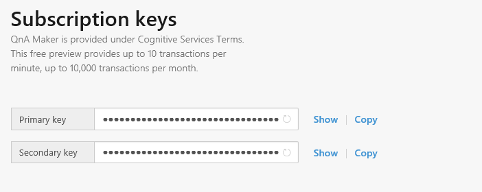

# Authentication and subscription keys for QnA Maker
To sign in to the portal, you need a [Microsoft account](https://www.microsoft.com/en-us/account/) if you don't already have one.

You will receive a unique pair of keys. The second one is just a spare. We recommend you do not share the secret keys with anyone.

These subscription keys are used to track your usage of the service and need to be part of every request, as mentioned in the API section.
To view your subscription keys, go to Settings.

Here you can view and also refresh your subscription keys, if you suspect they have been compromised.

Since currently the QnA Maker is a free to use tool, we have the following restrictions of usage per subscription key: **10,000 transactions per month, 10 per minute.** Beyond these limits your requests are throttled.
