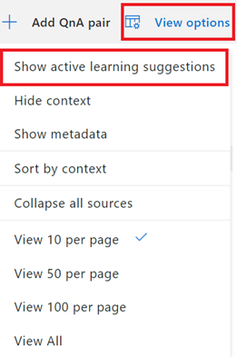
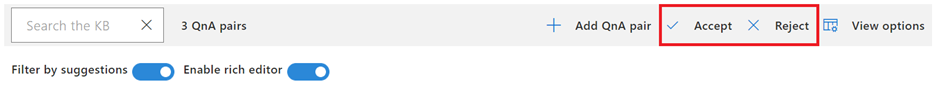
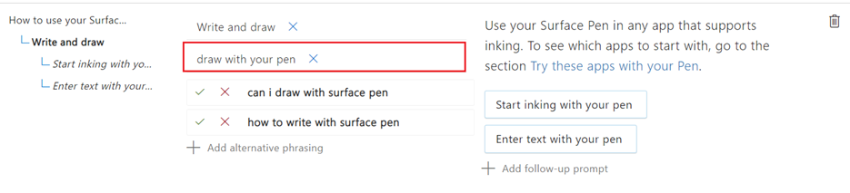

# Enrich your knowledge base with Active Learning

This tutorial shows you how enhance your knowledge base with active learning. If you notice that customers are asking questions, which are not part of your knowledge base. There are often variations of question that are paraphrased differently. 

These variations when added as alternate questions to the relevant QnA pair, help to optimize the knowledge base to answer real world user queries. You can manually add alternate questions to QnA pairs through the editor. At the same time, you can also use the active learning feature to generate active learning suggestions based on user queries. The active learning feature, however, requires that the knowledge base receives regular user traffic to generate suggestions.

## Enable Active Learning
Active Learning is turned on by default for the Custom Question Answering feature. However, you need to manually update the Active Learning setting for QnA Maker GA. You can find more details here: [Turn on Active Learning](../how-to/use-active-learning.md#turn-on-active-learning-for-alternate-questions).

To try out Active Learning suggestions, you can import the following file to the knowledge base: [SampleActiveLearning.tsv](https://github.com/Azure-Samples/cognitive-services-sample-data-files/blob/master/qna-maker/knowledge-bases/SampleActiveLearning.tsv). 
For more details on importing knowledge base, refer [Import Knowledge Base](migrate-knowledge-base.md).

## View and add/reject Active Learning Suggestions
Once the active learning suggestions are available, they can be viewed from **View Options** > **Show active learning suggestions**.

> [!div class="mx-imgBorder"]
> 

Clicking on **Show active learning suggestions**, enables the option to filter QnA Pairs that have suggestions. If active learning is disabled or there aren’t any suggestions, **Show active learning suggestions** will be disabled.

> [!div class="mx-imgBorder"]
> 

We can choose to filter only those QnA pairs that have alternate questions as suggested by Active Learning, so the filtered list of QnA pairs is displayed:

> [!div class="mx-imgBorder"]
> 

We can now either accept these suggestions or reject them using the checkmark or cross-mark. This can be either done individually navigating to each QnA pair or using the **Accept / Reject** option at the top.

> [!div class="mx-imgBorder"]
> 

The knowledge base does not change unless we choose to add or edit the suggestions as suggested by Active Learning. Finally, click on Save and train to save the changes.

> [!NOTE] 
> To check your version and service settings for active learning, refer the article on [how to use active learning](../how-to/use-active-learning.md)

## Add alternate questions using editor

While active learning automatically suggests alternate questions based on the user queries hitting the knowledge base, we can also add variations of a question using the editor.
Select the QnA pair where alternate question is to be added and select **Add alternative phrasing**

> [!div class="mx-imgBorder"]
> 

Alternate questions added to the QnA pair is shown as

> [!div class="mx-imgBorder"]
> 

By adding alternate questions along with Active Learning, we further enrich the knowledge base with variations of a question that helps to provide the same response to a similar user query.

> [!NOTE] 
> Alternate questions have many stop words, then they might not impact the accuracy of response as expected. So, if the only difference between alternate questions is in the stop words, these alternate questions are not required.

The list of stop words can be found here: List of [stop words](https://github.com/Azure-Samples/azure-search-sample-data/blob/master/STOPWORDS.md).

## Next steps

> [!div class="nextstepaction"]
> [Improve the quality of responses with synonyms](adding-synonyms.md)