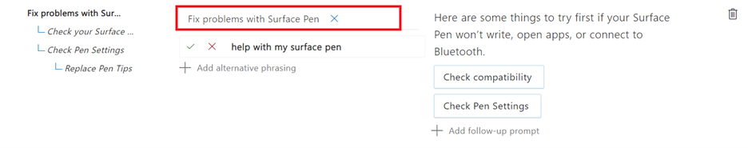

# Improve quality of response with synonyms

This tutorial will show you how you can improve the quality of your responses by using synonyms. Let's assume that users are not getting an accurate response to their queries, when they use alternate forms, synonyms or acronyms of a word. So, they decide to improve the quality of the response by using [Alterations API](/rest/api/cognitiveservices-qnamaker/QnAMaker4.0/Alterations) to add synonyms for keywords.

## Add synonyms using Alterations API

Let’s us add the following words and their alterations to improve the results:

|Word | Alterations|
|--------------|--------------------------------|
| fix problems | `Troubleshoot`, `trouble-shoot`|
| whiteboard   | `white-board`, `white board`   |
| bluetooth    | `blue-tooth`, `blue tooth`     |

```json
{
    "wordAlterations": [
        {
            "alterations": [
                "fix problems",
                "trouble shoot",
                "trouble-shoot",
                ]
        },
        {
            "alterations": [
                "whiteboard",
                "white-board",
                "white board"
            ]
        },
        {
            "alterations": [
                "bluetooth",
                "blue-tooth",
                "blue tooth"
            ]
        }
    ]
}

```

## Response after adding synonyms

For the question and answer pair “Fix problems with Surface Pen” shown below, we compare the response for a query made using its synonym “trouble shoot”.

> [!div class="mx-imgBorder"]
> [  ]( ../media/adding-synonyms/fix-problems.png#lightbox)

## Response before addition of synonym

> [!div class="mx-imgBorder"]
> [  ]( ../media/adding-synonyms/confidence-score.png#lightbox)

## Response after addition of synonym 

> [!div class="mx-imgBorder"]
> [  ]( ../media/adding-synonyms/increase-score.png#lightbox)

As you can see, when `trouble shoot` was not added as a synonym, we got a low confidence response to the query “How to troubleshoot your surface pen”. However, after we add `trouble shoot` as a synonym to “fix problems”, we received the correct response to the query with a higher confidence score. Once, these word alterations were added, the relevance of results improved thereby improving user experience. 

> [!NOTE]
> Synonyms are case insensitive. Synonyms also might not work as expected if you add stop words as synonyms. The list of stop words can be found here: [List of stop words](https://github.com/Azure-Samples/azure-search-sample-data/blob/master/STOPWORDS.md).

For instance, if you add the abbreviation **IT** for Information technology, the system might not be able to recognize Information Technology because **IT** is a stop word and filtered when query is processed.

## Next steps

> [!div class="nextstepaction"]
> [Create knowledge bases in multiple languages](multiple-languages.md)