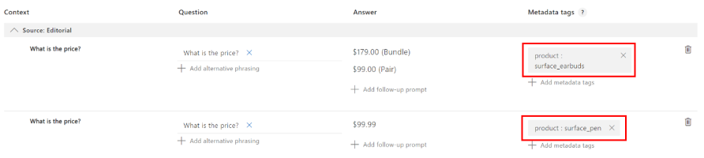
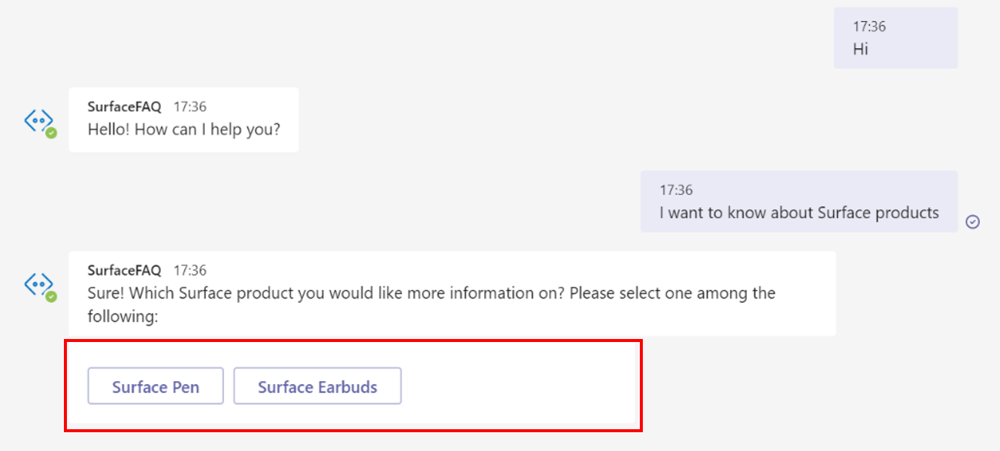
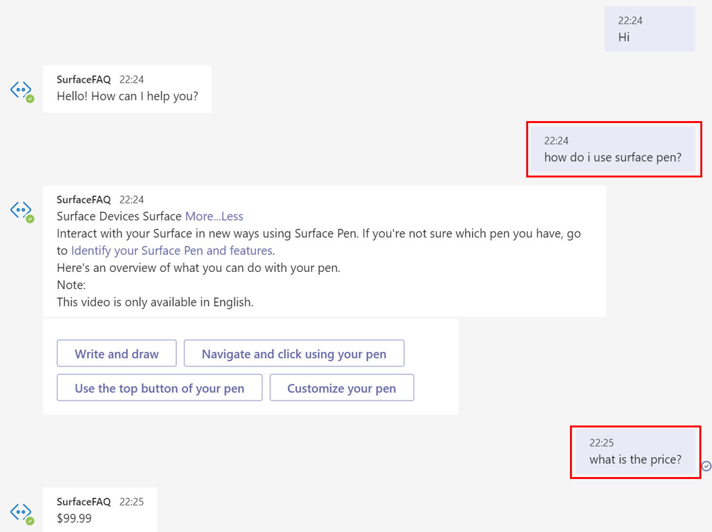
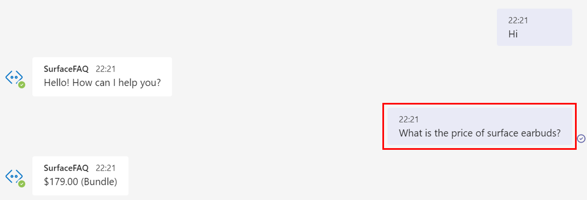

# Add multiple domains to your FAQ bot

When building a FAQ bot, you may encounter use cases that require you to address queries across multiple domains. Let's say the marketing team at Microsoft wants to build a customer support bot that answers common user queries on multiple Surface Products. For the sake of simplicity here, we will be using a FAQ URL each on [Surface Pen](https://support.microsoft.com/surface/how-to-use-your-surface-pen-8a403519-cd1f-15b2-c9df-faa5aa924e98) and [Surface Earbuds](https://support.microsoft.com/surface/use-surface-earbuds-aea108c3-9344-0f11-e5f5-6fc9f57b21f9) to create the Knowledge Base.

You can design your bot to handle queries across multiple domains with QnA Maker in the following ways:

* Create a single knowledge base and tag QnA pairs into distinct domains with metadata.
* Create a separate knowledge base for each domain.
* Create a separate QnA Maker resource for each domain.

## Create a single knowledge base and tag QnA pairs into distinct domains with metadata.

The content authors can use documents to extract QnAs or add custom QnAs to the knowledgebase. In order to group these QnAs into specific domains or categories, you can add [metadata](../How-To/query-knowledge-base-with-metadata.md) to the QnA pairs.

For the bot on surface products, you can take the following steps to create a bot that answers queries for both product types:

1. Add the following FAQ URLs on Surface products in the STEP 3 of the Create KB page and click on 'Create your KB'. A new knowledgebase is created after extracting QnA Pairs from these sources. 
   
   [Surface Pen FAQ](https://support.microsoft.com/surface/how-to-use-your-surface-pen-8a403519-cd1f-15b2-c9df-faa5aa924e98)<br>[Surface Earbuds FAQ](https://support.microsoft.com/surface/use-surface-earbuds-aea108c3-9344-0f11-e5f5-6fc9f57b21f9)
 
2. After having created the KB we can go to **View Options** and click on **Show metadata**. This open up a metadata column for the QnAs.

   >[!div class="mx-imgBorder"]
   >[ ]( ../media/qnamaker-tutorial-updates/expand/show-metadata.png#lightbox)


3. In this knowledge base, we have QnAs on two products and we would like to distinguish them such that we can search for responses amongst QnAs for a given product. In order to do that, we should update the metadata field for the QnA pairs accordingly. 

   As you can see in the example below, we have added a metadata with **product** as key and **surface_pen** or **surface_earbuds** as values wherever applicable. You can extend this example to extract data on multiple products and add a different value for each product.

   >[!div class="mx-imgBorder"]
   >[ ]( ../media/qnamaker-tutorial-updates/expand/metadata-example-2.png#lightbox)

4. Now, in order to to restrict the system to search for the response across a particular product you would need to pass that product as a strict filter in the generate Answer API.

    Learn [how to use the GenerateAnswer API](../How-To/metadata-generateanswer-usage.md). The GenerateAnswer URL has the following format:
    ```
    https://{QnA-Maker-endpoint}/knowledgebases/{knowledge-base-ID}/generateAnswer
    ```

    In the JSON body for the API call, we have passed *surface_pen* as value for the metadata *product*. So, the system will only look for the response among the QnA pairs with the same metadata. 

    ```json
    {
        "question": "What is the price?",
        "top": 6,
        "isTest": true,
        "scoreThreshold": 30,
        "rankerType": ""  // values: QuestionOnly
        "strictFilters": [
        {
            "name": "product",
            "value": "surface_pen"
        }],
        "userId": "sd53lsY="
    }
    ```

    You can obtain metadata value based on user input in the following ways: 

    * Explicitly take the domain as input from the user through the bot client. For instance as shown below, you can take product category as input from the user when the conversation is initiated.

      

    * Implicitly identify domain based on bot context. For instance, in case the previous question was on a particular Surface product, it can be saved as context by the client. If the user doesn't specify the product in the next query, you could pass on the bot context as metadata to the Generate Answer API.

      

    * Extract entity from user query to identify domain to be used for metadata filter. You can use other Cognitive Services such as Text Analytics and LUIS for entity extraction.

      

### How large can our knowledge bases be? 

You add upto 50000 QnA pairs to a single knowledge base. If your data exceeds 50,000 QnA pairs, you should consider splitting the knowledge base.

## Create a separate knowledge base for each domain

You can also create a separate knowledge base for each domain and maintain the knowledge bases separately. All APIs require for the user to pass on the knowledge base ID to make any update to the knowledge base or fetch an answer to the user's question.  

When the user question is received by the service, you would need to pass on the KB ID in the Generate Answer endpoint shown above to fetch a response from the relevant knowledgebase. You can locate the knowledge base ID in the **Publish** page section as shown below.

>[!div class="mx-imgBorder"]
>

## Create a separate QnA Maker resource for each domain.

Let's say the marketing team at Microsoft wants to build a customer support bot that answers user queries on Surface and Xbox products. They plan to assign distinct teams to access knowledge bases on Surface and Xbox. In this case, it is advised to create two QnA Maker resources - one  for Surface and another for Xbox. You can however define distinct roles for users accessing the same resource. Read more about [Role based access control](../How-To/manage-qna-maker-app.md). 
