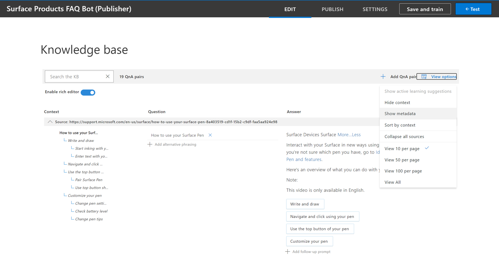

# Create a FAQ Bot for multiple domains 

When building a FAQ bot, you may encounter use cases that require you to address queries across multiple domains. Let's say the marketing team at Microsoft wants to build a customer support bot that answers common user queries on all Surface Products. For the sake of simplicity here, we will be using a FAQ URL each on [Surface Pen](https://support.microsoft.com/surface/how-to-use-your-surface-pen-8a403519-cd1f-15b2-c9df-faa5aa924e98) and [Surface Earbuds](https://support.microsoft.com/surface/use-surface-earbuds-aea108c3-9344-0f11-e5f5-6fc9f57b21f9) to create the Knowledge Base.

You can design your bot to handle queries across multiple domains with QnA Maker in the following ways:

* Create a single knowledge base and tag QnA pairs into distinct domains with metadata.
* Create a separate knowledge base for each domain.

### Create a single knowledge base and tag QnA pairs into distinct domains with metadata.

The content authors can use documents to extract QnAs or add custom QnAs to the knowledgebase. In order to group these QnAs into specific domains or categories, you can add [metadata](../How-To/query-knowledge-base-with-metadata.md) to the QnA pairs.

For the bot on surface products, you can take the following steps to create a bot that answers queries for both product types:

1. Add the following FAQ URLs on Surface products in the STEP 3 of the Create KB page and click on 'Create your KB'. A new knowledgebase is created after extracting QnA Pairs from these sources. 
   
   |[Surface Pen](https://support.microsoft.com/surface/how-to-use-your-surface-pen-8a403519-cd1f-15b2-c9df-faa5aa924e98)<br>[Surface Earbuds](https://support.microsoft.com/surface/use-surface-earbuds-aea108c3-9344-0f11-e5f5-6fc9f57b21f9)|

   


2. After having created the KB we can go to **View Options** and click on **Show metadata**. This open up a metadata column for the QnAs.

   


   


3. In this Knowledgebase, we have QnAs on two products and we would like to distinguish them such that we can search for responses amongst QnAs for a given product. In order to do that, we should update the metadata field for the QnA pairs accordingly. As you can see in the example below, we have added a metadata with **product** as key and **surface_pen** or **surface_earbuds** as values wherever applicable. You can extend this example to extract data on multiple products and add a different value for each product.

   

4. Now, in order to to restrict the system to search for the response across a particular product you would need to pass that product as a strict filter in the generate Answer API.

    You can find how to use the GenerateAnswer API [here](../How-To/metadata-generateanswer-usage.md). The GenerateAnswer URL has the following format:
    ```
    https://{QnA-Maker-endpoint}/knowledgebases/{knowledge-base-ID}/generateAnswer
    ```

    In the JSON body for the API call, we have passed *surface_pen* as value for the metadata *product*. So, the system will only look for the response amongst the QnA pairs with the same metadata. 

    ```json
    {
        "question": "change pen tips?",
        "top": 6,
        "isTest": true,
        "scoreThreshold": 30,
        "rankerType": ""  // values: QuestionOnly
        "strictFilters": [
        {
            "name": "product",
            "value": "surface_pen"
        }],
        "userId": "sd53lsY="
    }
    ```

    You can obtain metadata value based on user input in the following ways: 

    * Explicitly take the domain as input from the user through the bot interface. For instance, you can take as input from the user a product category they are interested in before they ask questions.
    * Identify domain based on any other input. For instance, in case of an empoloyee FAQ bot, you can identify department from employee id which can then be set as filter for metadata.
    * Extract entity from user query to identify domain to be used for metadata filter. You can use other cognitive services such as [Text Analytics](https://docs.microsoft.com/azure/cognitive-services/text-analytics/how-tos/text-analytics-how-to-entity-linking?tabs=version-3-preview) and [LUIS](https://docs.microsoft.com/azure/cognitive-services/luis/what-is-luis) for entity extraction.

#### How large can our knowledgebases be? 

You add upto 50000 QnA pairs to a single knowledgebase. If your data exceeds 50,000 QnA pairs, you should consider splitting the knowledgebase.

### Create a separate knowledge base for each domain

You can also create a separate knowledge base for each domain, however you will then have to write some logic to decide which KB answers the user query. [All APIs](https://docs.microsoft.com/rest/api/cognitiveservices-qnamaker/QnAMaker4.0/Alterations) require for the user to pass on the Knowledgebase ID. As you can see in the Generate Answer API above, the KB id is passed on in the endpoint, and the user will have to pass that on along with the user query. Hence, we advise you to instead add all content in the same knowledgebase using metadata, instead of creating multiple knowledgebases.


