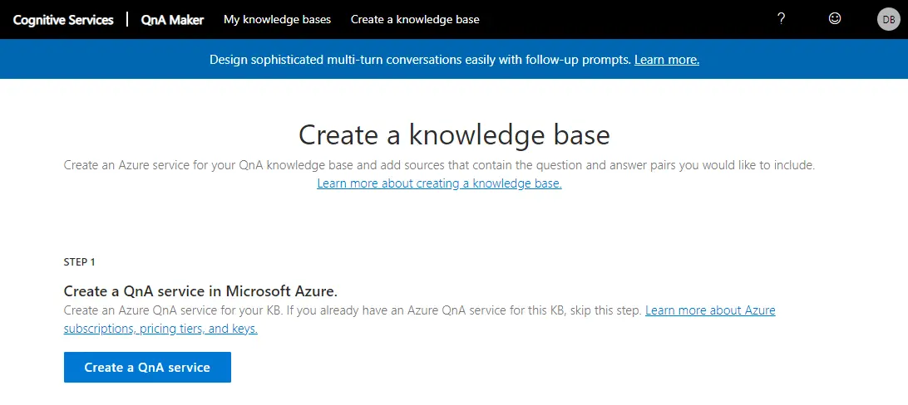
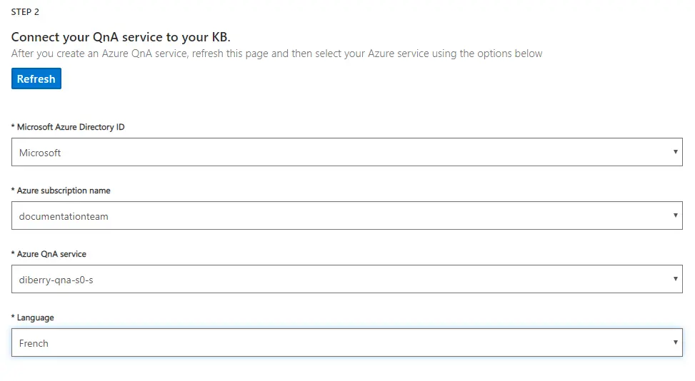
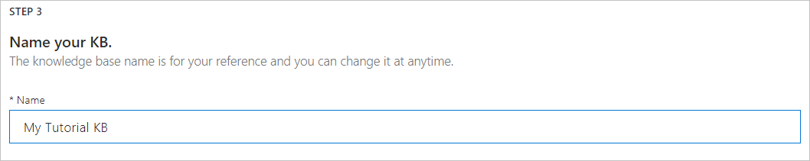
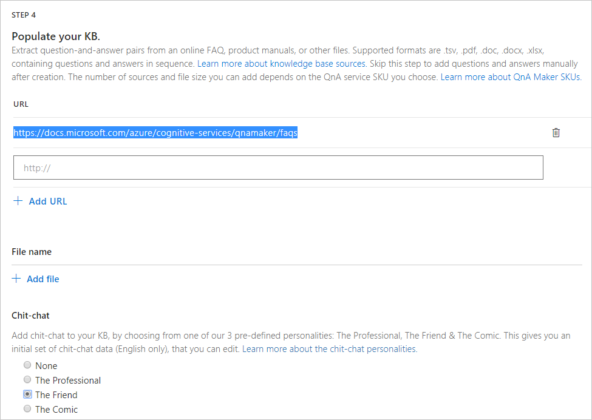
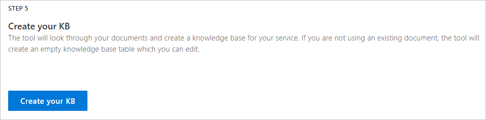
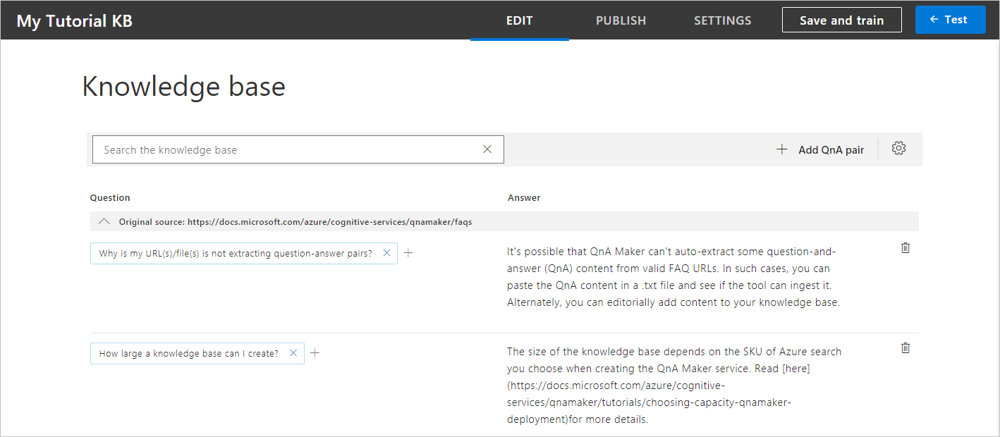
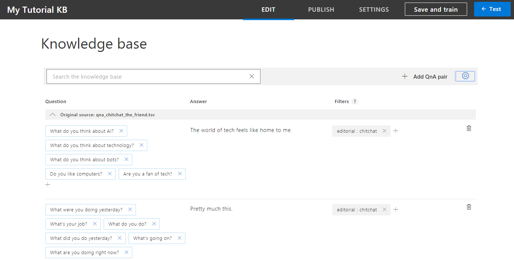
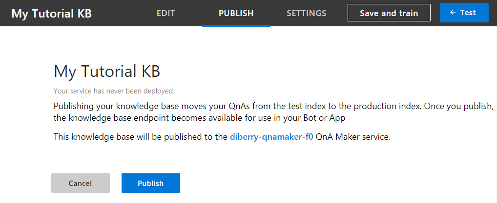
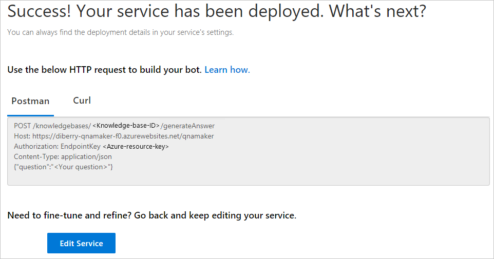
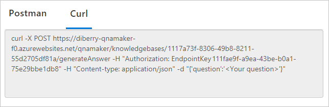

# Tutorial: From the QnA Maker portal, create a knowledge base

Create a new knowledge base with questions and answers from a public web-based FAQ. Save, train, and publish the knowledge base. After the knowledge base is published, send a question and receive an answer with a cURL command. Then create a bot, and test the bot with the same question. 

In this tutorial, you learn how to: 

> [!div class="checklist"]
> * Create a knowledge base in the QnA Maker portal.
> * Review, save, and train the knowledge base.
> * Publish the knowledge base.
> * Use cURL to query the knowledge base.
> * Create a bot.
 

> [!NOTE]
> The programmatic version of this tutorial is available with a complete solution from the [**Azure-Samples/cognitive-services-qnamaker-csharp** GitHub repository](https://github.com/Azure-Samples/cognitive-services-qnamaker-csharp/tree/master/documentation-samples/tutorials/create-publish-answer-knowledge-base).

## Prerequisites

This tutorial requires an existing [QnA Maker service](../How-To/set-up-qnamaker-service-azure.md). 

## Create a knowledge base 

1. Sign in to the [QnA Maker](https://www.qnamaker.ai) portal. 

1. Select **Create a knowledge base** from the top menu.

    

1. Skip the first step, because you will use your existing QnA Maker service. 

1. Select your existing settings:  

    |Setting|Purpose|
    |--|--|
    |Microsoft Azure Directory ID|This ID is associated with the account you use to sign into the Azure portal and the QnA Maker portal. |
    |Azure Subscription name|The billing account in which you created the QnA Maker resource.|
    |Azure QnA Service|Your existing QnA Maker resource.|

    

1. Enter your knowledge base name, `My Tutorial kb`.

    

1. Populate your knowledge base with the following settings:  

    |Setting name|Setting value|Purpose|
    |--|--|--|
    |URL|`https://docs.microsoft.com/azure/cognitive-services/qnamaker/faqs` |The contents of the FAQ at that URL are formatted with a question followed by an answer. QnA Maker can interpret this format to extract questions and the associated answers.|
    |File |_not used in this tutorial_|This uploads files for questions and answers. |
    |Chit-chat personality|Friendly|This gives a friendly and casual [personality](../Concepts/best-practices.md#chit-chat) to common questions and answers. You can edit these questions and answers later. |

    

1. Select **Create your KB** to finish the creation process.

    

## Review, save, and train the knowledge base

1. Review the questions and answers. The first page is questions and answers from the URL. 

    

1. Select the last page of questions and answers from the bottom of the table. The page shows questions and answers from the Chit-chat personality. 

1. From the toolbar above the list of questions and answers, select the **View options** icon, and then select **Show metadata**. This shows the metadata tags for each question and answer. The Chit-chat questions have the **editorial: chit-chat** metadata already set. This metadata is returned to the client application, along with the selected answer. The client application, such as a chat bot, can use this filtered metadata to determine additional processing or interactions with the user.

    

1. Select **Save and train** in the top menu bar.

## Publish to get knowledge base endpoints

Select the **Publish** button from the top menu. On the publish page, select **Publish**.



After the knowledge base is published, the endpoint is displayed.



Don't close this **Publish** page. You need it later in the tutorial, to create a bot. 

## Use cURL to query for an FAQ answer

1. Select the **Curl** tab. 

    

1. Copy the text of the **Curl** tab, and run it in a cURL-enabled terminal or command-line. The authorization header's value includes the text `Endpoint`, with a trailing space and then the key.

1. Replace `<Your question>` with `How large can my KB be?`. This is close to the question, `How large a knowledge base can I create?`, but not exactly the same. QnA Maker applies natural language processing to determine that the two questions are the same.     

1. Run the cURL command and receive the JSON response, including the score and answer. 

    ```TXT
      % Total    % Received % Xferd  Average Speed   Time    Time     Time  Current
                                     Dload  Upload   Total   Spent    Left  Speed
    100   581  100   543  100    38    418     29  0:00:01  0:00:01 --:--:--   447{
      "answers": [
        {
          "questions": [
            "How large a knowledge base can I create?"
          ],
          "answer": "The size of the knowledge base depends on the SKU of Azure search you choose when creating the QnA Maker service. Read [here](https://docs.microsoft.com/azure/cognitive-services/qnamaker/tutorials/choosing-capacity-qnamaker-deployment)for more details.",
          "score": 42.81,
          "id": 2,
          "source": "https://docs.microsoft.com/azure/cognitive-services/qnamaker/faqs",
          "metadata": []
        }
      ]
    }
    
    ```

    QnA Maker is somewhat confident with the score of 42.81%.  

## Use cURL to query for a Chit-chat answer

1. In the cURL-enabled terminal, replace `How large can my KB be?` with a bot conversation-ending statement from the user, such as `Thank you`.   

1. Run the cURL command and receive the JSON response, including the score and answer. 

    ```TXT
      % Total    % Received % Xferd  Average Speed   Time    Time     Time  Current
                                     Dload  Upload   Total   Spent    Left  Speed
    100   525  100   501  100    24    525     25 --:--:-- --:--:-- --:--:--   550{
      "answers": [
        {
          "questions": [
            "Thank you",
            "Thanks",
            "Thnx",
            "Kthx",
            "I appreciate it",
            "Thank you so much",
            "I thank you",
            "My sincere thank"
          ],
          "answer": "You're very welcome.",
          "score": 100.0,
          "id": 109,
          "source": "qna_chitchat_the_friend.tsv",
          "metadata": [
            {
              "name": "editorial",
              "value": "chitchat"
            }
          ]
        }
      ]
    }
   
    ```

    Because the question of `Thank you` exactly matched a Chit-chat question, QnA Maker is completely confident with the score of 100. QnA Maker also returned all the related questions, as well as the metadata property containing the Chit-chat metadata tag information.  

## Use cURL to query for the default answer

Any question that QnA Maker is not confident about receives the default answer. This answer is configured in the Azure portal. 

1. In the cURL-enabled terminal, replace `Thank you` with `x`. 

1. Run the cURL command and receive the JSON response, including the score and answer. 

    ```TXT
      % Total    % Received % Xferd  Average Speed   Time    Time     Time  Current
                                     Dload  Upload   Total   Spent    Left  Speed
    100   186  100   170  100    16    272     25 --:--:-- --:--:-- --:--:--   297{
      "answers": [
        {
          "questions": [],
          "answer": "No good match found in KB.",
          "score": 0.0,
          "id": -1,
          "metadata": []
        }
      ]
    }
    ```
    
    QnA Maker returned a score of `0`, which means no confidence. It also returned the default answer. 

## Create a knowledge base bot

For more information, see [Create a chat bot with this knowledge base](create-qna-bot.md).

## Clean up resources

When you are done with the knowledge base bot, remove the resource group, `my-tutorial-rg`, to remove all the Azure resources created in the bot process.

When you are done with the knowledge base, in the QnA Maker portal, select **My knowledge bases**. Then select the knowledge base, **My Tutorial kb**, and select the delete icon at the far right in that row.  

## Next steps

See [Data sources supported](../Concepts/data-sources-supported.md) for more information about support file formats. 

Learn more about Chit-chat [personalities](../Concepts/best-practices.md#chit-chat).

For more information about the default answer, see [No match found](../Concepts/confidence-score.md#no-match-found). 

> [!div class="nextstepaction"]
> [Create a chat bot with this knowledge base](create-qna-bot.md)