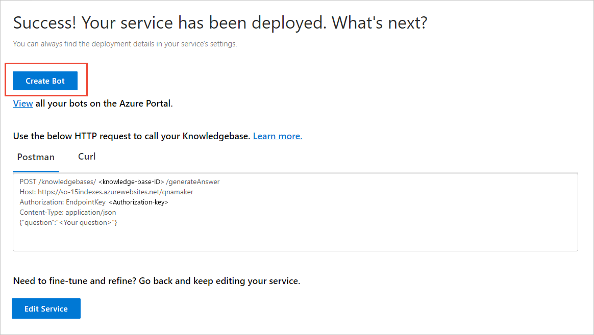
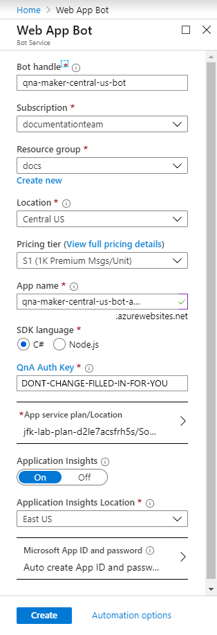
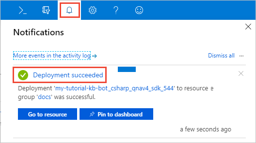
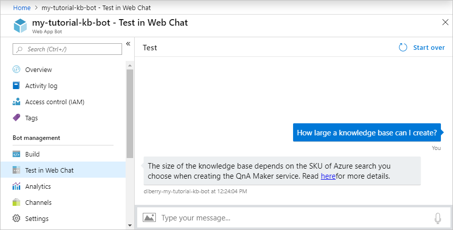

# Tutorial: Create a QnA Bot with Azure Bot Service v4

Create a QnA chat bot from the **Publish** page for an existing knowledge base. This bot uses the Bot Framework SDK v4. You do not need to write any code to build the bot, all the code is provided for you.

**In this tutorial, you learn how to:**

<!-- green checkmark -->
> [!div class="checklist"]
> * Create an Azure Bot Service from an existing knowledge base
> * Chat with the bot to verify the code is working 

## Prerequisites

You need to have a published knowledge base for this tutorial. If you do not have one, follow the steps in [Create and answer from KB](create-publish-query-in-portal.md) tutorial to create a QnA Maker knowledge base with questions and answers.

## Create a QnA Bot

Create a bot as a client application for the knowledge base. 

1. In the QnA Maker portal, go to the **Publish** page, and publish your knowledge base. Select **Create Bot**. 

    

    The Azure portal opens with the bot creation configuration.

1.  Enter the settings to create the bot:

    |Setting|Value|Purpose|
    |--|--|--|
    |Bot name|`my-tutorial-kb-bot`|This is the Azure resource name for the bot.|
    |Subscription|See purpose.|Select the same subscription as you used to create the QnA Maker resources.|
    |Resource group|`my-tutorial-rg`|The resource group used for all the bot-related Azure resources.|
    |Location|`west us`|The bot's Azure resource location.|
    |Pricing tier|`F0`|The free tier for the Azure bot service.|
    |App name|`my-tutorial-kb-bot-app`|This is a web app to support your bot only. This should not be the same app name as your QnA Maker service is already using. Sharing QnA Maker's web app with any other resource is not supported.|
    |SDK Language|C#|This is the underlying programming language used by the bot framework SDK. Your choices are [C#](https://github.com/Microsoft/botbuilder-dotnet) or [Node.js](https://github.com/Microsoft/botbuilder-js).|
    |QnA Auth Key|**Do not change**|This value is filled in for you.|
    |App service plan/Location|**Do not change**|For this tutorial, the location is not important.|
    |Azure Storage|**Do not change**|Conversation data is stored in Azure Storage tables.|
    |Application Insights|**Do not change**|Logging is sent to Application Insights.|
    |Microsoft App ID|**Do not change**|Active directory user and password is required.|

    

    Wait a couple of minutes until the bot creation process notification reports success.

## Chat with the Bot

1. In the Azure portal, open the new bot resource from the notification. 

    

1. From **Bot management**, select **Test in Web Chat** and enter: `How large can my KB be?`. The bot will respond with: 

    `The size of the knowledge base depends on the SKU of Azure search you choose when creating the QnA Maker service. Read [here](https://docs.microsoft.com/azure/cognitive-services/qnamaker/tutorials/choosing-capacity-qnamaker-deployment)for more details.`

    

    For more information about Azure Bots, see [Use QnA Maker to answer questions](https://docs.microsoft.com/azure/bot-service/bot-builder-howto-qna?view=azure-bot-service-4.0&tabs=cs)

## Clean up resources

When you are done with this tutorial's bot, remove the bot in the Azure portal. 

If you created a new resource group for the bot's resources, delete the resource group. 

If you didn't create a new resource group, you need to find the resources associated with the bot. The easiest way is to search by the name of the bot and bot app. The bot resources include:

* The App Service plan
* The Search service
* The Cognitive service
* The App service
* Optionally, it may also include the application insights service and storage for the application insights data

## Related to QnA Maker bots

* The QnA Maker help bot, used in the QnA Maker portal, is available as a [bot sample](https://github.com/Microsoft/BotBuilder-Samples/tree/master/experimental/csharp_dotnetcore/qnamaker-support-bot).
    
* [Healthcare bots](https://docs.microsoft.com/HealthBot/qna_model_howto) use QnA Maker as one of their [language models](https://docs.microsoft.com/HealthBot/qna_model_howto).

[!INCLUDE [Bot Information](../../../../includes/cognitive-services-qnamaker-luis-bot-info.md)]

## Next steps

> [!div class="nextstepaction"]
> [Concept: knowledge base](../concepts/knowledge-base.md)

## See also

- [Manage your knowledge base](https://qnamaker.ai)
- [Enable your bot in different channels](https://docs.microsoft.com/azure/bot-service/bot-service-manage-channels)
