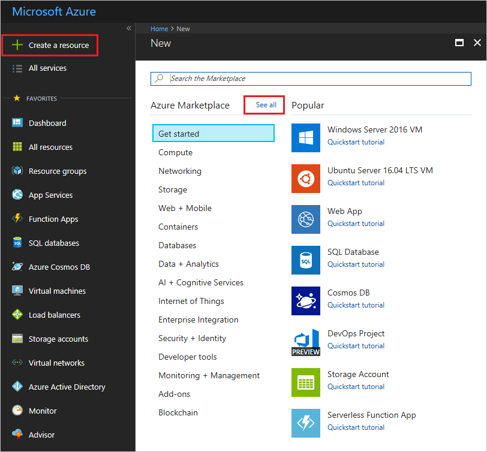
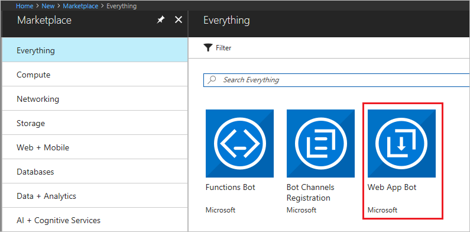
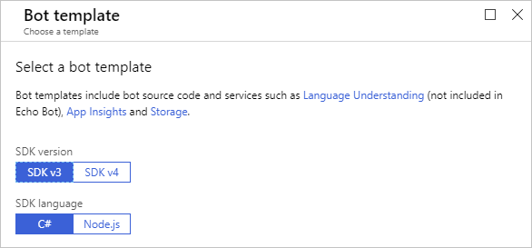
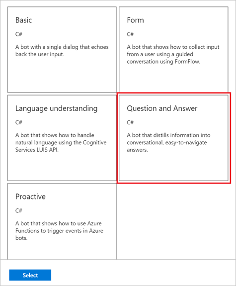
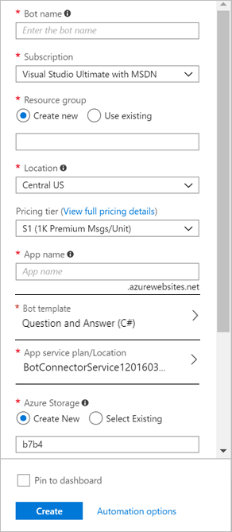
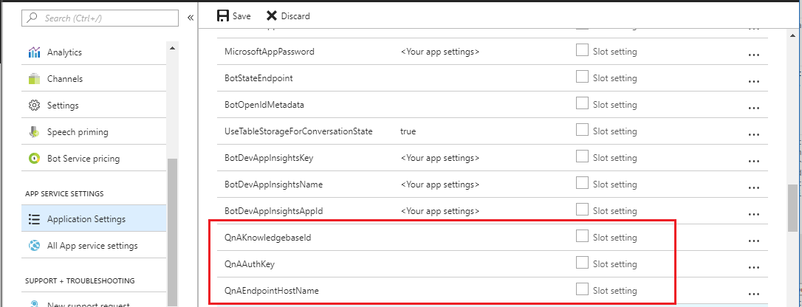
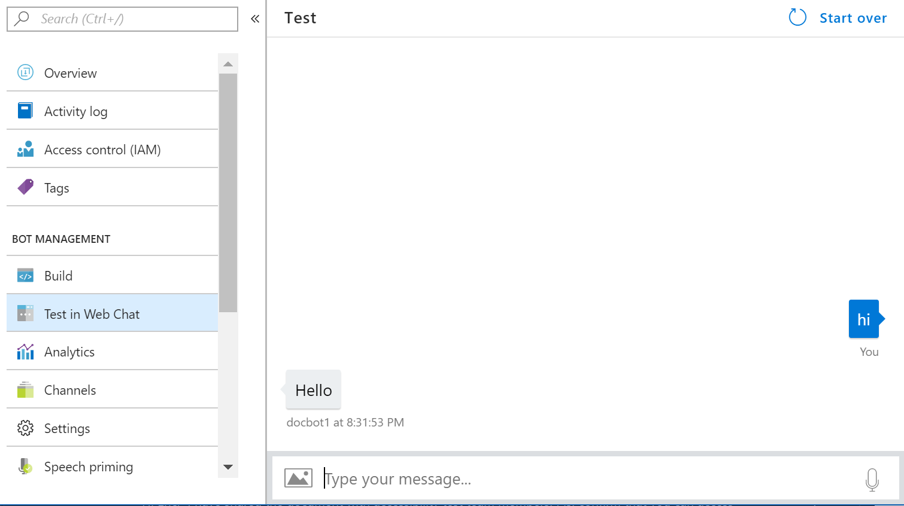

# Create a QnA Bot with Azure Bot Service v3
This tutorial walks you through building a QnA bot with Azure Bot service v3 on the Azure portal.

## Prerequisite
Before you build, follow the steps in [Create a knowledge base](../How-To/create-knowledge-base.md) to create a QnA Maker service with questions and answers.

The bot responds to questions from the knowledge base you created, via the QnAMakerDialog.

## Create a QnA Bot
1. In the [Azure portal](https://portal.azure.com), select **Create** new resource in the menu blade, and then select **See all**.

    

2. In the search box, search for **Web App Bot**.

    

3. In the **Bot Service blade**, provide the required information:

    - Set **App name** to your bot’s name. The name is used as the subdomain when your bot is deployed to the cloud (for example, mynotesbot.azurewebsites.net).
    - Select the subscription, resource group, App service plan, and location.

4. To see instructions for creating a QnA bot with SDK v4 - see [QnA v4 bot template](https://aka.ms/qna-bot-v4). To use the v3 templates, select SDK version of **SDK v3** and SDK language of **C#** or **Node.js**.

    

5. Select the **Question and Answer** template for the Bot template field, then save the template settings by selecting **Select**.

    

6. Review your settings, then select **Create**. This creates and deploys the bot service with QnAMakerDialog to Azure.

    

7. Confirm that the bot service has been deployed.

    - Select **Notifications** (the bell icon that is located along the top edge of the Azure portal). The notification will change from **Deployment started** to **Deployment succeeded**.
    - After the notification changes to **Deployment succeeded**, select **Go to resource** on that notification.

## Chat with the Bot
Selecting **Go to resource** takes you to the bot's resource blade.

Once the bot is registered, click **Test in Web Chat** to open the Web Chat pane. Type "hello" in Web Chat.

The bot responds with "Please set QnAKnowledgebaseId and QnASubscriptionKey in App Settings. Learn how to get them at https://aka.ms/qnaabssetup". This response confirms that your QnA Bot has received the message, but there is no QnA Maker knowledge base associated with it yet. Do that in the next step.

## Connect your QnA Maker knowledge base to the bot

1. Open **Application Settings** and edit the **QnAKnowledgebaseId**, **QnAAuthKey**, and the **QnAEndpointHostName** fields to contain the values of your QnA Maker knowledge base.

    

2. Get your knowledge base ID, host url, and the endpoint key from the settings tab of your knowledge base in https://qnamaker.ai.
    - Sign in to [QnA Maker](https://qnamaker.ai)
    - Go to your knowledge base
    - Click on the **Settings** tab
    - **Publish** your knowledge base, if not already done so

    

> [!NOTE]
> If you want to connect the preview version of the knowledge base with the QnA bot, set the value of **Ocp-Apim-Subscription-Key** to **QnAAuthKey**. Leave the **QnAEndpointHostName** empty.

## Test the bot
In the Azure portal, click on **Test in Web Chat** to test the bot. 

Your QnA Bot now answers from your knowledge base.

## Next steps

> [!div class="nextstepaction"]
> [Integrate QnA Maker and LUIS](./integrate-qnamaker-luis.md)

## See also

- [Manage your knowledge base](https://qnamaker.ai)
- [Enable your bot in different channels](https://docs.microsoft.com/azure/bot-service/bot-service-manage-channels)
