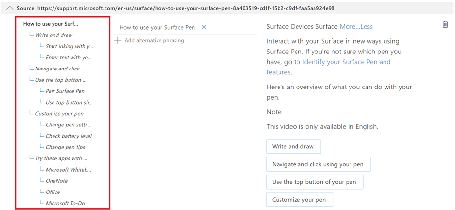
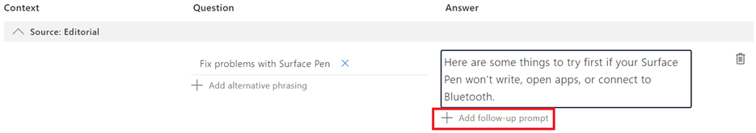

# Add guided conversations with multi-turn prompts

 In this tutorial, we use [Surface Pen FAQ](https://support.microsoft.com/surface/how-to-use-your-surface-pen-8a403519-cd1f-15b2-c9df-faa5aa924e98) to create a knowledge base.

For this example let's assume that users are asking for additional details about the Surface Pen product, particularly how to troubleshoot their Surface Pen, but they are not getting the correct answers. So, we add more prompts to support additional scenarios and guide the users to the correct answers using multi-turn prompts.

## View QnAs with context
While creating the knowledge base for [Surface Pen FAQ](https://support.microsoft.com/surface/how-to-use-your-surface-pen-8a403519-cd1f-15b2-c9df-faa5aa924e98), we choose to enable multi-turn extraction from the source document. For more details, follow [Create multi-turn conversation from document](../how-to/multiturn-conversation.md#create-a-multi-turn-conversation-from-a-documents-structure). This lists the multi-turn prompts that are associated with QnA pairs, which can be viewed using **Show context** under **View Options**.

> [!div class="mx-imgBorder"]
> 

This displays the context tree where all follow-up prompts linked to a QnA pair are shown: 

> [!div class="mx-imgBorder"]
> 

## Add new QnA pair with follow-up prompts

To help the user solve issues with their Surface Pen, we add follow-up prompts:

1.	Add a new QnA pair with two follow-up prompts
2.	Add a follow-up prompt to one of the newly added prompts

**Step 1**: Add a new QnA pair with two follow-up prompts **Check compatibility** and **Check Pen Settings**
Using the editor, we add a new QnA pair with a follow-up prompt by clicking on **Add QnA pair**

> [!div class="mx-imgBorder"]
> 

A new row in **Editorial** is created where we enter the QnA pair as shown below:

> [!div class="mx-imgBorder"]
> 

We then add a follow-up prompt to the newly created QnA pair by choosing **Add follow-up prompt**. Clicking on which, we fill the details for the prompt as shown:

> [!div class="mx-imgBorder"]
> 

We provide **Check Compatibility** as the “Display text” for the prompt and try to link it to a QnA. Since, no related QnA pair is available to link to the prompt, when we search “Check your Surface Pen Compatibility”, we create a new QnA pair by clicking on **Create new**. Once we **Save** the changes, the following screen is presented, where a new QnA pair for the follow-up prompt can be entered as shown below:

> [!div class="mx-imgBorder"]
> 

Similarly, we add another prompt **Check Pen Settings** to help the user troubleshoot the Surface Pen and add QnA pair to it.

> [!div class="mx-imgBorder"]
> 

**Step 2**: Add another follow-up prompt to newly created prompt. We now add “Replace Pen tips’ as a follow-up prompt to the previously created prompt “Check Pen Settings”.

> [!div class="mx-imgBorder"]
> 

We finally save the changes and test these prompts in the Test pane: 

> [!div class="mx-imgBorder"]
> 

For a user query **Issues with Surface Pen**, the system returns an answer and presents the newly added prompts to the user. The user then selects one of the prompts **Check Pen Settings** and the related answer is returned to the user with another prompt **Replace Pen Tips**, which when selected further provides the user with more information. So, multi-turn is used to help and guide the user to the desired answer.

## Next steps

> [!div class="nextstepaction"]
> [Enrich your knowlege base with active learning](active-learning.md)