# Tutorial: Add your knowledge base to Power Virtual Agents
Create and extend a [Power Virtual Agents](https://powervirtualagents.microsoft.com/) bot to provide answers from your knowledge base.

In this tutorial, you learn how to:

<!-- green checkmark -->
> [!div class="checklist"]
> * Create a Power Virtual Agents bot
> * Create a system fallback topic
> * Add QnA Maker as an action to a topic as a Power Automate flow
> * Create a Power Automate solution
> * Add a Power Automate flow to your solution
> * Publish Power Virtual Agents
> * Test Power Virtual Agents, and recieve an answer from your QnA Maker knowledge base

## Integrate an agent with a knowledge base

[Power Virtual Agents](https://powervirtualagents.microsoft.com/) allows teams to create powerful bots by using a guided, no-code graphical interface. You don't need data scientists or developers.

In Power Virtual Agents, you create an agent with a series of topics (subject areas), in order to answer user questions by performing actions. If an answer can't be found, a system fallback can return an answer.

Configure the agent to send the question to your knowledge base as part of a topic's action, or as part of the *System Fallback* topic path. They both use an action to connect to your knowledge base and return an answer.

## Power Automate connects to `GenerateAnswer` action

To connect your agent to your knowledge base, use Power Automate to create the action. Power Automate provides a process flow, which connects to QnA Maker's `GenerateAnswer` API.

After you design and save the flow, it's available from a Power Automate solution. Use that solution as an action in your agent.

## Connect an agent to your knowledge base

Here's an overview of the steps to connect an agent in Power Virtual Agents to a knowledge base in QnA Maker.

* In the [QnA Maker](https://www.qnamaker.ai/) portal:
    * Build and publish your knowledge base.
    * Copy your knowledge base details, including the ID, runtime endpoint key, and runtime endpoint host.
* In the [Power Virtual Agents](https://powerva.microsoft.com/) portal:
    * Build an agent topic.
    * Call an action (to Power Automate flow).
* In the [Power Automate](https://us.flow.microsoft.com/) portal:
    * Build a flow with a connector to [QnA
    Maker's GenerateAnswer](https://docs.microsoft.com/connectors/cognitiveservicesqnamaker/).
        * QnA Maker published knowledge base information:
            * Knowledge base ID
            * QnA Maker resource endpoint host
            * QnA Maker resource endpoint key
        * Input - user query
        * Output - knowledge base answer
    * Create a solution and add the flow.
* Return to Power Virtual Agents:
    * Select the solution's output as a message for a topic.

## Create and publish a knowledge base

1. Follow the [quickstart](../Quickstarts/create-publish-knowledge-base.md) to create a knowledge base. Don't complete the last section, about creating a bot. Instead, use this tutorial to create a bot with Power Virtual Agents.

    > [!div class="mx-imgBorder"]
    > 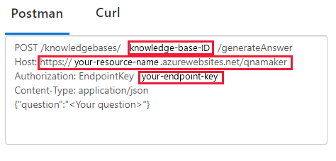

    Enter your published knowledge base settings found on the **Settings** page in the [QnA Maker](https://www.qnamaker.ai/) portal. You will need this information for the [Power Automate step](#create-a-power-automate-flow-to-connect-to-your-knowledge-base) to configure your QnA Maker `GenerateAnswer` connection.

1. In the QnA Maker portal, on the **Settings** page, find the endpoint key, endpoint host, and knowledge base ID.

## Create an agent in Power Virtual Agents

1. [Sign in to Power Virtual Agents](https://go.microsoft.com/fwlink/?LinkId=2108000&clcid=0x409). Use your school or work email account.
1. If this is your first bot, you'll be on the **Home** page of the agent. If this isn't your first bot, select the bot from the top-right area of the page, and select **+ New Bot**.

    > [!div class="mx-imgBorder"]
    > 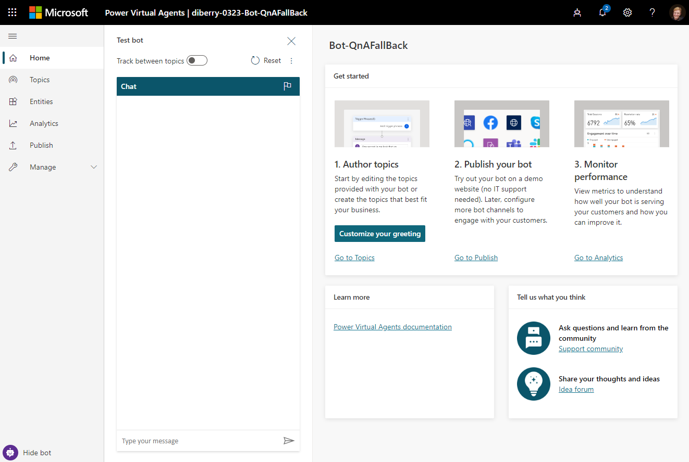

1. Enter your published knowledge base settings, found on the **Settings** page in the [QnA Maker](https://www.qnamaker.ai/) portal.

## Topics provided in the bot

The agent uses the topic collection to answer questions in your subject area. In this tutorial, the agent has many topics provided for you, divided into user topics and system topics.

> [!div class="mx-imgBorder"]
> 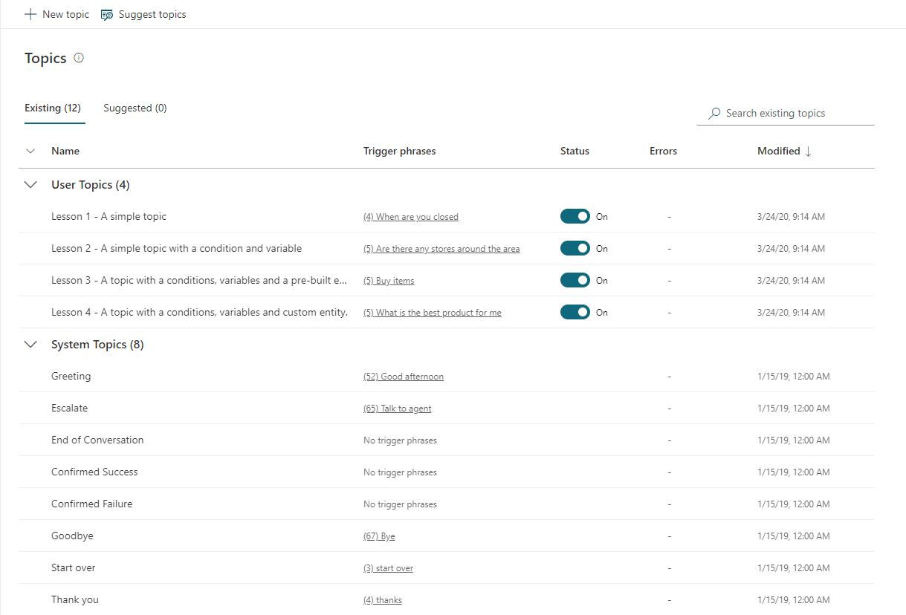

## Create the system fallback topic

Although the agent can connect to your knowledge base from any topic, this tutorial uses the *system fallback* topic. The fallback topic is used when the agent can't find an answer. The agent passes the user's text to QnA Maker's `GenerateAnswer` API, receives the answer from your knowledge base, and displays it to the user as a message.

1. In the [Power Virtual Agents](https://powerva.microsoft.com/#/) portal, on the top-right corner, select **Settings** (the gear icon). Then select **System Fallback**.

    > [!div class="mx-imgBorder"]
    > 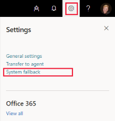

1. Select **+ Add** to add a system fallback topic.

    > [!div class="mx-imgBorder"]
    > 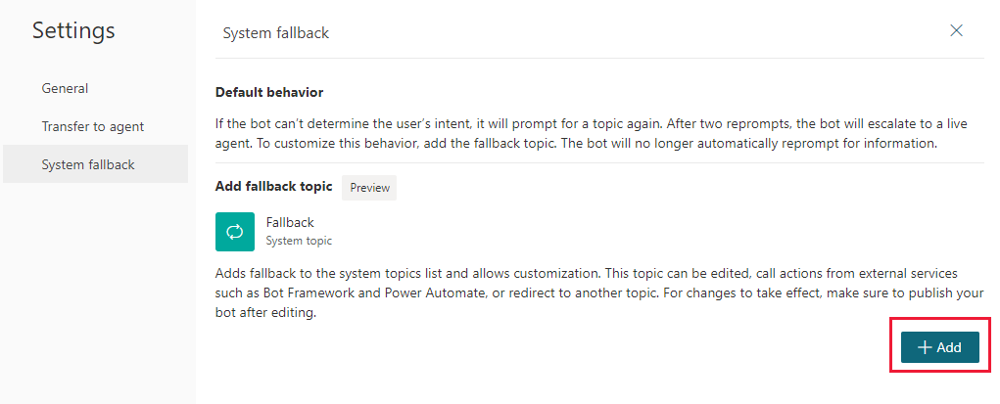

1. After the topic is added, select **Go to Fallback topic** to author the fallback topic on the authoring canvas.

    > [!TIP]
    > If you need to return to the fallback topic, it's available in the **Topics** section, as part of the **System** topics.

## Use the authoring canvas to add an action

Use the Power Virtual Agents authoring canvas to connect the fallback topic to your knowledge base. The topic starts with the unrecognized user text. Add an action that passes that text to QnA Maker, and then shows the answer as a message. The last step of displaying an answer is handled as a [separate step](#add-your-solutions-flow-to-power-virtual-agents), later in this tutorial.

This section creates the fallback topic conversation flow.

1. The new fallback action might already have conversation flow elements. Delete the **Escalate** item by selecting the **Options** menu.

    > [!div class="mx-imgBorder"]
    > 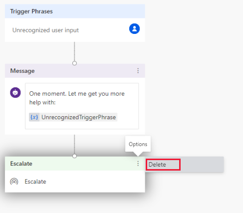

1. Select the **+** connector flowing from the **Message** box, and then select **Call an action**.

    > [!div class="mx-imgBorder"]
    > 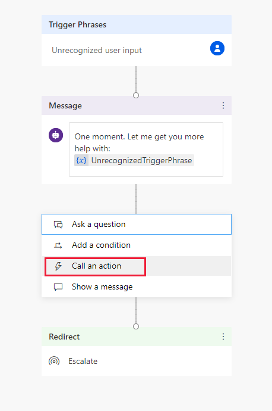

1. Select **Create a flow**. The process takes you to the Power Automate portal.

    > [!div class="mx-imgBorder"]
    > 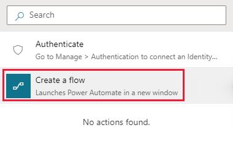

## Create a Power Automate flow to connect to your knowledge base

The following procedure creates a Power Automate flow that:
* Takes the incoming user text, and sends it to QnA Maker.
* Assigns the QnA Maker top answer to a variable, and sends the variable (top answer) as the response back to your agent.

1. In **Power Automate**, the **Flow Template** is started for you. On the **Power Virtual Agents** flow item, select **Edit** to configure the input variable coming from the agent to your knowledge base. The text-based input variable is the user-submitted text question from your agent.

    > [!div class="mx-imgBorder"]
    > 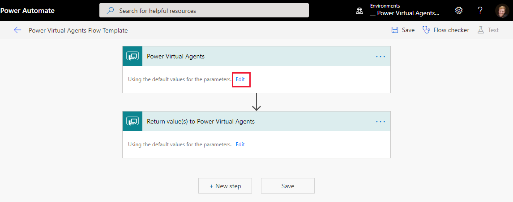

1. Add a text input, and name the variable `InputText`, with a description of `IncomingUserQuestion`. This naming helps distinguish the input text from the output text you create later.

    > [!div class="mx-imgBorder"]
    > 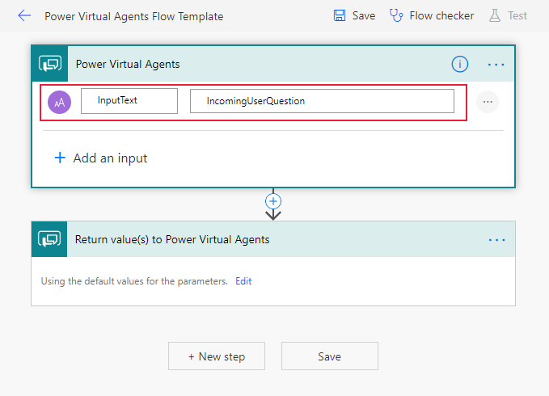

1. Select the **+** connector flowing from the **Power Virtual Agents** box, to insert a new step in the flow (before the **Return value(s) to Power Virtual Agent**). Then select **Add an action**.

1. Search for `Qna` to find the **QnA Maker** actions, and then select **Generate answer**.

    > [!div class="mx-imgBorder"]
    > 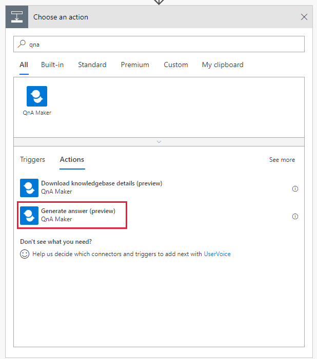

    The required connection settings for QnA Maker appear in the action and the question settings from the agent.

    > [!div class="mx-imgBorder"]
    > 

1. Configure the action with your knowledge base ID, endpoint host, and endpoint key. These are found on the **Settings** page of your knowledge base, in the QnA Maker portal.

    > [!div class="mx-imgBorder"]
    > 

1. To configure the **Question**, select the text box, and then select the `InputText` from the list.

1. To insert a new step in the flow, select the **+** connector flowing from the **Generate answer** action box. Then select **Add an action**.

1. To add a variable to capture the answer text returned from `GenerateAnswer`, search for and select the `Initialize variable` action.

    Set the name of the variable to `OutgoingQnAAnswer`, and select the type as **String**. Don't set the **Value**.

    > [!div class="mx-imgBorder"]
    > 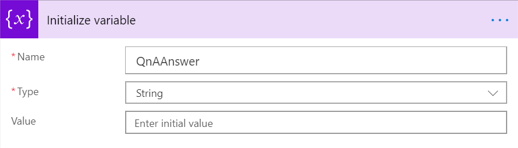

1. To insert a new step in the flow, select the **+** connector flowing from the **Initialize variable** action box. Then select **Add an action**.

1. To set the entire knowledge base JSON response to the variable, search for and select the`Apply to each` action. Select the `GenerateAnswer` `answers`.

1. To return only the top answer, in the same **Apply to each** box, select **Add an action**. Search for and select **Set variable**.

    In the **Set variable** box, select the text box for **Name**, and then select **OutgoingQnAAnswer** from the list.

    Select the text box for **Value**, and then select **Answers Answer** from the list.

    > [!div class="mx-imgBorder"]
    > 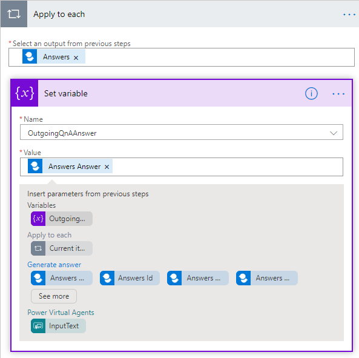

1. To return the variable (and its value), select the **Return value(s) to Power Virtual Agent** flow item. Then select **Edit** > **Add an output**. Select a **Text** output type, and then enter the **Title** of `FinalAnswer`. Select the text box for the **Value**, and then select the `OutgoingQnAAnswer` variable.

    > [!div class="mx-imgBorder"]
    > 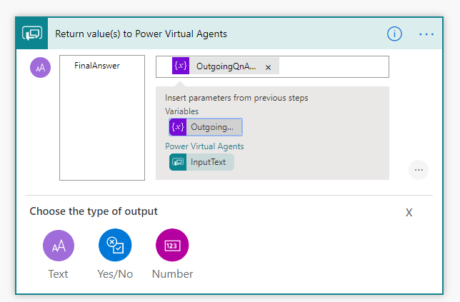

1. Select **Save** to save the flow.

## Create a solution and add the flow

For the agent to find and connect to the flow, the flow must be included in a Power Automate solution.

1. While still in the Power Automate portal, select **Solutions** from the left-side navigation.

1. Select **+ New solution**.

1. Enter a display name. The list of solutions includes every solution in your organization or school. Choose a naming convention that helps you filter to just your solutions. For example, you might prefix your email to your solution name: `jondoe-power-virtual-agent-qnamaker-fallback`.

1. Select your publisher from the list of choices.

1. Accept the default values for the name and version.

1. Select **Create** to finish the process.

## Add your flow to the solution

1. In the list of solutions, select the solution you just created. It should be at the top of the list. If it isn't, search by your email name, which is part of the solution name.

1. In the solution, select **+ Add existing**, and then select **Flow** from the list.

1. Find your flow, and then select **Add** to finish the process. If there are many flows, look at the **Modified** column to find the most recent flow.

## Add your solution's flow to Power Virtual Agents

1. Return to the browser tab with your agent in Power Virtual Agents. The authoring canvas should still be open.

1. To insert a new step in the flow, under the **Message** action box, select the **+** connector. Then select **Call an action**.

1. In the new action, select the input value of **UnrecognizedTriggerPhrase**. This passes the text from the agent to the flow.

    > [!div class="mx-imgBorder"]
    > 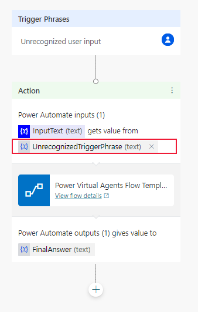

1. To insert a new step in the flow, under the **Action** box, select the **+** connector. Then select **Show a message**.

1. Enter the message text, `Your answer is:`. Select `FinalAnswer` as a context variable by using the function of the in-place toolbar.

    > [!div class="mx-imgBorder"]
    > 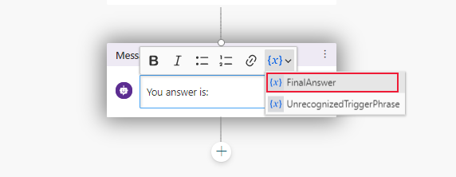

1. From the context toolbar, select **Save**, to save the authoring canvas details for the topic.

Here's what the final agent canvas looks like.

> [!div class="mx-imgBorder"]
> 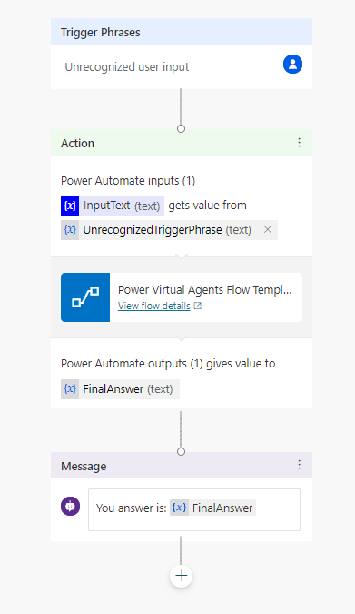

## Test the agent

1. In the test pane, toggle **Track between topics**. This allows you to watch the progression between topics, as well as within a single topic.

1. Test the agent by entering the user text in the following order. The authoring canvas reports the successful steps with a green check mark.

    |Question order|Test questions|Purpose|
    |--|--|--|
    |1|Hello|Begin conversation|
    |2|Store hours|Sample topic. This is configured for you without any additional work on your part.|
    |3|Yes|In reply to `Did that answer your question?`|
    |4|Excellent|In reply to `Please rate your experience.`|
    |5|Yes|In reply to `Can I help with anything else?`|
    |6|What is a knowledge base?|This question triggers the fallback action, which sends the text to your knowledge base to answer. Then the answer is shown. |

> [!div class="mx-imgBorder"]
> 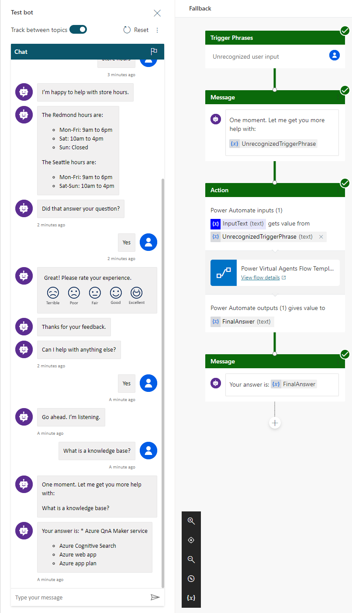

## Publish your bot

To make the agent available to all members of your school or organization, you need to publish it.

1. From the navigation on the left, select **Publish**. Then select **Publish** on the page.

1. Try your bot on the demo website (look for the link under **Publish**).

    A new web page opens with your bot. Ask the bot the same test question: `What is a knowledge base?`

    > [!div class="mx-imgBorder"]
    > 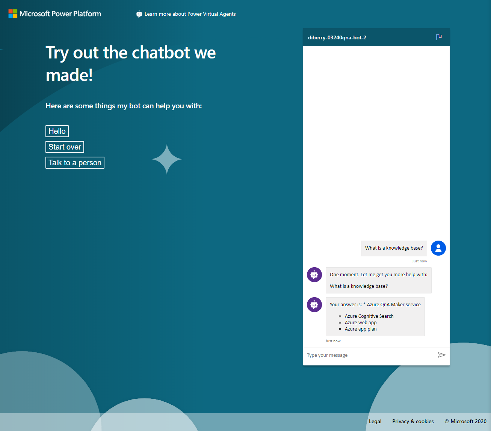

## Share your bot

To share the demo website, configure it as a channel.

1. From the navigation on the left, select **Manage** > **Channels**.

1. Select **Demo website** from the channels list.

1. Copy the link and select **Save**. Paste the link to your demo website into an email to your school or organization members.

## Clean up resources

When you are done with the knowledge base, remove the QnA Maker resources in the Azure portal.

## Next step

[Get analytics on your knowledge base](../How-To/get-analytics-knowledge-base.md)

Learn more about:
* [Power Virtual Agents](https://docs.microsoft.com/power-virtual-agents/)
* [Power Automate](https://docs.microsoft.com/power-automate/)
* [QnA Maker connector](https://us.flow.microsoft.com/connectors/shared_cognitiveservicesqnamaker/qna-maker/) and the [settings for the connector](https://docs.microsoft.com/connectors/cognitiveservicesqnamaker/)