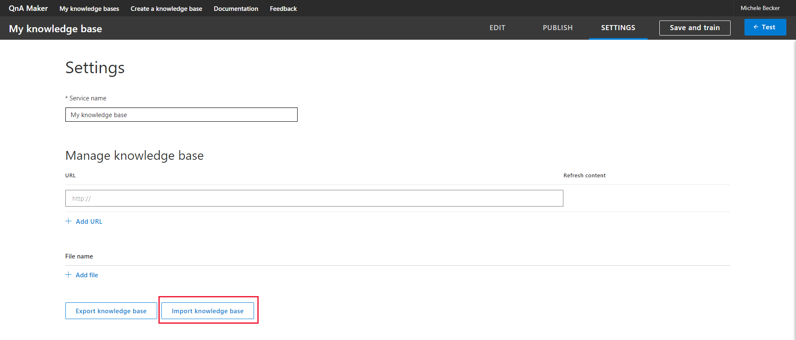
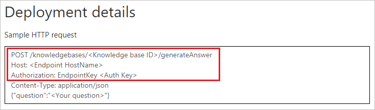

# Migrate a knowledge base using export-import

Migrating a knowledge base requires exporting from one knowledge base, then importing into another. 

## Prerequisites

* Create a [free account](https://azure.microsoft.com/free/?WT.mc_id=A261C142F) before you begin.
* Set up a new [QnA Maker service](../How-To/set-up-qnamaker-service-azure.md)

## Migrate a knowledge base from QnA Maker
1. Sign in to [QnA Maker portal](https://qnamaker.ai).
1. Select the knowledge base you want to migrate.

1. On the **Settings** page, select **Export knowledge base** to download a .tsv file that contains the content of your knowledge base - questions, answers, metadata, and the data source names from which they were extracted.

1. Select **Create a knowledge base** from the top menu then create an empty knowledge base. 

    

    - Give your service a **name.** Duplicate names are supported and special characters are supported as well.

1. Select **Create**.

    

1. In this new knowledge base, open the **Settings** tab and select **Import knowledge base**. This imports the questions, answers, and metadata, and retains the data source names from which they were extracted.

   

1. **Test** the new knowledge base using the Test panel. Learn how to [test your knowledge base](../How-To/test-knowledge-base.md).
1. **Publish** the knowledge base. Learn how to [publish your knowledge base](../Quickstarts/create-publish-knowledge-base.md#publish-the-knowledge-base).
1. Use the endpoint in your application or bot code. See here how to [create a QnA bot](../Tutorials/create-qna-bot.md).

    

    At this point, all the knowledge base content - questions, answers and metadata, along with the names of the source files and the URLs, are imported to the new knowledge base. 

## Chat logs and alterations
Case-insensitive alterations (synonyms) are not imported automatically. Use the [V4 APIs](https://go.microsoft.com/fwlink/?linkid=2092179) to move the alterations in the new knowledge base.

There is no way to migrate chat logs, since the new knowledge base uses Application Insights for storing chat logs. 

## Next steps

> [!div class="nextstepaction"]
> [Edit a knowledge base](../How-To/edit-knowledge-base.md)
