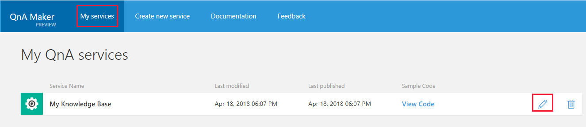
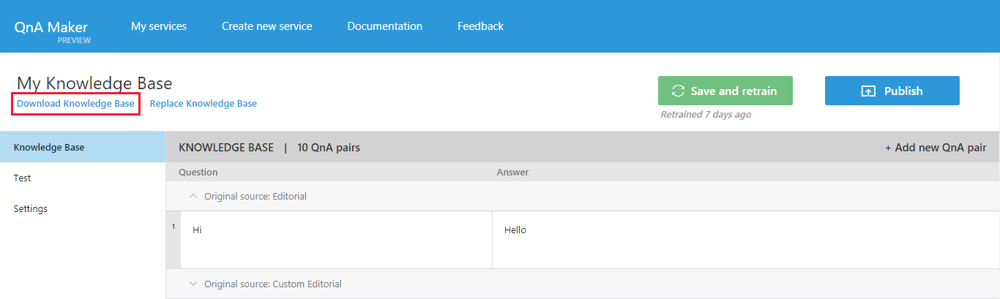

# Migrate a knowledge base using export-import
QnA Maker announced General Availability on May 7, 2018 at the \\\build\ conference. QnA Maker GA has a new architecture built on Azure. Knowledge bases created with QnA Maker Free Preview will need to be migrated to QnA Maker GA. QnA Maker Preview will be deprecated in November 2018. For more information about the changes in QnA Maker GA, see the QnA Maker GA announcement [blog post](https://aka.ms/qnamakerga-blog).

QnA Maker now has a [pricing model](https://azure.microsoft.com/pricing/details/cognitive-services/qna-maker/).

Prerequisites
> [!div class="checklist"]
> * If you don't have an Azure subscription, create a [free account](https://azure.microsoft.com/free/?WT.mc_id=A261C142F) before you begin.
> * Setup a new [QnA Maker service](../How-To/set-up-qnamaker-service-azure.md)

## Migrate a knowledge base from QnA Maker Preview portal
1. Navigate to [QnA Maker Preview portal](https://aka.ms/qnamaker-old-portal
) and click on **My services**.
2. Select the knowledge base you want to migrate by clicking on the edit icon.

    

3. Click on **Download knowledge base** to download a .tsv file that contains the content of your knowledge base - questions, answers, metadata, and the data source names from which they were extracted.

    

4. Sign into to the [QnA Maker portal](https://qnamaker.ai) with your azure credentials and click on **Create a knowledge base**.
    
5. If you have not already created a QnA Maker service, select **Create a QnA service**. Otherwise, choose a QnA Maker service from the drop-downs in Step 2. Select the QnA Maker service that will host the Knowledge Base.

    

6. Create an empty knowledge base 

    

    - Give your service a **name.** Duplicate names are supported and special characters are supported as well.
    - Skip uploading files or URLs as you want to use the data from your Preview knowledge base. For now, you will create an empty knowledge base.

7. Select **Create**.

    

8. In this new Knowledge base, open the **Settings** tab and click on **Import knowledge base**. This imports the questions, answers, and metadata, and retains the data source names from which they were extracted.

   

9. **Test** the new knowledge base using the Test panel. Learn how to [test your knowledge base](../How-To/test-knowledge-base.md).
10. **Publish** the knowledge base. Learn how to [publish your knowledge base](../How-To/publish-knowledge-base.md).
11. Use the endpoint below in your application or bot code. See here how to [create a QnA bot](../Tutorials/create-qna-bot.md).

    

At this point, all the knowledge base content - questions, answers and metadata, along with the names of the source files and the URLs, are imported to the new knowledge base. 

## Chatlogs and alterations
Alterations (synonyms) are not imported automatically. Use the [V2 APIs](https://aka.ms/qnamaker-v2-apis) to export the alterations from the preview stack and the [V4 APIs](https://aka.ms/qnamaker-v4-apis) to replace in the new stack.

There is no way to migrate chatlogs, since the new stack uses Application Insights for storing chatlogs. You can however download the chatlogs from the [preview portal](https://aka.ms/qnamaker-old-portal).

## Next steps

> [!div class="nextstepaction"]
> [Edit a knowledge base](../How-To/edit-knowledge-base.md)
