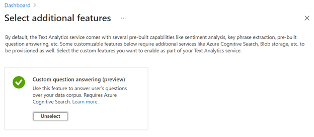
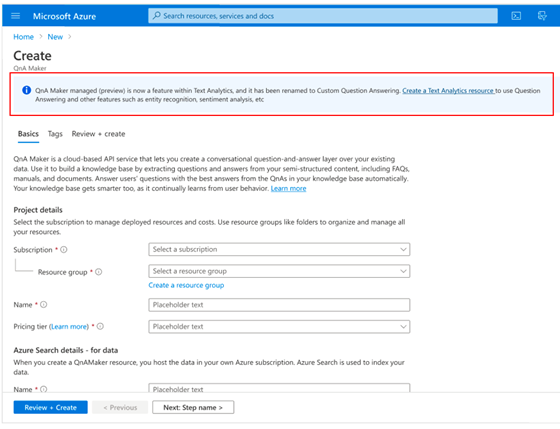

# QnA Maker managed is now renamed to custom question answering

[QnA Maker managed (preview)](https://techcommunity.microsoft.com/t5/azure-ai/introducing-qna-maker-managed-now-in-public-preview/ba-p/1845575) was launched in November 2020 as a free public preview offering. It introduced several new features including enhanced relevance using a deep learning ranker, precise answers, and end-to-end region support. 

As part of our effort to consolidate the language offerings from Cognitive Services, QnA Maker managed is now a feature within Text Analytics, and it has been renamed to custom question answering.  

## Creating a new custom question answering service

[Create a Text Analytics resource](https://ms.portal.azure.com/?quickstart=true#create/Microsoft.CognitiveServicesTextAnalytics) to use question answering and other features such as entity recognition, sentiment analysis, etc.  

Now when you create a new Text Analytics resource, you can select features that you want included. Select **custom question answering (preview)** and continue to create your resource.  

> [!div class="mx-imgBorder"]
> 

You can no longer create a QnA Maker managed resource from the QnA Maker create flow, instead you will be redirected to the Text Analytics service. There is no change to the QnA Maker stable release. 

> [!div class="mx-imgBorder"]
> 

## Details

- All existing QnA Maker managed (preview) resources continue to work as before. There is no action required for these resources at this time.
- The creation flow for Custom question answering (preview) is the primary change. The service, portal, endpoints, SDK, etc. remain as before.
- Custom question answering (preview) continues to be offered as a free public preview. This feature is only available as part of Text Analytics Standard resources. Do not change your pricing tier for Text Analytics resources to free.
- Custom question answering (preview) is available in the following regions:
    - South Central US
	- North Europe
	- Australia East.

## Next steps

* [Get started with QnA Maker client library](./quickstarts/quickstart-sdk.md)
* [Get started with QnA Maker portal](./quickstarts/create-publish-knowledge-base.md)

