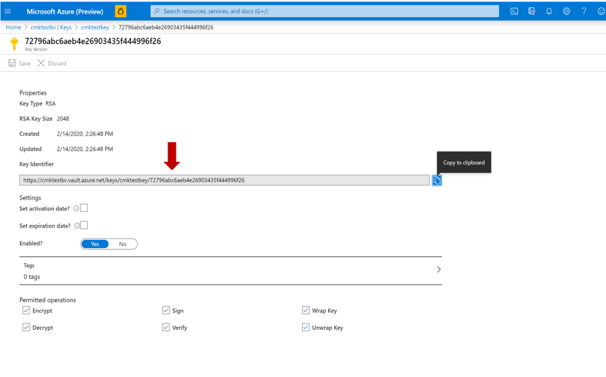
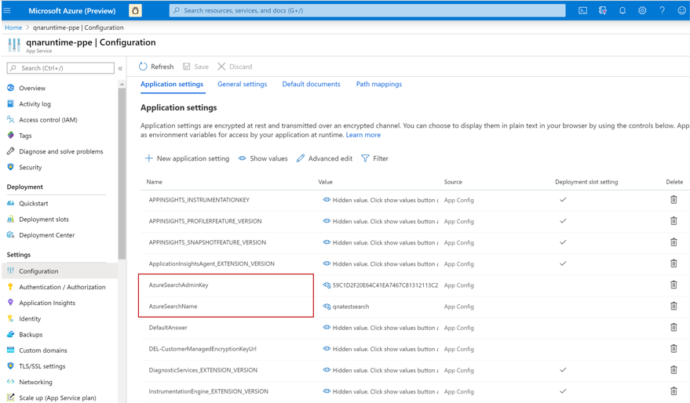
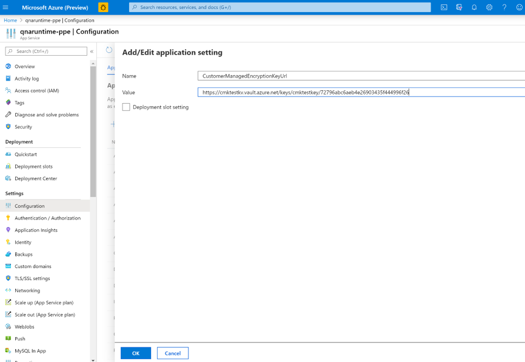

# QnA Maker encryption of data at rest

QnA Maker automatically encrypts your data when it is persisted to the cloud, helping to meet your organizational security and compliance goals.

## About encryption key management

By default, your subscription uses Microsoft-managed encryption keys. There is also the option to manage your subscription with your own keys called customer-managed keys (CMK). CMK offer greater flexibility to create, rotate, disable, and revoke access controls. You can also audit the encryption keys used to protect your data. If CMK is configured for your subscription, double encryption is provided, which offers a second layer of protection, while allowing you to control the encryption key through your Azure Key Vault.

# [QnA Maker GA (stable release)](#tab/v1)

QnA Maker uses CMK support from Azure search. You need to create [CMK in Azure Search using Azure Key Vault](https://docs.microsoft.com/azure/search/search-security-manage-encryption-keys). This Azure instance should be associated with QnA Maker service to make it CMK enabled.

# [QnA Maker managed (preview release)](#tab/v2)

QnA Maker uses [CMK support from Azure search](https://docs.microsoft.com/azure/search/search-security-manage-encryption-keys), and automatically associates the provided CMK to encrypt the data stored in Azure search index.

---

> [!IMPORTANT]
> Your Azure Search service resource must have been created after January 2019 and cannot be in the free (shared) tier. There is no support to configure customer-managed keys in the Azure portal.

## Enable customer-managed keys

The QnA Maker service uses CMK from the Azure Search service. Follow these steps to enable CMKs:

# [QnA Maker GA (stable release)](#tab/v1)

1. Create a new Azure Search instance and enable the prerequisites mentioned in the [customer-managed key prerequisites for Azure Cognitive Search](https://docs.microsoft.com/azure/search/search-security-manage-encryption-keys#prerequisites).

   

2. When you create a QnA Maker resource, it's automatically associated with an Azure Search instance. This cannot be used with CMK. To use CMK, you'll need to associate your newly created instance of Azure Search that was created in step 1. Specifically, you'll need to update the `AzureSearchAdminKey` and `AzureSearchName` in your QnA Maker resource.

   

3. Next, create a new application setting:
   * **Name**: Set this to `CustomerManagedEncryptionKeyUrl`
   * **Value**: This is the value that you got in Step 1 when creating your Azure Search instance.

   

4. When finished, restart the runtime. Now your QnA Maker service is CMK-enabled.

# [QnA Maker managed (preview release)](#tab/v2)

1.	Go to the **Encryption** tab of your QnA Maker managed (Preview) service.
2.	Select the **Customer Managed Keys** option. Provide the details of your [customer-managed keys](https://docs.microsoft.com/azure/storage/common/customer-managed-keys-configure-key-vault?tabs=portal) and click on **Save**.

    

3.	On a successful save, the CMK will be used to encrypt the data stored in the Azure Search Index.

> [!IMPORTANT]
> It is recommended to set your CMK in a fresh Azure Cognitive Search service before any knowledge bases are created. If you set CMK in a QnA Maker service with existing knowledge bases, you might lose access to them. Read more about [working with encrypted content](https://docs.microsoft.com/azure/search/search-security-manage-encryption-keys#work-with-encrypted-content) in Azure Cognitive search.

> [!NOTE]
> To request the ability to use customer-managed keys, fill out and submit the [Cognitive Services Customer-Managed Key Request Form](https://aka.ms/cogsvc-cmk).

---

## Regional availability

Customer-managed keys are available in all Azure Search regions.

## Encryption of data in transit

QnA Maker portal runs in the user's browser. Every action trigger a direct call to the respective cognitive service API. Hence, QnA Maker is compliant for data in transit.
However, as the QnA Maker portal service is hosted in West-US, it is still not ideal for non-US customers. 

## Next steps

* [Encryption in Azure Search using CMKs in Azure Key Vault](https://docs.microsoft.com/azure/search/search-security-manage-encryption-keys)
* [Data encryption at rest](https://docs.microsoft.com/azure/security/fundamentals/encryption-atrest)
* [Learn more about Azure Key Vault](https://docs.microsoft.com/azure/key-vault/key-vault-overview)