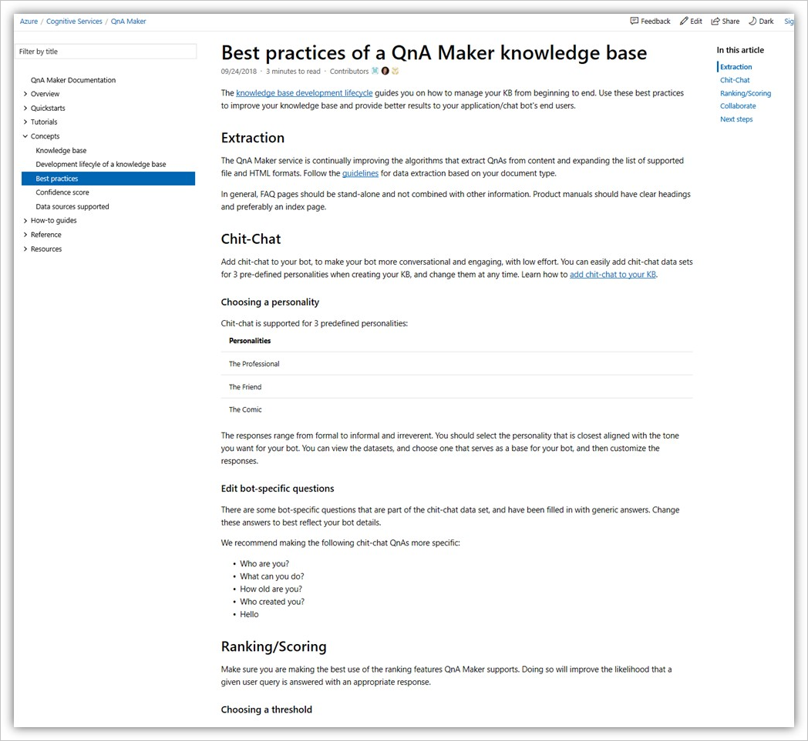

# URLs supported for importing documents

Understand how the types of URLs are used to import and create QnA pairs.

## FAQ URLs

QnA Maker can support FAQ web pages in 3 different forms:

* Plain FAQ pages
* FAQ pages with links
* FAQ pages with a Topics Homepage

### Plain FAQ pages

This is the most common type of FAQ page, in which the answers immediately follow the questions in the same page.

Below is an example of a plain FAQ page:

### FAQ pages with links

In this type of FAQ page, questions are aggregated together and are linked to answers that are either in different sections of the same page, or in different pages.

Below is an example of an FAQ page with links in sections that are on the same page:

 

### Parent Topics page links to child answers pages

This type of FAQ has a Topics page where each topic is linked to a corresponding set of questions and answers on a different page. QnA Maker crawls all the linked pages to extract the corresponding questions & answers.

Below is an example of a Topics page with links to FAQ sections in different pages.

 

## Support URLs

QnA Maker can process semi-structured support web pages, such as web articles that would describe how to perform a given task, how to diagnose and resolve a given problem, and what are the best practices for a given process. Extraction works best on content that has a clear structure with hierarchical headings.

> [!NOTE]
> Extraction for support articles is a new feature and is in early stages. It works best for simple pages, that are well structured, and do not contain complex headers/footers.

