# Markdown format supported in QnA Maker answer text

QnA Maker stores answer text as markdown. There are many flavors of markdown. In order to make sure the answer text is returned and displayed correctly, use this reference.

Use the **[CommonMark](https://commonmark.org/help/tutorial/index.html)** tutorial to validate your Markdown. The tutorial has a **Try it** feature for quick copy/paste validation.

## When to use rich-text editing versus markdown

[Rich-text editing](How-To/edit-knowledge-base.md#add-an-editorial-qna-set) of answers allows you, as the author, to use a formatting toolbar to quickly select and format text.

Markdown is a better tool when you need to autogenerate content to create knowledge bases to be imported as part of a CI/CD pipeline or for [batch testing](Quickstarts/batch-testing.md).

## Supported markdown format

Following is the list of markdown formats that you can use in QnA Maker's answer text.

|Purpose|Format|Example markdown|Rendering as displayed in Chat bot|
|--|--|--|--|
A new line between 2 sentences.|`\n\n`|`How can I create a bot with \n\n QnA Maker?`|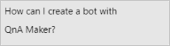|
|Headers from h1 to h6, the number of `#` denotes which header. 1 `#` is the h1.|`\n# text \n## text \n### text \n####text \n#####text` |`## Creating a bot \n ...text.... \n### Important news\n ...text... \n### Related Information\n ....text...`  `\n# my h1 \n## my h2\n### my h3 \n#### my h4 \n##### my h5`| 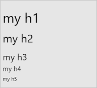|
|Italics |`*text*`|`How do I create a bot with *QnA Maker*?`|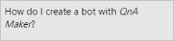|
|Strong (bold)|`**text**`|`How do I create a bot with **QnA Maker**?`|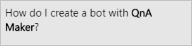|
|URL for link|`[text](https://www.my.com)`|`How do I create a bot with [QnA Maker](https://www.qnamaker.ai)?`|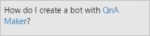|
|*URL for public image|``|`How can I create a bot with `|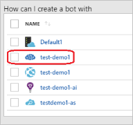|
|Strikethrough|`~~text~~`|`some ~~questoins~~ questions need to be asked`|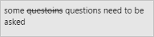|
|Bold and italics|`***text***`|`How can I create a ***QnA Maker*** bot?`||
|Bold URL for link|`[**text**](https://www.my.com)`|`How do I create a bot with [**QnA Maker**](https://www.qnamaker.ai)?`|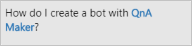|
|Italics URL for link|`[*text*](https://www.my.com)`|`How do I create a bot with [*QnA Maker*](https://www.qnamaker.ai)?`|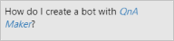|
|Escape markdown symbols|`\*text\*`|`How do I create a bot with \*QnA Maker\*?`|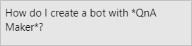|
|Ordered list|`\n 1. item1 \n 1. item2`|`This is an ordered list: \n 1. List item 1 \n 1. List item 2` The preceding example uses automatic numbering built into markdown. `This is an ordered list: \n 1. List item 1 \n 2. List item 2` The preceding example uses explicit numbering.|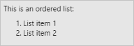|
|Unordered list|`\n * item1 \n * item2` or `\n - item1 \n - item2`|`This is an unordered list: \n * List item 1 \n * List item 2`|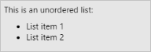|
|Nested lists|`\n * Parent1 \n\t * Child1 \n\t * Child2 \n * Parent2`  `\n * Parent1 \n\t 1. Child1 \n\t * Child2 \n 1. Parent2`  You can nest ordered and unordered lists together. The tab, `\t`, indicates the indentation level of the child element.|`This is an unordered list: \n * List item 1 \n\t * Child1 \n\t * Child2 \n * List item 2`  `This is an ordered nested list: \n 1. Parent1 \n\t 1. Child1 \n\t 1. Child2 \n 1. Parent2`| 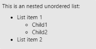|

*QnA Maker doesn't process the image in any way. It is the client application's role to render the image.

If you want to add content using update/replace knowledge base APIs and the content/file contains html tags, you can preserve the HTML in your file by ensuring that opening and closing of the tags are converted in the encoded format.

| Preserve HTML  | Representation in the API request  | Representation in KB |
|-----------|---------|-------------------------|
| Yes | \&lt;br\&gt; | &lt;br&gt; |
| Yes | \&lt;h3\&gt;header\&lt;/h3\&gt; | &lt;h3&gt;header&lt;/h3&gt; |

Additionally, CR LF(\r\n) are converted to \n in the KB. LF(\n) is kept as is. If you want to escape any escape sequence like a \t or \n you can use backslash, for example: '\\\\r\\\\n' and '\\\\t'

## Next steps

Review batch testing [file formats](reference-tsv-format-batch-testing.md).
