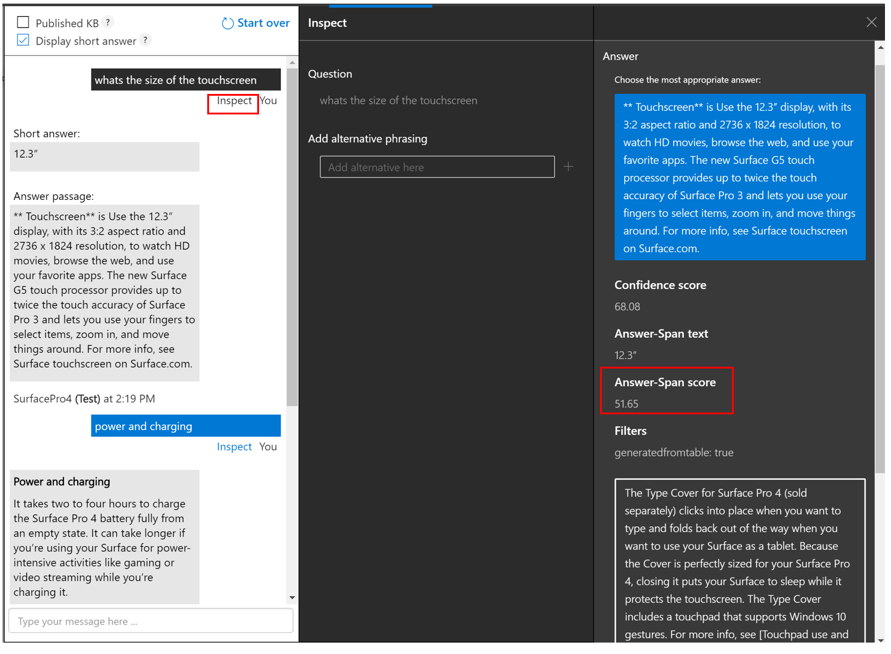

# Precise answering

The precise answering feature introduced in QnA Maker managed (Preview), allows you to get the precise short answer from the best candidate answer passage present in the knowledge-base for any user query. This feature uses a deep learning model which on runtime, which understands the intent of the user query and 
detects the precise short answer from the answer passage, if there is a short answer present as a fact in the answer passage. 

This feature is on by-default in the test pane, so that you can test the functionality specific to your scenario. This feature is extremely beneficial for both content developers as well as 
end users. Now, content developers don't need to manually curate specific QnA pairs for every fact present in the knowledge-base, and the end user doesn't need to look through the whole answer passage returned from the service to find the actual fact that answers the user's query. You can fetch [precise answers via the Generate Answer API](How-To/metadata-generateanswer-usage.md#get-precise-answers-with-generateanswer-api).

## Precise answering on QnA Maker portal

In the QnA Maker portal, when you open the test-pane, you will see an option to **Display short answer** on the top. This option will be selected by-default. 
When you enter a query in the test pane, you will see a short-answer along with the answer passage, if there is a short answer present in the answer passage.
 

You can unselect the **Display short answer** option, if you want to see only the answer passage in the test pane. 

The service also returns back the confidence score of the precise answer as an **Answer-span score** which you can check by selecting the **Inspect** option present just below the query in the test pane.

## Publishing a QnA Maker bot

When you publish a bot, you get the precise answer enabled experience by default in your application, where you will see short answer along with the answer passage. Refer to the API reference for [Generate Answer](/rest/api/cognitiveservices/qnamakerv5.0-preview.1/knowledgebase/generateanswer#answerspan) to see how to use the precise answer (called AnswerSpan) in the response. User has the flexibility to choose other experiences by updating the template through the Bot app service. 

## Language support

Currently the precise answer feature is only supported for English.
