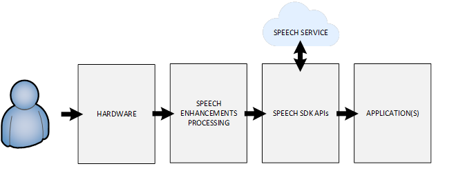
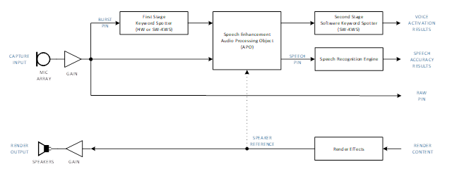

# Speech Service Architecture
Microsoft Speech Recognition devices are configured with below components.

This specification will provide a framework to test the system-level speech recognition performance as provided to applications from defined user scenarios, in addition to guidance and testing for sub-systems where applicable.
The signal paths and architecture used for testing a Microsoft Windows Speech Platform device is described below:  
  
 

Capture streams represent audio signals acquired by integrated microphone(s), and pre-processed for use by a speech recognition engine or keyword spotter.
Render streams represent audio signals destined for playback via device speakers or playback accessories, and enable echo cancellation algorithm functionality.

# Speech Enhancements Processing

Microsoft provides speech enhancement processing using the Microsoft Audio Stack (MAS) in Windows 10 and Speech SDK devices.  The MAS includes signal processing enhancements, pre-tuned and optimized for SR:
* Stereo Acoustic Echo Cancellation (AEC) and Echo Suppression (ES)
* Adaptive Beam forming (BF) for a variety of Microphone Array configurations
* Stationary Noise Suppression (NS)
* Voice Activity Detection (VAD) and Automatic Gain Control (AGC)

Device manufacturers may elect to integrate and tune custom speech enhancement processing into their devices instead.  The MAS will be applied by default in Windows devices, unless the audio driver correctly exposes custom speech pre-processing.
Devices that use Linux and Android may need to implement custom speech pre-processing, depending on the microphone array geometry chosen.  For more details, refer to the companion specification **Microsoft Speech Platform: Hardware Guidelines**.

> Note:
Many SR devices also include voice communication features.  While communications tuning focuses on optimizing intelligibility and conversational voice quality, SR performance does not necessarily align to human perceptual norms as the end consumer is an algorithmic, machine-learned model.
Caution is advised.  Audio enhancements typically used in communications (i.e. voice switching) can significantly degrade SR, while echo leakage has a greater perceptual impact to humans than to SR models

