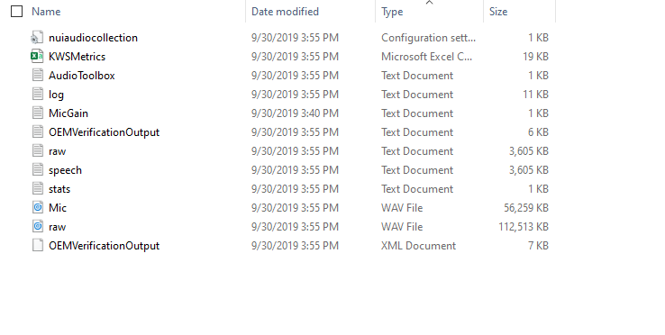

Speech Accuracy(SA)/Voice Activation(CA) can be measured by using Tool chain. Using these tools, OEM can verify whether the device meet requirements defined for a valid test.

## Audio Tool Box

## Audio Scorer/Score Utility

Manufacturer : Microsoft 
Version      : 7.0.0.1 
Released on  : 10/31/2019

The scoring utility is provided with the Speech Platform Toolchain, and must be installed on a x64 Windows 10 PC.  It is highly recommended to install the scoring utility on an additional PC (rather than on a Lab PC).

### Installation Steps:
1. Copy latest version from [AudioScorer 7.0.0.1]() to local drive
1. Run ScoringUtility.exe
1. After Successful installation, Run SPRLHelper.exe as **admin**

### Default Usage:
1.	Create a folder where the scoring results output shall be saved
2.	From that folder, open a command prompt
3.	Type score.cmd (parent), where “parent” is a folder with individual session sub-folders to be scored

#### Input Parameters
-model : by default Scorer will be executed by using Richland model as per 7.0.0.1 changes,however if you want to capture Score using old SPSIM lite model, pass this parameter as below
> Score "c:\Score" -model SPSIM

#### Sample input Session

**Example Recorded Session Contents:**

1. Mic.wav :  
    Recording (processed stream) used as an input for scoring.  The file must be 16kHz sampling rate, 32-bit float.  The scoring utility will only look for files named “Mic.wav” of this format when scoring.

1. OEMVerificationOutput.txt and OEMVerificationOutput.xml :               Output results from OEMVerification executable including device            configuration details.

1. Stats.txt :  
    Log for timestamps and discontinuities observed during recording.

1. KWSMetrics :  
    Metrics generated by KWSMetricsCapture

**Example Command Line with Result:**

**Example Output Folder**

## OEM Verification Tool

## KWS Metrics Capture

