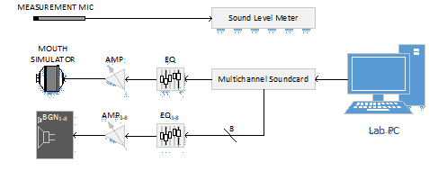
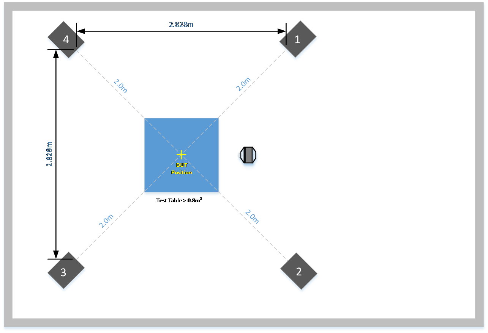
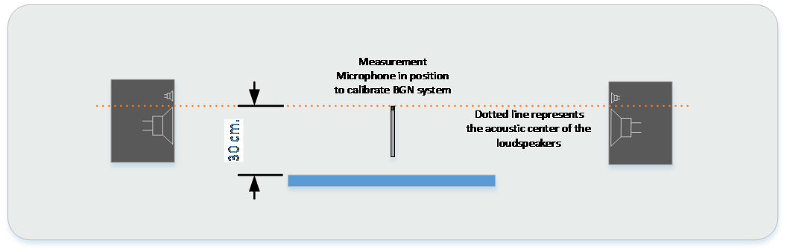

## How to Setup your Equipment

#### Test Equipment Requirements

<table Border="1">
<tr>
<th align="left">Test Equipment</th>
<th align="left">Requirement</th>
<th align="left">Recommended Equipment</th>
</tr>

<tr>
<td><b>Measurement Microphone</td>
<td>Free Field, Class 1 (IEC 61672)</td>
<td>NTI M2230</td>
</tr>
<tr>
<td><b>Sound Level Meter</td>
<td>IEC 61672-1</td>
<td>NTI XL2</td>
</tr>
<tr>
<td><b>Mouth Simulator + Amplifier</td>
<td>ITU-T Rec. P.51</td>
<td>B&K 4227A or GRAS 44AB (built-in amps)</td>
</tr>
<tr>
<td><b>EQ for Mouth Simulator</td>
<td>±0.5 dB, 160 – 8k Hz, 3rd Octave</td>
<td>31-band Graphic EQ or SW-based EQ</td>
</tr>
<tr>
<td><b>BGN Speakers + Amplifiers</td>
<td RowSpan="2">±3 dB, 160 – 8k Hz, 3rd Octave</td>
<td>Low-THD, i.e. powered Neumann KH120A0</td>
</tr>
<tr>
<td><b>EQs for BGN Speakers</td>
<td>31-band Graphic EQ or SW-based EQ</td>
</tr>
<tr>
<td><b>Multichannel Soundcard</td>
<td>9+ Channels Output</td>
<td>RME Fireface 802, UFX, or UCX</td>
</tr>
</table>

The signal flow of the test equipment is illustrated below:

## How to Setup Your Test Environment

#### Test Environment Requirements
This room required for testing is based on the [ETSI ES 202 396-1 : Section 6](http://aka.ms/es202-396-1) specification, with slight modifications (reduced upper limit for reverberation time).  Reverberation time can be reduced through the installation of removable or fixed absorptive (i.e. acoustic foam) panels covering reflective surfaces.

<table Border="2">
<tr>
<th align="left">Test environment</th>
<th align="left">Requirement</th>
</tr>

<tr>
<td><b>Room Dimensions</td>
<td><b>Min (L x W)</b> 2.7m x 3.7m, <b>Height</b> > 2.2m</td>
</tr>
<tr>
<td><b>Room Isolation</td>
<td><b>Min</b> STC > 50, <b>Recommended</b> STC > 60</td>
</tr>
<tr>
<td><b>Room Noise Floor</td>
<td><b>Max</b> 35 dBSPL(A), <b>Recommended</b> < 28 dBSPL(A)</td>
</tr>
<tr>
<td><b>Room Acoustics</td>
<td><b>0.15s ≤ RT60avg ≤ 0.4s</b>, Octave Bands 100-8000Hz per Table Below:

<table Border="1">
<th>Octave Band(Hz)</th>
<th>Lower Limit (RT60, s)</th>
<th>Upper Limit (RT60, s)</th>

<tr>
<td align="center"><b>250</td>
<td align="center">150</td>
<td align="center">600</td>
</tr>
<tr>
<td align="center"><b>500</td>
<td align="center">150</td>
<td align="center">400</td>
</tr>
<tr>
<td align="center"><b>1000</td>
<td align="center">150</td>
<td align="center">350</td>
</tr>
<tr>
<td align="center"><b>2000</td>
<td align="center">150</td>
<td align="center">350</td>
</tr>
<tr>
<td align="center"><b>4000</td>
<td align="center">150</td>
<td align="center">350</td>
</tr>
<tr>
<td align="center"><b>8000</td>
<td align="center">150</td>
<td align="center">300</td>
</tr>
</table>
</td>
</tr>
</table>

#### Test room Topology
The required test setup is shown below:

**Top View:**

**DUT Position** is 30cm above the center of the table, while maintaining a 2m distance from each BGN speaker.  The recommended table height is 80cm to 90cm, and should maintain relative height to speakers for all devices.

The side view of BGN test setup and microphone calibration position (i.e. “DUT Position” is shown below):

Consult the manufacturer specifications to determine the acoustic center of BGN loudspeakers.