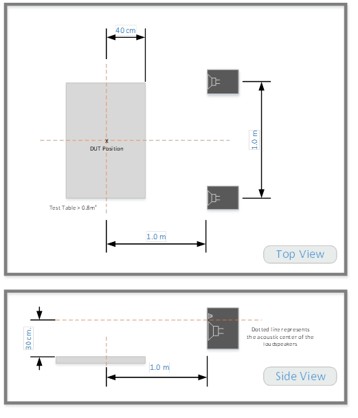

Voice activations that falsely occur when a keyword is not spoken provide a poor user experience.  False Accept testing is required for KWS platform providers only.

#### Requirements
<table border=1>
<th align="left">Release</th>
<th align="left">Requirement</th>

<tr>
<td>V6 Specification</td>
<td>≤ 5 FA per 100 hours of continuous speech, tested for every supported locale</td>
</tr>
</table>

#### Test Position
The playback level of FA material presented to the device is calibrated to be 65 dBA @ the DUT position indicated below.  The device is centered in the table, as described per device categories relative to the DUT position:

