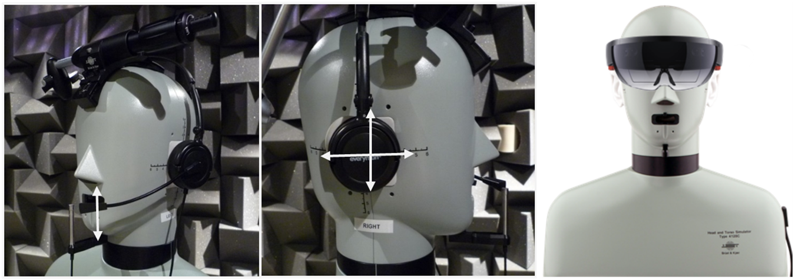
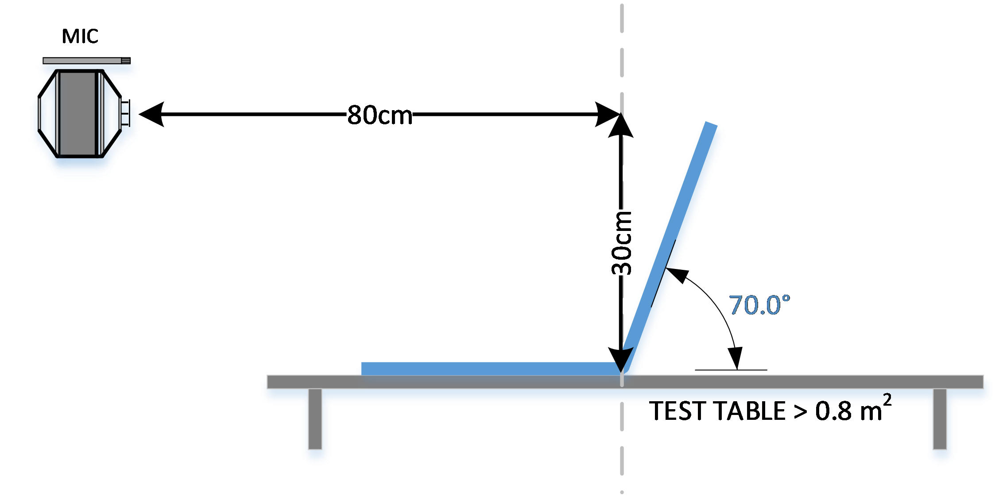
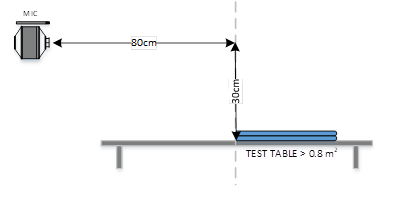
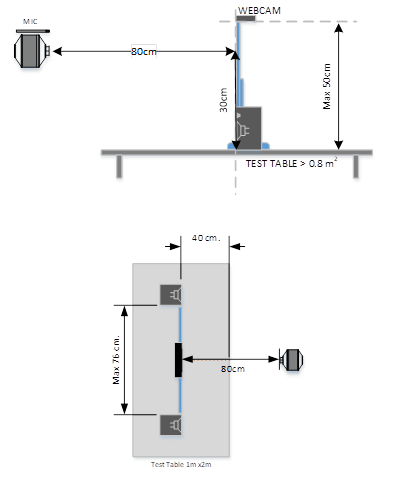
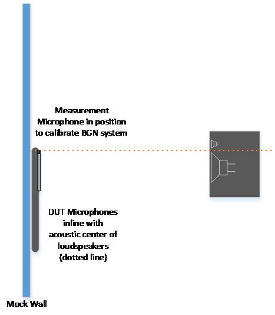
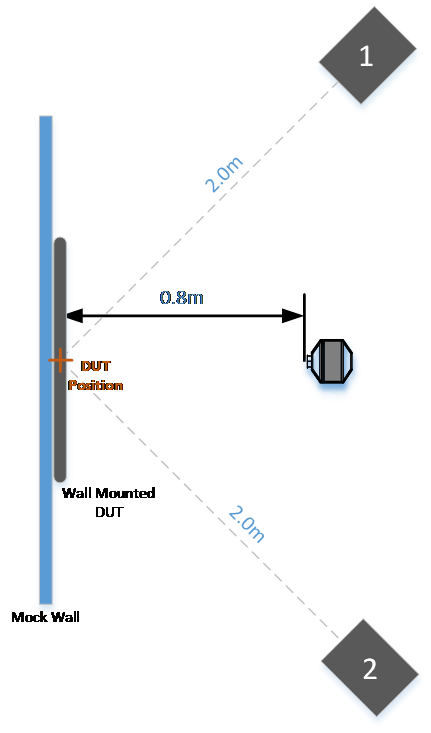

#### Head Mount Devices
Devices must be tested using an ITU-T P.58 HATS, and placement should closely resemble the intended positioning on a real human.  Adjustable microphones should be placed as close to the mouth as reasonably possible, and any earpiece(s) should be centered and sealed where possible on the ear(s).  Documentation of testing/wearing position is recommended to ensure repeatability.

#### Near Field Devices
The device shall be tested at a **distance of 0.8m** from the talker for each scenario at __**0° and 50°**__ angles of incidence.

<table>
<th align="left">Device</th>
<th align="left">Reference Diagram</th>
<th align="left">Notes</th>

<tr>
<td align="center"><b>Laptop</td>
<td></td>
<td>Mouth MRP to fulcrum of laptop (or tablet bottom edge) = 0.8m

Lid open @ 70°

Laptop fulcrum (or tablet bottom edge) centered on table > 0.8m2, min distance from fulcrum to edge = 0.4m
</td>
</tr>
<tr>
<td align="center"><b>Laptop

Lid Closed</b></td>
<td></td>
<td>Mouth MRP to top edge of closed laptop = 0.8m

Laptop edge centered on table > 0.8m2, min distance from laptop to table edge = 0.4m

Lid closed is tested at the discretion of OEMs 
</td>
</tr>
<tr>
<td align="center"><b>AIO PC or Monitor</b></td>
<td></td>
<td>Mouth MRP to display front = 0.8m, Mouth MRP 0.3m above table

Display centered on table >0.8m2, min distance to edge = 0.4m
</td>
</tr>
<tr>
<td align="center"><b>Webcam</b></td>
<td></td>
<td>Webcam placed on top of monitor (≤ 0.5m height).  Recommend 27” monitor.

Self-powered low-THD speakers used to test echo cancellation, driven by a PC with low latency interface.  Recommend Neumann KH120 via Surface Pro headset line out.

Speaker distance ≤ 76 cm from inner edges

</td>
</tr>
<tr>
<td align="center"><b>Personal Speaker</b></td>
<td></td>
<td>Speaker centered on a table >0.8m2, min distance from center to edge = 0.4m

Mouth MRP to center axis of speaker = 0.8m, Mouth MRP 0.3m above table

</td>
</tr>
<tr>
<td rowSpan="2" align="center"><b>Wall Mount Devices</b></td>
<td></td>
<td rowspan"2">Mock Wall should be constructed with > 1” thick plywood

The recommended size is 1m x 1m or larger, with the microphone array centered

The DUT microphones are centered at the DUT position

Only the front channels of the BGN system are active (Speakers 3 and 4 will be muted for testing)

Note that noise playback level should be calibrated with the wall in place, while noise equalization is performed without the wall.  Mouth calibration is performed without the wall.
</td>
</tr>
<tr>
<td></td>
</tr>
</table>

#### Far Field Devices

The device shall be tested at a **distance of 4m** from the talker for each scenario at **0° and 50°** angles of incidence.  Due to common lab size constraints, an acceptable simulation of the 4m far field test distance is a **2m distance with a reduced speech level of 95 dBSPL(A).** 
 
***Please consult the test positions shown for Near Field Devices, substituting the 0.8m distance to the mouth simulator for 4m (or 2m simulated). The far field echo level is still calibrated at 0.8m, however.***

#### Far Field 360° Devices
The device shall be tested at a **distance of 4m** from the talker for each scenario at **0°, 50°, 180°** angles of incidence.  Due to common lab size constraints, an acceptable simulation of the 4m far field test distance is a **2m distance with a reduced speech level of 95 dBSPL(A).**

***Please consult the test positions shown for Near Field Devices, substituting the 0.8m distance to the mouth simulator for 4m (or 2m simulated). The far field echo level is still calibrated at 0.8m, however***
