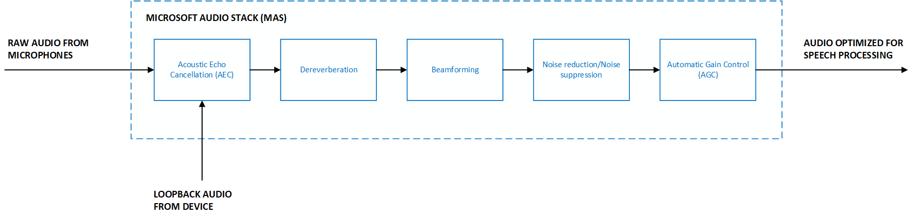

# Audio processing

Audio processing refers to enhancements applied to a stream of audio with a goal of improving the audio quality. A set of enhancements combined are often called an audio processing stack. The goal of improving audio quality can be further segmented into different scenarios like speech processing and telecommunications. Examples of common enhancements include automatic gain control (AGC), noise suppression, and acoustic echo cancellation (AEC).

Different scenarios/use-cases require different optimizations that influence the behavior of the audio processing stack. For example, in telecommunications scenarios such as telephone calls, it is acceptable to have minor distortions in the audio signal after processing has been applied. This is because humans can continue to understand the speech with high accuracy. However, it is unacceptable and disruptive for a person to hear their own voice in an echo. This contrasts with speech processing scenarios, where distorted audio can adversely impact a machine-learned speech recognition model’s accuracy, but it is acceptable to have minor levels of echo residual.

## Microsoft Audio Stack

The Microsoft Audio Stack is a set of enhancements optimized for speech processing scenarios. This includes examples like keyword recognition and speech recognition. It consists of various enhancements/components that operate on the input audio signal:

* **Noise suppression** - Reduce the level of background noise.
* **Beamforming** - Localize the origin of sound and optimize the audio signal using multiple microphones.
* **Dereverberation** - Reduce the reflections of sound from surfaces in the environment.
* **Acoustic echo cancellation** - Suppress audio being played out of the device while microphone input is active.
* **Automatic gain control** - Dynamically adjust the person’s voice level to account for soft speakers, long distances, or non-calibrated microphones.

The Microsoft Audio Stack powers a wide range of Microsoft’s products:
* **Windows** - Microsoft Audio Stack is the default speech processing pipeline when using the Speech audio category. 
* **Microsoft Teams Displays and Microsoft Teams Room devices** - Microsoft Teams Displays and Teams Room devices use the Microsoft Audio Stack to enable high quality hands-free, voice-based experiences with Cortana.

### Pricing

There is no cost to using the Microsoft Audio Stack with the Speech SDK.

### Minimum requirements to use Microsoft Audio Stack

Microsoft Audio Stack can be used by any product or application that can meet the following requirements:
* **Raw audio** - Microsoft Audio Stack requires raw (i.e., unprocessed) audio as input to yield the best results. Providing audio that is already processed limits the audio stack’s ability to perform enhancements at high quality.
* **Microphone geometries** - Geometry information about each microphone on the device is required to correctly perform all enhancements offered by the Microsoft Audio Stack. Information includes the number of microphones, their physical arrangement, and coordinates. Up to 16 input microphone channels are supported. 
* **Loopback or reference audio** - An audio channel that represents the audio being played out of the device is required to perform acoustic echo cancellation. 
* **Input format** - Microsoft Audio Stack supports downsampling for sample rates that are integral multiples of 16 kHz. A minimum sampling rate of 16 kHz is required. Additionally, the following formats are supported: 32-bit IEEE little endian float, 32-bit little endian signed int, 24-bit little endian signed int, 16-bit little endian signed int, and 8-bit signed int.

## Next steps

* [Learn more about the Speech SDK integration of Microsoft Audio Stack.](audio-processing-speech-sdk.md)
