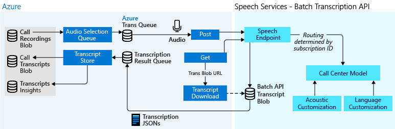
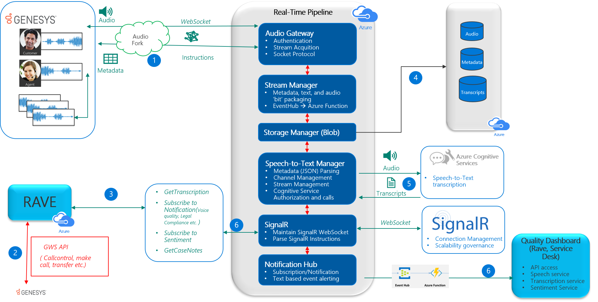

# Speech service for telephony data

Telephony data that is generated through landlines, mobile phones, and radios are typically low quality, and narrowband in the range of 8 KHz, which creates challenges when converting speech-to-text. The latest speech recognition models from the Speech service excel at transcribing this telephony data, even in cases when the data is difficult for a human to understand. These models are trained with large volumes of telephony data, and have best-in-market recognition accuracy, even in noisy environments.

A common scenario for speech-to-text is transcribing large volumes of telephony data that may come from various systems, such as Interactive Voice Response (IVR). The audio these systems provide can be stereo or mono, and raw with little-to-no post processing done on the signal. Using the Speech service and the Unified speech model, a business can get high-quality transcriptions, whatever systems are used to capture audio.

Telephony data can be used to better understand your customers' needs, identify new marketing opportunities, or evaluate the performance of call center agents. After the data is transcribed, a business can use the output for purposes such as improved telemetry, identifying key phrases, or analyzing customer sentiment.

The technologies outlined in this page are by Microsoft internally for various support call processing services, both in real-time and batch mode.

Let's review some of the technology and related features the Speech service offers.

> [!IMPORTANT]
> The Speech service Unified model is trained with diverse data and offers a single-model solution to a number of scenario from Dictation to Telephony analytics.

## Azure Technology for Call Centers

Beyond the functional aspect of the Speech service features, their primary purpose – when applied to the call center – is to improve the customer experience. Three clear domains exist in this regard:

- Post-call analytics, which is essentially batch processing of call recordings after the call.
- Real-time analytics, which is processing of the audio signal to extract various insights as the call is taking place (with sentiment being a prominent use case).
- Voice assistants (bots), either driving the dialogue between the customer and the bot in an attempt to solve the customer's issue with no agent participation, or being the application of artificial intelligence (AI) protocols to assist the agent.

A typical architecture diagram of the implementation of a batch scenario is depicted in the picture below

## Speech Analytics Technology Components

Whether the domain is post-call or real-time, Azure offers a set of mature and emerging technologies to improve the customer experience.

### Speech to text (STT)

[Speech-to-text](speech-to-text.md) is the most sought-after feature in any call center solution. Because many of the downstream analytics processes rely on transcribed text, the word error rate (_WER_) is of utmost importance. One of the key challenges in call center transcription is the noise that’s prevalent in the call center (for example other agents speaking in the background), the rich variety of language locales and dialects as well as the low quality of the actual telephone signal. WER is highly correlated with how well the acoustic and language models are trained for a given locale, thus the ability to customize the model to your locale is important. Our latest Unified version 4.x models are the solution to both transcription accuracy and latency. Trained with tens of thousands of hours of acoustic data and billions of lexical information, Unified models are the most accurate models in the market to transcribe call center data.

### Sentiment

Gauging whether the customer had a good experience is one of the most important areas of Speech analytics when applied to the call center space. Our [Batch Transcription API](batch-transcription.md) offers sentiment analysis per utterance. You can aggregate the set of values obtained as part of a call transcript to determine the sentiment of the call for both your agents and the customer.

### Silence (non-talk)

It is not uncommon for 35 percent of a support call to be what we call non-talk time. Some scenarios for which non-talk occurs are: agents looking up prior case history with a customer, agents using tools that allow them to access the customer's desktop and perform functions, customers sitting on hold waiting for a transfer, and so on. It is extremely important to gauge when silence is occurring in a call as there are number of important customer sensitivities that occur around these types of scenarios and where they occur in the call.

### Translation

Some companies are experimenting with providing translated transcripts from foreign language support calls so that delivery managers can understand the world-wide experience of their customers. Our [translation](translation.md) capabilities are unsurpassed. We can translate audio-to-audio or audio-to-text for a large number of locales.

### Text to Speech

[Text-to-speech](text-to-speech.md) is another important area in implementing bots that interact with the customers. The typical pathway is that the customer speaks, their voice is transcribed to text, the text is analyzed for intents, a response is synthesized based on the recognized intent, and then an asset is either surfaced to the customer or a synthesized voice response is generated. Of course all of this has to occur quickly – thus low-latency is an important component in the success of these systems.

Our end-to-end latency is considerably low for the various technologies involved such as [Speech-to-text](speech-to-text.md), [LUIS](https://azure.microsoft.com/services/cognitive-services/language-understanding-intelligent-service/), [Bot Framework](https://dev.botframework.com/), [Text-to-speech](text-to-speech.md).

Our new voices are also indistinguishable from human voices. You can use our voices to give your bot its unique personality.

### Search

Another staple of analytics is to identify interactions where a specific event or experience has occurred. This is typically done with one of two approaches; either an ad hoc search where the user simply types a phrase and the system responds, or a more structured query where an analyst can create a set of logical statements that identify a scenario in a call, and then each call can be indexed against that set of queries. A good search example is the ubiquitous compliance statement "this call shall be recorded for quality purposes... ". Many companies want to make sure that their agents are providing this disclaimer to customers before the call is actually recorded. Most analytics systems have the ability to trend the behaviors found by query/search algorithms, and this reporting of trends is ultimately one of the most important functions of an analytics system. Through [Cognitive services directory](https://azure.microsoft.com/services/cognitive-services/directory/search/) your end to end solution can be significantly enhanced with indexing and search capabilities.

### Key Phrase Extraction

This area is one of the more challenging analytics applications and one that is benefiting from the application of AI and machine learning. The primary scenario in this case is to infer customer intent. Why is the customer calling? What is the customer problem? Why did the customer have a negative experience? Our [text analytics service](https://azure.microsoft.com/services/cognitive-services/text-analytics/) provides a set of analytics out of the box for quickly upgrading your end-to-end solution for extracting those important keywords or phrases.

Let's now have a look at the batch processing and the real-time pipelines for speech recognition in a bit more detail.

## Batch transcription of call center data

For transcribing bulk audio we developed the [Batch Transcription API](batch-transcription.md). The Batch Transcription API was developed to transcribe large amounts of audio data asynchronously. With regard to transcribing call center data, our solution is based on these pillars:

- **Accuracy** - With fourth-generation Unified models, we offer unsurpassed transcription quality.
- **Latency** - We understand that when doing bulk transcriptions, the transcriptions are needed quickly. The transcription jobs initiated via the [Batch Transcription API](batch-transcription.md) will be queued immediately, and once the job starts running it's performed faster than real-time transcription.
- **Security** - We understand that calls may contain sensitive data. Rest assured that security is one of our highest priorities. Our service has obtained ISO, SOC, HIPAA, PCI certifications.

Call centers generate large volumes of audio data on a daily basis. If your business stores telephony data in a central location, such as Azure Storage, you can use the [Batch Transcription API](batch-transcription.md) to asynchronously request and receive transcriptions.

A typical solution uses these services:

- The Speech service is used to transcribe speech-to-text. A standard subscription (S0) for the Speech service is required to use the Batch Transcription API. Free subscriptions (F0) will not work.
- [Azure Storage](https://azure.microsoft.com/services/storage/) is used to store telephony data, and the transcripts returned by the Batch Transcription API. This storage account should use notifications, specifically for when new files are added. These notifications are used to trigger the transcription process.
- [Azure Functions](https://docs.microsoft.com/azure/azure-functions/) is used to create the shared access signatures (SAS) URI for each recording, and trigger the HTTP POST request to start a transcription. Additionally, Azure Functions is used to create requests to retrieve and delete transcriptions using the Batch Transcription API.

Internally we are using the above technologies to support Microsoft customer calls in Batch mode.
:::image type="content" source="media/scenarios/call-center-batch-pipeline.png" alt-text="Technologies used to support Microsoft customer calls in Batch mode.":::

## Real-time transcription for call center data

Some businesses are required to transcribe conversations in real-time. Real-time transcription can be used to identify key-words and trigger searches for content and resources relevant to the conversation, for monitoring sentiment, to improve accessibility, or to provide translations for customers and agents who aren't native speakers.

For scenarios that require real-time transcription, we recommend using the [Speech SDK](speech-sdk.md). Currently, speech-to-text is available in [more than 20 languages](language-support.md), and the SDK is available in C++, C#, Java, Python, Node.js, Objective-C, and JavaScript. Samples are available in each language on [GitHub](https://github.com/Azure-Samples/cognitive-services-speech-sdk). For the latest news and updates, see [Release notes](releasenotes.md).

Internally we are using the above technologies to analyze in real-time Microsoft customer calls as they happen, as illustrated in the following diagram.

## A word on IVRs

The Speech service can be easily integrated in any solution by using either the [Speech SDK](speech-sdk.md) or the [REST API](rest-apis.md). However, call center transcription may require additional technologies. Typically, a connection between an IVR system and Azure is required. Although we do not offer such components, here is a description what a connection to an IVR entails.

Several IVR or telephony service products (such as Genesys or AudioCodes) offer integration capabilities that can be leveraged to enable inbound and outbound audio pass-through to an Azure service. Basically, a custom Azure service might provide a specific interface to define phone call sessions (such as Call Start or Call End) and expose a WebSocket API to receive inbound stream audio that is used with the Speech service. Outbound responses, such as conversation transcription or connections with the Bot Framework, can be synthesized with Microsoft's text-to-speech service and returned to the IVR for playback.

Another scenario is direct integration with Session Initiation Protocol (SIP). An Azure service connects to a SIP Server, thus getting an inbound stream and an outbound stream, which is used for the speech-to-text and text-to-speech phases. To connect to a SIP Server there are commercial software offerings, such as Ozeki SDK, or [the Teams calling and meetings API](/graph/api/resources/communications-api-overview) (currently in beta), that are designed to support this type of scenario for audio calls.

## Customize existing experiences

 The Speech service works well with built-in models. However, you may want to further customize and tune the experience for your product or environment. Customization options range from acoustic model tuning to unique voice fonts for your brand. After you've built a custom model, you can use it with any of the Speech service features in real-time or batch mode.

| Speech service | Model | Description |
| -------------- | ----- | ----------- |
| Speech-to-text | [Acoustic model](how-to-customize-acoustic-models.md) | Create a custom acoustic model for applications, tools, or devices that are used in particular environments like in a car or on a factory floor, each with specific recording conditions. Examples include accented speech, specific background noises, or using a specific microphone for recording. |
|                | [Language model](how-to-customize-language-model.md) | Create a custom language model to improve transcription of industry-specific vocabulary and grammar, such as medical terminology, or IT jargon. |
|                | [Pronunciation model](how-to-customize-pronunciation.md) | With a custom pronunciation model, you can define the phonetic form and display for a word or term. It's useful for handling customized terms, such as product names or acronyms. All you need to get started is a pronunciation file, which is a simple `.txt` file. |
| Text-to-speech | [Voice font](how-to-customize-voice-font.md) | Custom voice fonts allow you to create a recognizable, one-of-a-kind voice for your brand. It only takes a small amount of data to get started. The more data that you provide, the more natural and human-like your voice font will sound. |

## Sample code

Sample code is available on GitHub for each of the Speech service features. These samples cover common scenarios like reading audio from a file or stream, continuous and single-shot recognition, and working with custom models. Use these links to view SDK and REST samples:

- [Speech-to-text and speech translation samples (SDK)](https://github.com/Azure-Samples/cognitive-services-speech-sdk)
- [Batch transcription samples (REST)](https://github.com/Azure-Samples/cognitive-services-speech-sdk/tree/master/samples/batch)
- [Text-to-speech samples (REST)](https://github.com/Azure-Samples/Cognitive-Speech-TTS)

## Reference docs

- [Speech SDK](speech-sdk-reference.md)
- [Speech Devices SDK](speech-devices-sdk.md)
- [REST API: Speech-to-text](rest-speech-to-text.md)
- [REST API: Text-to-speech](rest-text-to-speech.md)
- [REST API: Batch transcription and customization](https://westus.cris.ai/swagger/ui/index)

## Next steps

> [!div class="nextstepaction"]
> [Get a Speech service subscription key for free](get-started.md)
