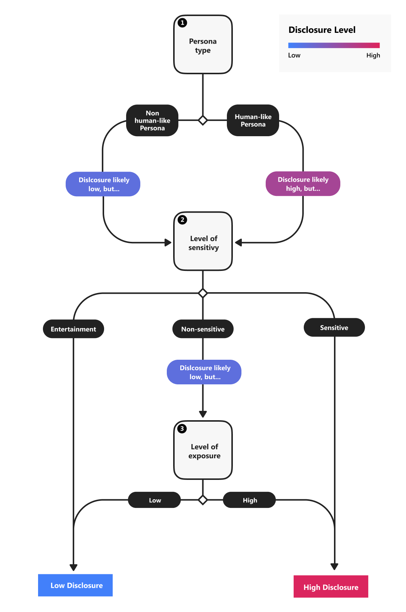

# Disclosure design guidelines
Learn how to build and maintain trust with customers by being transparent about the synthetic nature of your voice experience.

## What is disclosure?

Disclosure is a means of letting people know they&#39;re interacting with or listening to a voice that is synthetically generated.

## Why is disclosure necessary?

The need to disclose the synthetic origins of a computer-generated voice is relatively new. In the past, computer-generated voices were obviously that—no one would ever mistake them for a real person. Every day, however, the realism of synthetic voices improves, and they become increasingly indistinguishable from human voices.

## Goals
These are the principles to keep in mind when designing synthetic voice experiences:

**Reinforce trust**
 Design with the intention to fail the Turing Test without degrading the experience. Let the users in on the fact that they're interacting with a synthetic voice while allowing them to  engage seamlessly with the experience.

**Adapt to context of use**
 Understand when, where, and how your users will interact with the synthetic voice to provide the right type of disclosure at the right time.

**Set clear expectations**
 Allow users to easily discover and understand the capabilities of the agent. Offer opportunities to learn more about synthetic voice technology upon request.

**Embrace failure**
 Use moments of failure to reinforce the capabilities of the agent.

## How to use this guide

This guide helps you determine which disclosure patterns are best fit for your synthetic voice experience. We then offer examples of how and when to use them. Each of these patterns is designed to maximize transparency with users about synthetic speech while staying true to human-centered design.

Considering the vast body of design guidance on voice experiences, we focus here specifically on:

1. [**Disclosure assessment**](#disclosure-assessment): A process to determine the type of disclosure recommended for your synthetic voice experience

2. [**How to disclose**](concepts-disclosure-patterns.md): Examples of disclosure patterns that can be applied to your synthetic voice experience

3. [**When to disclose**](concepts-disclosure-patterns.md#when-to-disclose): Optimal moments to disclose throughout the user journey

## Disclosure assessment
Consider your users&#39; expectations about an interaction and the context in which they will experience the voice. If the context makes it clear that a synthetic voice is &quot;speaking,&quot; disclosure may be minimal, momentary, or even unnecessary. The main types of context that affect disclosure include persona type, scenario type, and level of exposure. It also helps to consider who might be listening.

### Understand context

Use this worksheet to determine the context of your synthetic voice experience. You'll apply this in next step where you'll determine your disclosure level.

|                                    | Context of use                                                                                                                                                                                                                                                                                                                                                       | Potential Risks & Challenges                                                                                                                                                                                                                                                                                                                                                                       |
|------------------------------------|-----------------------------------------------------------------------------------------------------------------------------------------------------------------------------------------------------------------------------------------------------------------------------------------------------------------------------------------------------------------------|-----------------------------------------------------------------------------------------------------------------------------------------------------------------------------------------------------------------------------------------------------------------------------------------------------------------------------------------------------------------------------------------------------|
| **1. Persona type**               | **If any of the following apply, your persona fits under the 'Human-like Persona' category:**  <ul><li> Persona embodies a real human whether it's a fictitious representation or not. (e.g., photograph or a computer-generated rendering of a real person)  <li> The synthetic voice is based on the voice of a widely recognizable real person (e.g., celebrity, political figure) | The more human-like representations you give your persona, the more likely a user will associate it with a real person, or cause them to believe that the content is spoken by a real person rather than computer-generated. </ul>                                                                                                                                                                      |
| **2. Scenario type**            | **If any of the following apply,  your voice experience fits under the 'Sensitive' category:**  <ul><li> Obtains or displays personal information from the user    <li> Broadcasts time sensitive news/information (e.g., emergency alert)  <li> Aims to help real people communicate with each other (e.g., reads personal emails/texts)   <li> Provides medical/health assistance </ul>            | The use of synthetic voice may not feel appropriate or trustworthy to the people using it when topics are related to sensitive, personal, or urgent matters. They may also expect the same level of empathy and contextual awareness as a real human. |
| **3. Level of exposure** |**Your voice experience most likely fits under the 'High' category if:**   <ul><li>The user will hear or interact with the synthetic voice frequently or for a long duration of time </ul>                                                                                                                                                                             | The importance of being transparent and building trust with users is even higher when establishing long-term relationships.                                                                                                                                                                                                                                                                      |

### Determine disclosure level

Use the following diagram to determine whether your synthetic voice experience requires high or low disclosure based on your context of use.

  

## Reference docs

* [Disclosure for Voice Talent](https://aka.ms/disclosure-voice-talent)
* [Guidelines for Responsible Deployment of Synthetic Voice Technology](concepts-guidelines-responsible-deployment-synthetic.md)
* [Gating overview](concepts-gating-overview.md)

## Next steps

* [Disclosure design patterns](concepts-disclosure-patterns.md)
