# Disclosure design patterns
Now that you&#39;ve determined the right [level of disclosure](concepts-disclosure-guidelines.md#disclosure-assessment) for your synthetic voice experience, it&#39;s a good time to explore potential design patterns.
## Overview
There's a spectrum of disclosure design patterns you can apply to your synthetic voice experience. If the outcome of your disclosure assessment was 'High Disclosure', we recommend [**explicit disclosure**](#explicit-disclosure), which means communicating the origins of the synthetic voice outright. [**Implicit disclosure**](#implicit-disclosure) includes cues and interaction patterns that benefit voice experiences whether or not required disclosure levels are high or low.
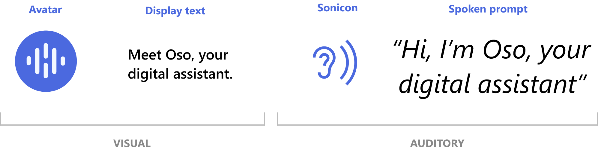

| Explicit disclosure patterns                                                                                                                                                                                    | Implicit disclosure patterns                                                                 |
|--------------------------------------------------------------------------------------------------------------------------------------------------------------------------------------------------------|-------------------------------------------------------------------------------------|
|[Transparent Introduction](#transparent-introduction)  [Verbal Transparent Introduction](#verbal-transparent-introduction)   [Explicit Byline](#explicit-byline)   [Customization and Calibration](#customization-and-calibration)  [Parental Disclosure](#parental-disclosure)  [Providing opportunities to learn more about how the voice was made](#providing-opportunities-to-learn-more-about-how-the-voice-was-made) | [Capability Disclosure](#capability-disclosure) [Implicit Cues and Feedback](#implicit-cues--feedback)  [Conversational Transparency](#conversational-transparency) |

Use the following chart to refer directly to the patterns that apply to your synthetic voice. Some of the other conditions in this chart may also apply to your scenario: 

| If your synthetic voice experience… | Recommendations | Design patterns |
| --- | --- | --- |
| Requires High Disclosure  | Use at least one explicit pattern and implicit cues up front to helps users build associations. |[Explicit Disclosure](#explicit-disclosure) [Implicit Disclosure](#implicit-disclosure)  |
| Requires Low Disclosure | Disclosure may be minimal or unnecessary, but could benefit from some implicit patterns. | [Capability Disclosure](#capability-disclosure) [Conversational Transparency](#conversational-transparency)  |
| Has a high level of engagement | Build for the long term and offer multiple entry points to disclosure along the user journey. It is highly recommended to have an onboarding experience. | [Transparent Introduction](#transparent-introduction) [Customization and Calibration](#customization-and-calibration) [Capability Disclosure](#capability-disclosure) |
| Includes children as the primary intended audience | Target parents as the primary disclosure audience and ensure that they can effectively communicate disclosure to children.  | [Parental Disclosure](#parental-disclosure) [Verbal Transparent Introduction](#verbal-transparent-introduction)  [Implicit Disclosure](#implicit-disclosure)  [Conversational Transparency](#conversational-transparency)  |
| Includes blind users or people with low vision as the primary intended audience  | Be inclusive of all users and ensure that any form of visual disclosure has associated alternative text or sound effects. Adhere to accessibility standards for contrast ratio and display size. Use auditory cues to communicate disclosure.  | [Verbal Transparent Introduction](#verbal-transparent-introduction)  [Auditory Cues](#implicit-cues--feedback) [Haptic Cues](#implicit-cues--feedback) [Conversational Transparency](#conversational-transparency) [Accessibility Standards](https://www.microsoft.com/accessibility) |
| Is screen-less, device-less or uses voice as the primary or only mode of interaction | Use auditory cues to communicate disclosure. | [Verbal Transparent Introduction](#verbal-transparent-introduction)   [Auditory Cues](#implicit-cues--feedback)  |
| Potentially includes multiple users/listeners (e.g., personal assistant in multiple household)  | Be mindful of various user contexts and levels of understanding and offer multiple opportunities for disclosure in the user journey.  | [Transparent Introduction (Return User)](#transparent-introduction)  [Providing opportunities to learn more about how the voice was made](#providing-opportunities-to-learn-more-about-how-the-voice-was-made)  [Conversational Transparency](#conversational-transparency)  |

## Explicit disclosure
If your synthetic voice experience requires high disclosure, it's best to use at least one of the following explicit patterns to clearly state the synthetic nature.
### Transparent Introduction

Before the voice experience begins, introduce the digital assistant by being fully transparent about the origins of its voice and its capabilities. The optimal moment to use this pattern is when onboarding a new user or when introducing new features to a returning user. Implementing implicit cues during an introduction helps users form a mental model about the synthetic nature of the digital agent.

#### First-time user experience

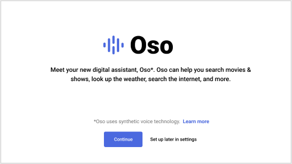  
*The synthetic voice is introduced while onboarding a new user.*

Recommendations
- Describe that the voice is artificial (e.g. &quot;digital&quot;)
- Describe what the agent is capable of doing
- Explicitly state the voice&#39;s origins
- Offer an entry point to learn more about the synthetic voice

#### Returning user experience

If a user skips the onboarding experience, continue to offer entry points to the Transparent Introduction experience until the user triggers the voice for the first time.
 

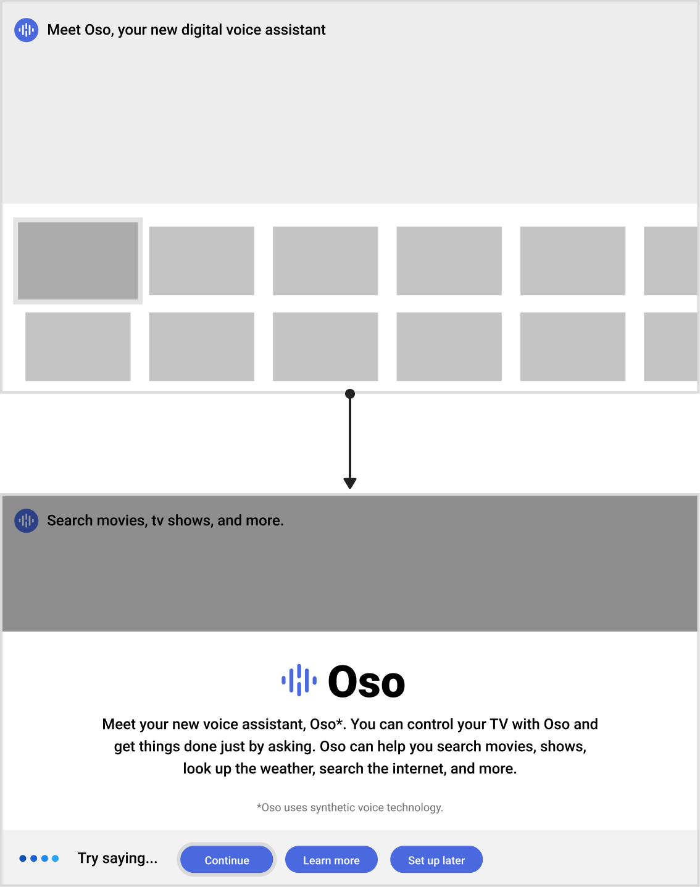 
*Provide a consistent entry point to the synthetic voice experience. Allow the user to return to the onboarding experience when they trigger the voice for the first time at any point in the user journey.*

### Verbal Transparent Introduction

A spoken prompt stating the origins of the digital assistant&#39;s voice is explicit enough on its own to achieve disclosure. This pattern is best for high disclosure scenarios where voice is the only mode of interaction available.
 

 *Use a transparent introduction when there are moments in the user experience where you might already introduce or attribute a person&#39;s voice.*

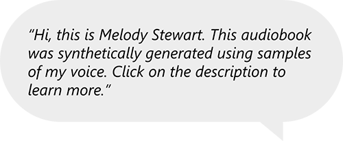 
*For additional transparency, the voice actor can disclose the origins of the synthetic voice in the first person.*

### Explicit Byline

Use this pattern if the user will be interacting with an audio player or interactive component to trigger the voice.

  
*An explicit byline is the attribution of where voice came from.*

Recommendations

- Offer entry point to learn more about the synthesized voice

### Customization and Calibration

Provide users control over how the digital assistant responds to them (i.e., how the voice sounds).  When a user interacts with a system on their own terms and with specific goals in mind, then by definition, they have already understood that it&#39;s not a real person.

#### User Control

Offer choices that have a meaningful and noticeable impact on the synthetic voice experience.

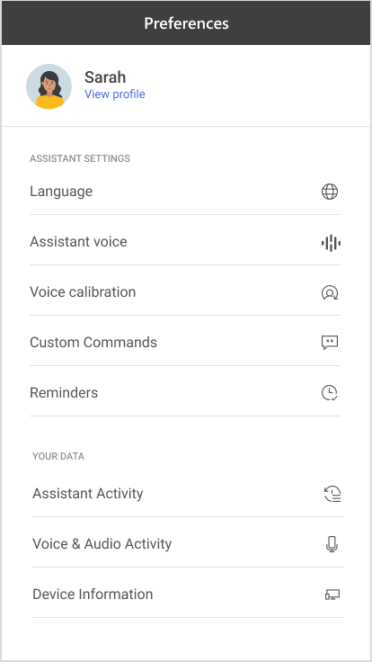 
*User preferences allow users to customize and improve their experience.*

Recommendations

- Allow users to customize the voice (e.g., select language and voice type)
- Provide users a way to teach the system to respond to his/her unique voice (e.g., voice calibration, custom commands)
- Optimize for user-generated or contextual interactions (e.g., reminders)

#### Persona Customization

Offer ways to customize the digital assistant&#39;s voice. If the voice is based on a celebrity or a widely recognizable person, consider using both visual and spoken introductions when users preview the voice.

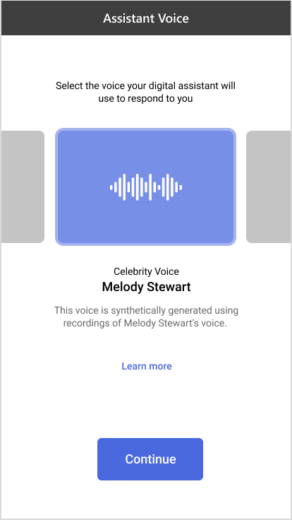 
*Offering the ability to select from a set of voices helps convey the artificial nature.*

Recommendations
- Allow users to preview the sound of each voice
- Use an authentic introduction for each voice
- Offer entry points to learn more about the synthesized voice

### Parental Disclosure

In addition to complying with COPPA regulations, provide disclosure to parents if your primary intended audience is young children and your exposure level is high. For sensitive uses, consider gating the experience until an adult has acknowledged the use of the synthetic voice. Encourage parents to communicate the message to their children.

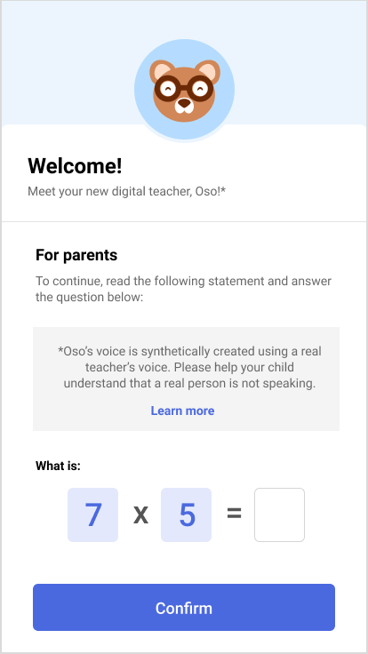 
*A transparent introduction optimized for parents ensures that an adult was made aware of the synthetic nature of the voice before a child interacts with it.*

Recommendations

- Target parents as the primary audience for disclosure
- Encourage parents to communicate disclosure to their children
- Offer entry points to learn more about the synthesized voice
- Gate the experience by asking parents a simple &quot;safeguard&quot; question to show they have read the disclosure

### Providing opportunities to learn more about how the voice was made

Offer context-sensitive entry points to a page, pop-up, or external site that provides more information about the synthetic voice technology. For example, you could surface a link to learn more during onboarding or when the user prompts for more information during conversation.

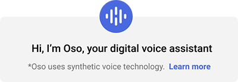 
*Example of an entry point to offer the opportunity to learn more about the synthesized voice.*

Once a user requests more information about the synthetic voice, the primary goal is to educate them about the origins of the synthetic voice and to be transparent about the technology.

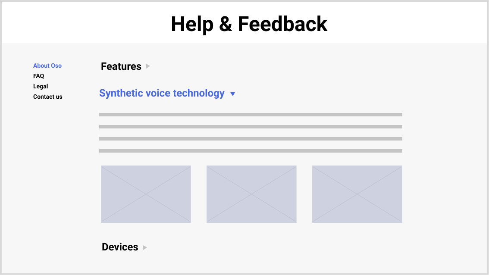 
*More information can be offered in an external site help site.*

Recommendations

- Simplify complex concepts and avoid using legalese and technical jargon
- Don't bury this content in privacy and terms of use statements
- Keep content concise and use imagery when available

## Implicit disclosure

Consistency is the key to achieving disclosure implicitly throughout the user journey. Consistent use of visual and auditory cues across devices and modes of interaction can help build associations between implicit patterns and explicit disclosure.

### Implicit Cues & Feedback

Anthropomorphism can manifest in different ways, from the actual visual representation of the agent, to the voice, sounds, patterns of light, bouncing shapes, or even the vibration of a device. When defining your persona, leverage implicit cues and feedback patterns rather than aim for a very human-like avatar. This is one way to minimize the need for more explicit disclosure.

 
*These cues help anthropomorphize the agent without being too human-like. They can also become effective disclosure mechanisms on their own when used consistently over time.*

Consider the different modes of interactions of your experience when incorporating the following types of cues:

| Visual Cues                                                                                                                                                               | Auditory Cues                                                      | Haptic Cues |
|---------------------------------------------------------------------------------------------------------------------------------------------------------------------------|--------------------------------------------------------------------|-------------|
|  Avatar  Responsive real-time cues (e.g., animations)  Non-screen cues (e.g., lights and patterns on a device)   | Sonicon (e.g., a brief distinctive sound, series of musical notes) | Vibration   |

### Capability Disclosure

Disclosure can be achieved implicitly by setting accurate expectations for what the digital assistant is capable of. Provide sample commands so that users can learn how to interact with the digital assistant and offer contextual help to learn more about the synthetic voice during the early stages of the experience.

 

### Conversational Transparency

When conversations fall in unexpected paths, consider crafting default responses that can help reset expectations, reinforce transparency, and steer users towards successful paths. There are opportunities to use explicit disclosure in conversation as well.

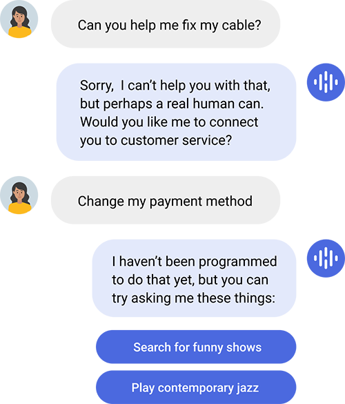 

 
Off-task or &quot;personal&quot; questions directed to the agent are a good time to remind users of the synthetic nature of the agent and steer them to engage with it appropriately or to redirect them to a real person.

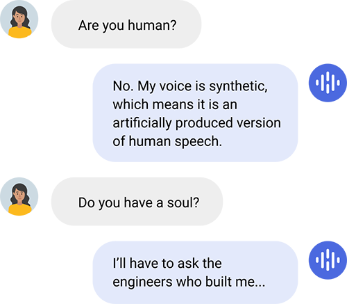 

## When to disclose

There are many opportunities for disclosure throughout the user journey. Design for the first use, second use, nth use…, but also embrace moments of &quot;failure&quot; to highlight transparency—like when the system makes a mistake or when the user discovers a limitation of the agent&#39;s capabilities.

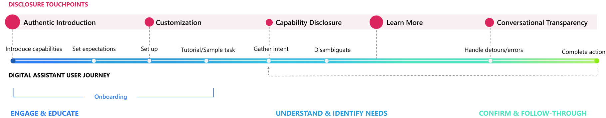 

Example of a standard digital assistant user journey highlighting various disclosure opportunities.

### Up-front

The optimal moment for disclosure is the first time a person interacts with the synthetic voice.  In a personal voice assistant scenario, this would be during onboarding, or the first time the user virtually unboxes the experience. In other scenarios, it could be the first time a synthetic voice reads content on a website or the first time a user interacts with a virtual character.

- [Transparent Introduction](#transparent-introduction)
- [Capability Disclosure](#capability-disclosure)
- [Customization and Calibration](#customization-and-calibration)
- [Implicit Cues](#implicit-cues--feedback)

### Upon request

Users should be able to easily access additional information, control preferences, and receive transparent communication at any point during the user journey when requested.

- [Providing opportunities to learn more about how the voice was made](#providing-opportunities-to-learn-more-about-how-the-voice-was-made)
- [Customization and Calibration](#customization-and-calibration)
- [Conversational Transparency](#conversational-transparency)

### Continuously

Use the implicit design patterns that enhance the user experience continuously.

- [Capability Disclosure](#capability-disclosure)
- [Implicit Cues](#implicit-cues--feedback)

### When the system fails

Use disclosure as an opportunity to fail gracefully.

- [Conversational Transparency](#conversational-transparency)
- [Providing opportunities to learn more about how the voice was made](#providing-opportunities-to-learn-more-about-how-the-voice-was-made)
- [Handoff to human](#conversational-transparency)

## Additional resources
- [Microsoft Bot Guidelines](https://www.microsoft.com/research/uploads/prod/2018/11/Bot_Guidelines_Nov_2018.pdf)
- [Cortana Design Guidelines](https://docs.microsoft.com/cortana/voice-commands/voicecommand-design-guidelines)
- [Microsoft Windows UWP Speech Design Guidelines](https://docs.microsoft.com/windows/uwp/design/input/speech-interactions)
- [Microsoft Windows Mixed Reality Voice Commanding Guidelines](https://docs.microsoft.com/windows/mixed-reality/voice-design#top-things-users-should-know-about-speech-in-mixed-reality)

## Reference docs

* [Disclosure for Voice Talent](https://aka.ms/disclosure-voice-talent)
* [Guidelines for Responsible Deployment of Synthetic Voice Technology](concepts-guidelines-responsible-deployment-synthetic.md)
* [Gating Overview](concepts-gating-overview.md)
* [How to Disclose](concepts-disclosure-guidelines.md)

## Next steps

* [Disclosure for Voice Talent](https://aka.ms/disclosure-voice-talent)
