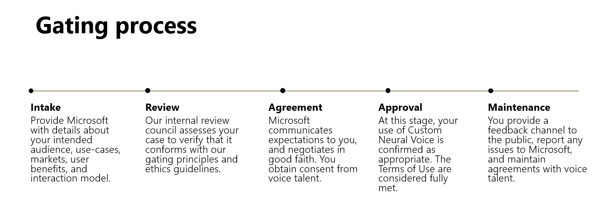

# Custom Neural Voice Gating Overview

## Commitment to responsible innovation

As part of Microsoft's commitment to designing responsible AI, we have assembled a set of materials to guide customers in using Custom Neural Voice. The guidelines and insights found here are based on Microsoft's [principles for responsible innovation in AI.](https://www.microsoft.com/en-us/AI/our-approach-to-ai)

### Guidance for deploying Custom Neural Voice

- [Guidelines for Responsible Deployment](concepts-deployment-guidelines.md): our top recommendations based on our research
- [Neural Text-to-Speech Transparency Note](concepts-transparency-note.md): what you need to know about the technology to use it responsibly
- [Disclosure Design](concepts-disclosure-guidelines.md): how to design experiences so that users know when a synthetic voice is being used and trust your service

### Why Custom Neural Voice is a gated technology

Our intent is to protect the rights of individuals and society, foster transparent human-computer interactions, and counteract the proliferation of harmful deepfakes and misleading content. For this reason, we have gated the use of Custom Neural Voice. Customers gain access to the technology only after their applications are reviewed and they have committed to using it in alignment with our ethics principles.

### Our gating process

Customers who would like to deploy Microsoft&#39;s Custom Neural Voice are led through this process:

To get started with Custom Neural Voice, begin your application [here](https://speech.microsoft.com/customvoice).

## Reference docs

* [Transparency Note](https://aka.ms/neural-tts-transparency-note)
* [Guidelines for Responsible Deployment](concepts-deployment-guidelines.md)
* [Disclosure Design Patterns](concepts-disclosure-patterns.md)

## Next steps

* [Guidelines for Responsible Deployment](concepts-deployment-guidelines.md)
