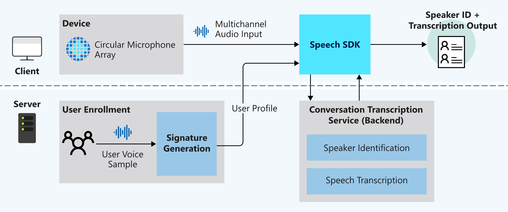

# What is Conversation Transcription in meetings (Preview)?

Conversation Transcription is a [speech-to-text](speech-to-text.md) solution that combines speech recognition, speaker identification, and sentence attribution to each speaker (also known as _diarization_) to provide real-time and/or asynchronous transcription of any conversation. Conversation Transcription distinguishes speakers in a conversation to determine who said what and when, and makes it easy for developers to add speech-to-text to their applications that perform multi-speaker diarization.

## Key features

- **Timestamps** - each speaker utterance has a timestamp, so that you can easily find when a phrase was said.
- **Readable transcripts** - transcripts have formatting and punctuation added automatically to ensure the text closely matches what was being said.
- **User profiles** - user profiles are generated by collecting user voice samples and sending them to signature generation.
- **Speaker identification** - speakers are identified using user profiles and a _speaker identifier_ is assigned to each.
- **Multi-speaker diarization** - determine who said what by synthesizing the audio stream with each speaker identifier.
- **Real-time transcription** – provide live transcripts of who is saying what and when while the conversation is happening.
- **asynchronous transcription** – provide transcripts with higher accuracy by using a multichannel audio stream.

> [!NOTE]
> Although Conversation Transcription does not put a limit on the number of speakers in the room, it is optimized for 2-10 speakers per session.

## Use cases

### Inclusive meetings

To make meetings inclusive for everyone, such as participants who are deaf and hard of hearing, it is important to have transcription in real time. Conversation Transcription in real-time mode takes meeting audio and determines who is saying what, allowing all meeting participants to follow the transcript and participate in the meeting without a delay.

### Improved efficiency

Meeting participants can focus on the meeting and leave note-taking to Conversation Transcription. Participants can actively engage in the meeting and quickly follow up on next steps, using the transcript instead of taking notes and potentially missing something during the meeting.

## How it works

This is a high-level overview of how Conversation Transcription works.

## Expected inputs

- **Multi-channel audio stream** – For specification and design details, see [Microsoft Speech Device SDK Microphone](https://aka.ms/cts/microphone). To learn more or purchase a development kit, see [Get Microsoft Speech Device SDK](https://aka.ms/cts/getsdk).
- **User voice samples** – Conversation Transcription needs user profiles in advance of the conversation. You will need to collect audio recordings from each user, then send the recordings to the [Signature Generation Service](https://aka.ms/cts/signaturegenservice) to validate the audio and generate user profiles.

## Real-time vs. asynchronous

Conversation Transcription offers three transcription modes:

### Real-time

Audio data is processed live to return speaker identifier + transcript. Select this mode if your transcription solution requirement is to provide conversation participants a live transcript view of their ongoing conversation. For example, building an application to make meetings more accessible the deaf and hard of hearing participants is an ideal use case for real-time transcription.

### Asynchronous

Audio data is batch processed to return speaker identifier and transcript. Select this mode if your transcription solution requirement is to provide higher accuracy without live transcript view. For example, if you want to build an application to allow meeting participants to easily catch up on missed meetings, then use the asynchronous transcription mode to get high-accuracy transcription results.

### Real-time plus asynchronous

Audio data is processed live to return speaker identifier + transcript, and, in addition, a request is created to also get a high-accuracy transcript through asynchronous processing. Select this mode if your application has a need for real-time transcription but also requires a higher accuracy transcript for use after the conversation or meeting occurred.

## Language support

Currently, Conversation Transcription supports "en-US" and "zh-CN" in the following regions: *centralus* and *eastasia*. If you require additional locale support, contact the [Conversation Transcription Feature Crew](mailto:CTSFeatureCrew@microsoft.com).

## Next steps

> [!div class="nextstepaction"]
> [Transcribe conversations in real time](how-to-use-conversation-transcription-service.md)
