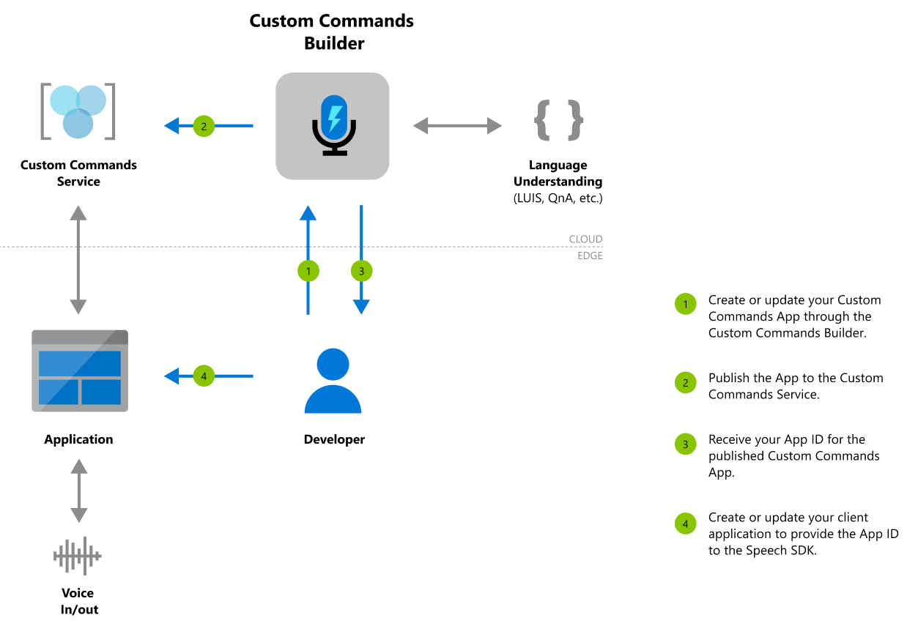

# What is Custom Commands?

Applications such as [Voice assistants](voice-assistants.md) listen to users and take an action in response, often speaking back. They use [speech-to-text](speech-to-text.md) to transcribe the user's speech, then take action on the natural language understanding of the text. This action frequently includes spoken output from the assistant generated with [text-to-speech](text-to-speech.md). Devices connect to assistants with the Speech SDK's `DialogServiceConnector` object.

**Custom Commands** makes it easy to build rich voice commanding apps optimized for voice-first interaction experiences. It provides a unified authoring experience, an automatic hosting model, and relatively lower complexity, helping you focus on building the best solution for your voice commanding scenarios.

Custom Commands is best suited for task completion or command-and-control scenarios, particularly well-matched for Internet of Things (IoT) devices, ambient and headless devices. Examples include solutions for Hospitality, Retail and Automotive industries, allowing you to build the best in-room voice-controlled experiences for your guests, manage inventory in your store and control in-car functionality while on the move.

> [!TIP]
> View our sample demos on our landing page at [https://speech.microsoft.com/customcommands](https://speech.microsoft.com/customcommands).

If you're interested in building complex conversational apps, you're encouraged to try the Bot Framework using the [Virtual Assistant Solution](https://docs.microsoft.com/azure/bot-service/bot-builder-enterprise-template-overview). You can add voice to any bot framework bot using Direct Line Speech.

Good candidates for Custom Commands have a fixed vocabulary with well-defined sets of variables. For example, home automation tasks, like controlling a thermostat, are ideal.

   

## Getting started with Custom Commands

Our goal with Custom Commands is to reduce your cognitive load to learn all the different technologies and focus building your voice commanding app. First step for using Custom Commands to <a href="https://ms.portal.azure.com/#create/Microsoft.CognitiveServicesSpeechServices" target="_blank">create an Azure Speech resource </a>. You can author your Custom Commands app on the Speech Studio and publish it, after which an on-device application can communicate with it using the Speech SDK.

#### Authoring flow for Custom Commands
   

Follow our quickstart to have your first Custom Commands app running code in less than 10 minutes.

* [Create a voice assistant using Custom Commands](quickstart-custom-commands-application.md)

Once you're done with the quickstart, explore our how-to guides for detailed steps for designing, developing, debugging, deploying and integrating a Custom Commands application.

## Building Voice Assistants with Custom Commands
> [!VIDEO https://www.youtube.com/embed/1zr0umHGFyc]

## Next steps

* [Get a Speech service subscription key for free](get-started.md)
* [View our Voice Assistants repo on GitHub for samples](https://aka.ms/speech/cc-samples)
* [Go to the Speech Studio to try out Custom Commands](https://speech.microsoft.com/customcommands)
* [Get the Speech SDK](speech-sdk.md)
