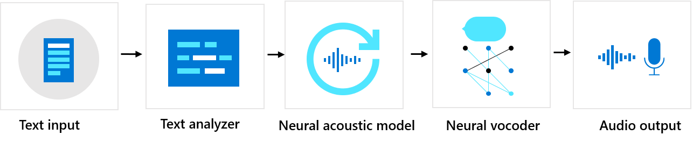

# What is Custom Neural Voice?

Custom Neural Voice is a text-to-speech (TTS) feature that lets you create a one-of-a-kind customized synthetic voice for your applications. With Custom Neural Voice, you can build a highly natural-sounding voice by providing your audio samples as training data. Based on the Neural TTS technology and the multi-lingual multi-speaker universal model, Custom Neural Voice lets you create synthetic voices that are rich in speaking styles, or adaptable cross languages. The realistic and natural sounding voice of Custom Neural Voice can represent brands, personify machines, and allow users to interact with applications conversationally. See the supported [languages](language-support.md#customization) for Custom Neural Voice and cross-lingual feature.

> [!NOTE]
> The Custom Neural Voice feature requires registration, and access to it is limited based upon Microsoft’s eligibility and use criteria. Customers who wish to use this feature are required to register their use cases through the [intake form](https://aka.ms/customneural).

## The basics of Custom Neural Voice

The underlying Neural TTS technology used for Custom Neural Voice
consists of three major components: Text Analyzer, Neural Acoustic
Model, and Neural Vocoder. To generate natural synthetic speech from
text, text is first input into Text Analyzer, which provides output in
the form of phoneme sequence. A phoneme is a basic unit of sound that
distinguishes one word from another in a particular language. A sequence
of phonemes defines the pronunciations of the words provided in the
text. 

Next, the phoneme sequence goes into the Neural Acoustic Model to
predict acoustic features that define speech signals, such as the
timbre, the speaking style, speed, intonations, and stress patterns. Finally, the Neural Vocoder converts the acoustic features into audible waves so that synthetic speech is generated.

Neural TTS voice models are trained using deep neural networks based on
the recording samples of human voices. In this
[blog](https://techcommunity.microsoft.com/t5/azure-ai/neural-text-to-speech-extends-support-to-15-more-languages-with/ba-p/1505911),
we describe how Neural TTS works with state-of-the-art neural speech
synthesis models. The blog also explains how a universal base model can be adapted to a target speaker's voice with less
than 2 hours of speech data (or less than 2,000 recorded utterances), and additionally transfer the voice to another language or style. To read about how a neural vocoder is trained, see the [blog post](https://techcommunity.microsoft.com/t5/azure-ai/azure-neural-tts-upgraded-with-hifinet-achieving-higher-audio/ba-p/1847860).

Custom Neural Voice lets you adapt the Neural TTS engine to fit your scenarios. To create a custom neural voice, use [Speech Studio](https://speech.microsoft.com/customvoice) to upload the recorded audio and corresponding scripts, train the model, and deploy the voice to a custom endpoint. Custom Neural Voice can use text provided by the user to convert text into speech in real-time, or generate audio content offline with text input. This is made available via the [REST API](./rest-text-to-speech.md), the [Speech SDK](./get-started-text-to-speech.md), or the [web portal](https://speech.microsoft.com/audiocontentcreation).

## Get started

* To get started with Custom Neural Voice and create a project, see [Get started with Custom Neural Voice](how-to-custom-voice.md).
* To prepare and upload your audio data, see [Prepare training data](how-to-custom-voice-prepare-data.md).
* To train and deploy your models, see [Create and use your voice model](how-to-custom-voice-create-voice.md).

## Terms and definitions

| **Term**      | **Definition**                                                                                                                                                                                                                                                                                                                                                                                       |
|---------------|------------------------------------------------------------------------------------------------------------------------------------------------------------------------------------------------------------------------------------------------------------------------------------------------------------------------------------------------------------------------------------------------------|
| Voice model   | A text-to-speech model that can mimic the unique vocal characteristics of a target speaker. A *voice model* is also known as a *voice font* or *synthetic voice*. A voice model is a set of parameters in binary format that is not human readable and does not contain audio recordings. It cannot be reverse engineered to derive or construct the audio of a human voice. |
| Voice talent  | Individuals or target speakers whose voices are recorded and used to create voice models that are intended to sound like the voice talent’s voice.                                                                                                                                                                                                                                                   |
| Standard TTS  | The standard, or "traditional," method of TTS that breaks down spoken language into phonetic snippets so that they can be remixed and matched using classical programming or statistical methods.                                                                                                                                                                                                    |
| Neural TTS    | Neural TTS synthesizes speech using deep neural networks that have "learned" the way phonetics are combined in natural human speech, rather than using procedural programming or statistical methods. In addition to the recordings of a target voice talent, Neural TTS uses a source library/base model that is built with voice recordings from many different speakers.          |
| Training data | A custom neural voice training dataset that includes the audio recordings of the voice talent, and the associated text transcriptions.                                                                                                                                                                                                                                                               |
| Persona       | A persona describes who you want this voice to be. A good persona design will inform all voice creation whether it’s choosing an available voice model already created, or starting from scratch by casting and recording a new voice talent.                                                                                                |
| Script        | A script is a text file that contains the utterances to be spoken by your voice talent. (The term "*utterances*" encompasses both full sentences and shorter phrases.)                                                                                                                                                                                                                               |

## Responsible use of AI

To learn how to use Custom Neural Voice responsibly, see the [transparency note](/legal/cognitive-services/speech-service/custom-neural-voice/transparency-note-custom-neural-voice?context=/azure/cognitive-services/speech-service/context/context). Microsoft’s transparency notes are intended to help you understand how our AI technology works, the choices system owners can make that influence system performance and behavior, and the importance of thinking about the whole system, including the technology, the people, and the environment.

## Next steps

* [Get started with Custom Neural Voice](how-to-custom-voice.md)
