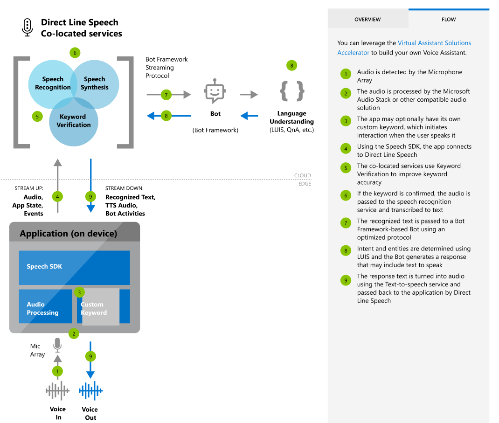

# About Direct Line Speech

[Voice assistants](voice-assistants.md) listen to users and take an action in response, often speaking back. They use [speech-to-text](speech-to-text.md) to transcribe the user's speech, then take action on the natural language understanding of the text. This action frequently includes spoken output from the assistant generated with [text-to-speech](text-to-speech.md). Devices connect to assistants with the Speech SDK’s `DialogServiceConnector` object.

**Direct Line Speech** is a robust, end-to-end solution for creating a flexible, extensible voice assistant, powered by the Bot Framework and its Direct Line Speech channel, that is optimized for voice-in, voice-out interaction with bots.

Direct Line Speech offers the highest levels of customization and sophistication for voice assistants. It is well-suited to conversational scenarios that’re open-ended, natural, or hybrids of these with task completion or command-and-control use. This high degree of flexibility comes with a greater complexity, and scenarios that are scoped to well-defined tasks using natural language input may want to consider [Custom Commands (Preview)](custom-commands.md) for a streamlined solution experience.

## Getting started with Direct Line Speech

The first steps for creating a voice assistant using Direct Line Speech are to [get a speech subscription key](get-started.md), create a new bot associated with that subscription, and connect the bot to the Direct Line Speech Channel.

   

For a complete, step-by-step guide on creating a simple voice assistant using Direct Line Speech, please see [the tutorial for speech-enabling your bot with the Speech SDK and the Direct Line Speech channel](tutorial-voice-enable-your-bot-speech-sdk.md).

We also offer Quickstarts designed to have you running code in less than 10 minutes. This table includes a list of voice assistant quickstarts organized by language.

| Quickstart | Platform | API reference |
|------------|----------|---------------|
| C#, UWP | Windows | [Browse](https://aka.ms/csspeech/csharpref) |
| Java | Windows, macOS, Linux | [Browse](https://aka.ms/csspeech/javaref) |
| Java | Android | [Browse](https://aka.ms/csspeech/javaref) |

## Sample code

Sample code for creating a voice assistant is available on GitHub. These samples cover the client application for connecting to your assistant in several popular programming languages.

* [Voice assistant samples (SDK)](https://aka.ms/csspeech/samples)
* [Tutorial: Voice enable your assistant with the Speech SDK, C#](tutorial-voice-enable-your-bot-speech-sdk.md)

## Customization

Voice assistants built using Azure Speech Services can use the full range of customization options available for [speech-to-text](speech-to-text.md), [text-to-speech](text-to-speech.md), and [custom keyword selection](speech-devices-sdk-create-kws.md).

> [!NOTE]
> Customization options vary by language/locale (see [Supported languages](supported-languages.md)).

Direct Line Speech and its associated functionality for voice assistants are an ideal supplement to the [Virtual Assistant Solution and Enterprise Template](https://docs.microsoft.com/azure/bot-service/bot-builder-enterprise-template-overview). Though Direct Line Speech can work with any compatible bot, these resources provide a reusable baseline for high-quality conversational experiences as well as common supporting skills and models for getting started quickly.

## Reference docs

* [Speech SDK](speech-sdk-reference.md)
* [Azure Bot Service](https://docs.microsoft.com/azure/bot-service/?view=azure-bot-service-4.0)

## Next steps

* [Get a Speech Services subscription key for free](get-started.md)
* [Get the Speech SDK](speech-sdk.md)
* [Create and deploy a basic bot](https://docs.microsoft.com/azure/bot-service/bot-builder-tutorial-basic-deploy?view=azure-bot-service-4.0)
* [Get the Virtual Assistant Solution and Enterprise Template](https://github.com/Microsoft/AI)
