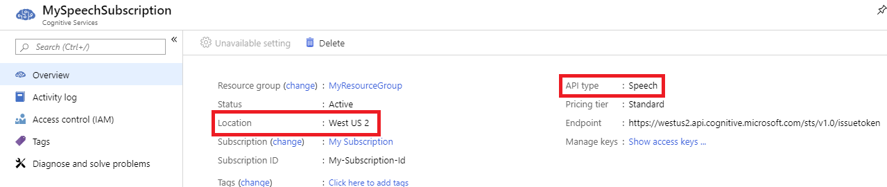

# Voice assistants: Frequently asked questions

If you can't find answers to your questions in this document, check out [other support options](support.md).

## General

**Q: What is a voice assistant?**

**A:** Like Cortana, a voice assistant is a solution that listens to a user's spoken utterances, analyzes the contents of those utterances for meaning, performs one or more actions in response to the utterance's intent, and then provides a response to the user that often includes a spoken component. It's a "voice-in, voice-out" experience for interacting with a system. voice assistant authors create an on-device application using the `DialogServiceConnector` in the Speech SDK to communicate with an assistant created using [Custom Commands (Preview)](custom-commands.md) or the [Direct Line Speech](direct-line-speech.md) channel of the Bot Framework. These assistants can use custom keywords, custom speech, and custom voice to provide an experience tailored to your brand or product.

**Q: Should I use Custom Commands (Preview) or Direct Line Speech? What's the difference?**

**A:** [Custom Commands (Preview)](custom-commands.md) is a lower-complexity set of tools to easily create and host an assistant that's well-suited to task completion scenarios. [Direct Line Speech](direct-line-speech.md) provides richer, more sophisticated capabilities that can enable robust conversational scenarios. See the [comparison of assistant solutions](voice-assistants.md#comparing-assistant-solutions) for more information.

**Q: How do I get started?**

**A:** The best way to begin with creating a Custom Commands (Preview) application or basic Bot Framework bot.

* [Create a Custom Commands (Preview) application](quickstart-custom-speech-commands-create-new.md)
* [Create a basic Bot Framework bot](https://docs.microsoft.com/azure/bot-service/bot-builder-tutorial-basic-deploy?view=azure-bot-service-4.0)
* [Connect a bot to the Direct Line Speech channel](https://docs.microsoft.com/azure/bot-service/bot-service-channel-connect-directlinespeech)

## Debugging

**Q: I get a 401 error when connecting and nothing works. I know my speech subscription key is valid. What's going on?**

**A:** When managing your subscription on the Azure portal, please ensure you're using the **Speech** resource (Microsoft.CognitiveServicesSpeechServices, "Speech") and *not* the **Cognitive Services** resource (Microsoft.CognitiveServicesAllInOne, "All Cognitive Services"). Also, please check [Speech service region support for voice assistants](regions.md#voice-assistants).

**Q: I get recognition text back from my `DialogServiceConnector`, but I see a '1011' error and nothing from my bot. Why?**

**A:** This error indicates a communication problem between your assistant and the voice assistant service.

* For Custom Commands (Preview), ensure that your Custom Commands (Preview) Application is published
* For Direct Line Speech, ensure that you've [connected your bot to the Direct Line Speech channel](https://docs.microsoft.com/azure/bot-service/bot-service-channel-connect-directlinespeech), [added Streaming protocol support](https://aka.ms/botframework/addstreamingprotocolsupport) to your bot (with the related Web Socket support), and then check that your bot is responding to incoming requests from the channel.

**Q: This code still doesn't work and/or I'm getting a different error when using a `DialogServiceConnector`. What should I do?**

**A:** File-based logging provides substantially more detail and can help accelerate support requests. To enable this functionality, see [how to use file logging](how-to-use-logging.md).

## Next steps

* [Troubleshooting](troubleshooting.md)
* [Release notes](releasenotes.md)
