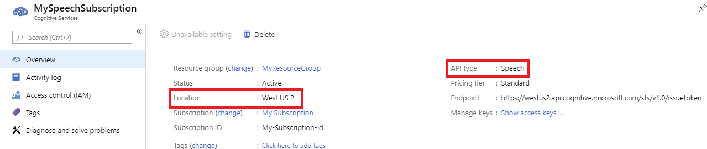

# Voice-first virtual assistants Preview: Frequently asked questions

If you can't find answers to your questions in this document, check out [other support options](support.md).

## General

**Q: What is Direct Line Speech?**

**A:** The `DialogServiceConnector` from the Speech SDK provides bidirectional, asynchronous communication to bots that are connected to the Direct Line Speech channel on the Bot Framework. This channel provides coordinated access to speech-to-text and text-to-speech from Azure Speech Services that allow bots to become fully voice in, voice out conversational experiences. With the support for wake words and Wake Word Verification, this solution makes it possible to build highly customizable voice-first virtual assistants for your brand or product.

**Q: How do I get started?**

**A:** The best way to begin with creating a voice-first virtual assistant is to start with [creating a basic Bot Framework bot](https://docs.microsoft.com/azure/bot-service/bot-builder-tutorial-basic-deploy?view=azure-bot-service-4.0). Next, connect your bot to the [Direct Line Speech channel](https://docs.microsoft.com/azure/bot-service/bot-service-channel-connect-directlinespeech).

## Debugging

**Q: I receive a 401 error when connecting and nothing works. I know my speech subscription key is valid. What's going on?**

**A:** In preview, Direct Line Speech has specific limitations on which subscriptions you can use. Ensure you're using the **Speech** resource (Microsoft.CognitiveServicesSpeechServices, "Speech") and *not* the **Cognitive Services** resource (Microsoft.CognitiveServicesAllInOne, "All Cognitive Services"). Only [a subset of Speech Services regions](regions.md#voice-first-virtual-assistants) are currently supported for Direct Line Speech.

**Q: I get recognition text back from Direct Line Speech, but I see a '1011' error and nothing from my bot. Why?**

**A:** This error indicates a communication problem between the bot and Direct Line Speech. Ensure that you've [connected the Direct Line Speech channel](https://docs.microsoft.com/azure/bot-service/bot-service-channel-connect-directlinespeech), [added Streaming protocol support](https://aka.ms/botframework/addstreamingprotocolsupport) to your bot (with the related Web Socket support), and then check that your bot is responding to incoming requests from the channel.

**Q: This code still doesn't work and/or I'm getting a different error when using a DialogServiceConnector. What should I do?**

**A:** File-based logging provides substantially more detail and can help accelerate support requests. To enable this functionality, see [how to use file logging](how-to-use-logging.md).

## Next steps

* [Troubleshooting](troubleshooting.md)
* [Release notes](releasenotes.md)
