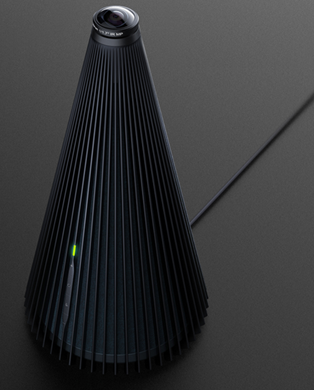
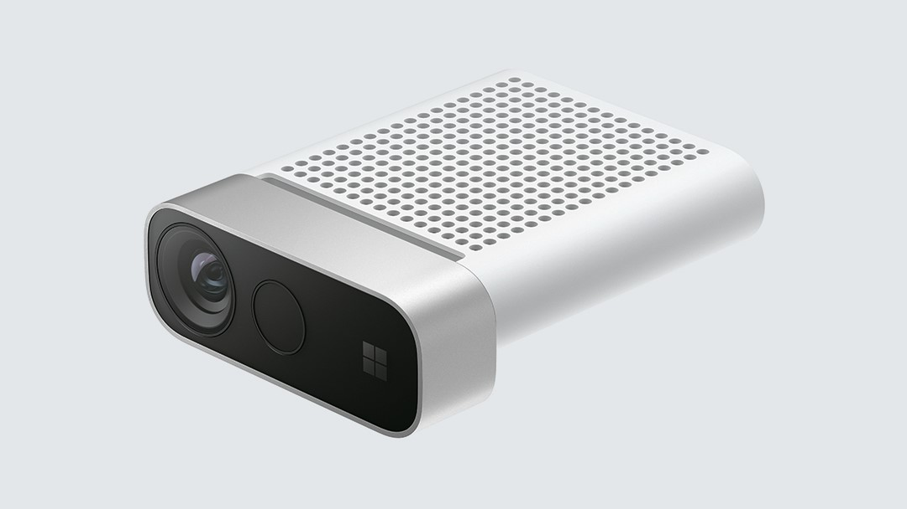

# Get the Cognitive Services Speech Devices SDK

The Speech Devices SDK is a pretuned library designed to work with purpose-built development kits, and varying microphone array configurations.

## Choose your development kit

|Devices|Specification|Description|Scenarios|
|--|--|--|--|
|Princeton Tower |7 Mic Array, Speaker, 360 Camera, ARM SOC, WIFI, Ethernet, ID.  Linux|A flagship device for conversation transcription, equipped the best camera and mic array. Only available via systems integrators.|Conversation Transcription|
|[Azure Kinect DK](https://azure.microsoft.com/en-us/services/kinect-dk/)|7 Mic Array RGB and Depth cameras.  Windows/Linux|A developer kit with advanced artificial intelligence (AI) sensors for building sophisticated computer vision and speech models. It combines a best-in-class spatial microphone array and depth camera with a video camera and orientation sensor—all in one small device with multiple modes, options, and SDKs to accommodate a range of compute types.|Conversation Transcription, Robotics, Smart Building|
|[Roobo Smart Audio Dev Kit](http://ddk.roobo.com) [Setup](speech-devices-sdk-roobov1.md) / [Quickstart](speech-devices-sdk-android-qsg.md)|7 Mic Array, ARM SOC, WIFI, Audio Out, IO.  Android|The first Speech Devices SDK to adapt Microsoft Mic Array and front processing SDK, for developing high quality transcription and speech scenarios|Conversation Transcription, Smart Speaker, Voice Agent, Wearable|
|Roobo Smart Audio Dev Kit 2|7 Mic Array, ARM SOC, WIFI, Bluetooth, IO.  Linux|The 2nd generation Speech Devices SDK that provides alternative OS and more features in a cost effective reference design.|Conversation Transcription, Smart Speaker, Voice Agent, Wearable|
|Tonly USB Mic Array|4 Mic Array, USB 2.0A, ID.  Windows/Linux/Android|A USB Mic array product to enable far filed capability for any Windows10 PC and Linux/Android device|Win10 PC, Smart Cars, Robotics, Smart Building|
|URbetter T11 Development Board|7 Mic Array, ARM SOC, WIFI, Ethernet, HDMI, USB Camera.  Linux|An industry level Speech Devices SDK that adapts Microsoft Mic array and supports extended I/O such as HDMI/Ethernet and more USB peripherals|Conversation Transcription, Education, Hospital, Robots, OTT Box, Voice Agent, Drive Thru|

## Download the Speech Devices SDK

Go to the [Speech Devices SDK download site](https://aka.ms/sdsdk-download).

## Next steps

> [!div class="nextstepaction"]
> [Get started with the Speech Devices SDK](speech-devices-sdk-qsg.md)
