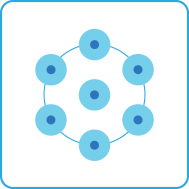
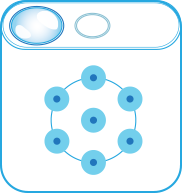
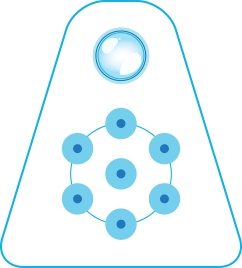

# Get the Cognitive Services Speech Devices SDK

The Speech Devices SDK is a pretuned library designed to work with purpose-built development kits, and varying microphone array configurations .

## Choose your development kit

ToDo add graphic and text on how to choose the DK, and how to buy it.

## Download the Speech Devices SDK

Go to the [Speech Devices SDK download site](https://shares.datatransfer.microsoft.com/). 

ToDo add details of the new download site and process to get the SDK for the chosen device.

## Next steps

> [!div class="nextstepaction"]
> [Get started with the Speech Devices SDK](speech-devices-sdk-qsg.md)
