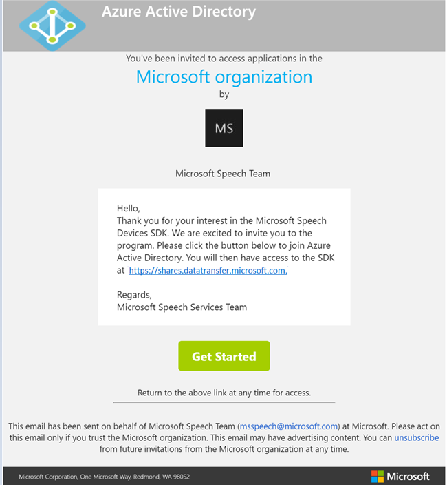
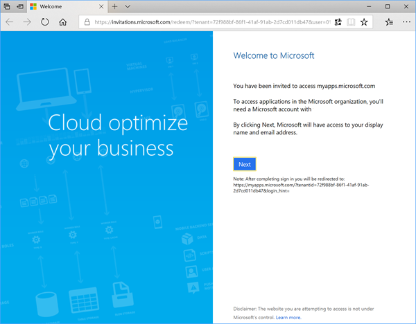
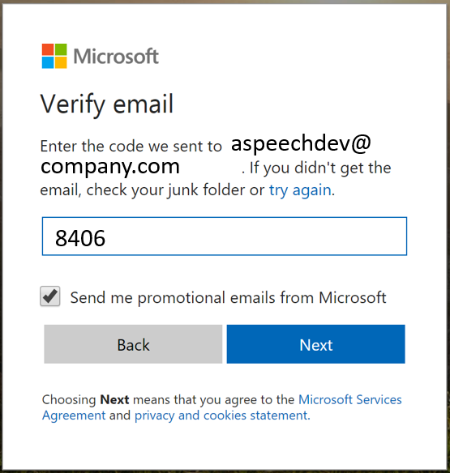
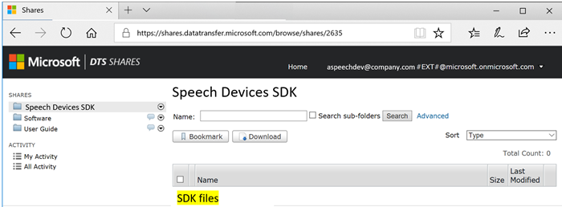
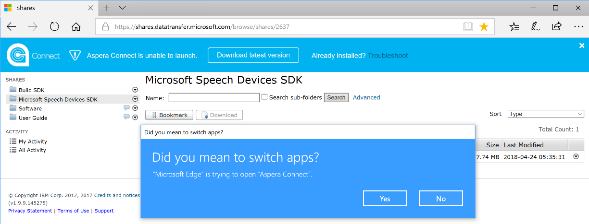
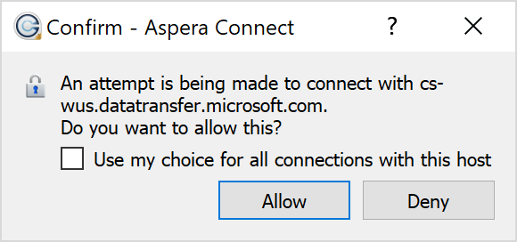
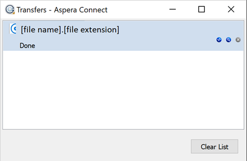

# Get the Cognitive Services Speech Devices SDK

The Speech Devices SDK is in restricted preview and requires you to be enrolled in the program. Currently, Microsoft prefers large companies as candidates for access to this product.

## Request access

To get access to the Speech Devices SDK:

1. Go to the Microsoft Speech Devices SDK [sign-up form](https://aka.ms/sdsdk-signup).
1. Read the [license agreement](speech-devices-sdk-license.md).
1. If you agree to the terms of the license agreement, select **I agree**.
1. Answer the questions in the form.
1. Submit the form. 
1. If your email address is not already part of Azure Active Directory (Azure AD), you receive an invitation email like the following example when you're approved for access. If your email address is already in Azure AD, you receive an email message from the Microsoft Speech Team when you're approved for access, and you can skip ahead to [Download the Speech Devices SDK](#download-the-speech-devices-sdk).

## Approval e-mail

```
From: Microsoft Speech Team from Microsoft (via Microsoft) <invites@microsoft.com> 
Subject: You're invited to the Microsoft organization 
```



## Accept access

Complete the following steps to join Azure AD with the email address you provided during registration. This process grants you access to the Speech Devices SDK [download site](https://shares.datatransfer.microsoft.com/).

1. In the email message you received, select **Get Started**. If your organization is already an Office 365 customer, you are prompted to sign in and you can skip ahead to step 8.

2. In the browser window that opens, select **Next**.

    

3. Create a Microsoft account if you don't already have one. Enter the same email address at which you received the invitation email.

    

4. Select **Next** to create a password.

5. When prompted to verify your e-mail, get the verification code from the invitation email you received.
 
7. Paste or type the security code from the email message in the dialog box. In this example, the security code is **8406**. Select **Next**.

    
 
8. When you see the Access Panel Application in the browser, you have confirmed that your email address is part of Azure AD. You now have access to the Speech Devices SDK download site.

## Download the Speech Devices SDK

Go to the [Speech Devices SDK download site](https://shares.datatransfer.microsoft.com/). Sign in with the Microsoft account you created earlier. 



To download the Speech Devices SDK, associated sample code, and reference material:

1. Download and install the Aspera Connect tool when prompted in the browser.

    
 
1. Select **Yes** to switch apps to Aspera Connect.

    
 
1. Select **Allow** to confirm downloading the files by using Aspera Connect.

    
 
1. Close the Aspera Connect Transfers window after the files are downloaded.

    
 
By default, the files are downloaded to your **Downloads** folder. You can sign out of this site now. 

## Next steps

> [!div class="nextstepaction"]
> [Get started with the Speech Devices SDK](speech-devices-sdk-qsg.md)
