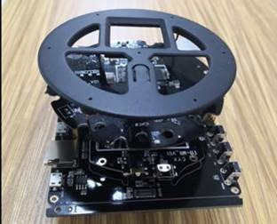
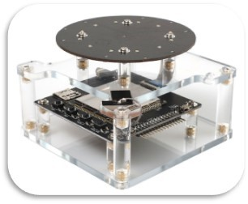
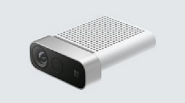
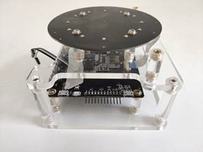

# Get the Cognitive Services Speech Devices SDK

The Speech Devices SDK is a pretuned library designed to work with purpose-built development kits, and varying microphone array configurations.

## Choose a Development kit

|Devices|Specification|Description|Scenarios|
|--|--|--|--|
|[Urbetter Dev Kit](http://www.urbetter.com/products_56/278.html)|7 Mic Array, ARM SOC, WIFI, Ethernet, HDMI, USB Camera.  Linux|An industry level Speech Devices SDK that adapts Microsoft Mic array and supports extended I/O such as HDMI/Ethernet and more USB peripherals   [Contact Urbetter](http://www.urbetter.com/products_56/278.html)|Conversation Transcription, Education, Hospital, Robots, OTT Box, Voice Agent, Drive Thru|
|[Roobo Smart Audio Dev Kit](https://ddk.roobo.com) [Setup](speech-devices-sdk-roobo-v1.md) / [Quickstart](speech-devices-sdk-android-quickstart.md)|7 Mic Array, ARM SOC, WIFI, Audio Out, IO.  [Android](speech-devices-sdk-android-quickstart.md)|The first Speech Devices SDK to adapt Microsoft Mic Array and front processing SDK, for developing high-quality transcription and speech scenarios|Conversation Transcription, Smart Speaker, Voice Agent, Wearable|
|[Azure Kinect DK](https://azure.microsoft.com/services/kinect-dk/) [Setup](https://docs.microsoft.com/azure/Kinect-dk/set-up-azure-kinect-dk) / [Quickstart](speech-devices-sdk-windows-quickstart.md)|7 Mic Array RGB and Depth cameras.  [Windows](speech-devices-sdk-windows-quickstart.md)/[Linux](speech-devices-sdk-linux-quickstart.md)|A developer kit with advanced artificial intelligence (AI) sensors for building sophisticated computer vision and speech models. It combines a best-in-class spatial microphone array and depth camera with a video camera and orientation sensor—all in one small device with multiple modes, options, and SDKs to accommodate a range of compute types.|Conversation Transcription, Robotics, Smart Building|
|Roobo Smart Audio Dev Kit 2 [Setup](speech-devices-sdk-roobo-v2.md) |7 Mic Array, ARM SOC, WIFI, Bluetooth, IO.  Linux|The 2nd generation Speech Devices SDK that provides alternative OS and more features in a cost effective reference design.|Conversation Transcription, Smart Speaker, Voice Agent, Wearable|

## Download the Speech Devices SDK

Download the [Speech Devices SDK](https://aka.ms/sdsdk-download).

## Next steps

> [!div class="nextstepaction"]
> [Get started with the Speech Devices SDK](https://aka.ms/sdsdk-quickstart)
