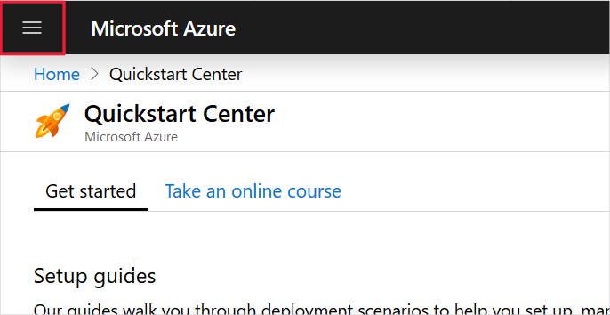
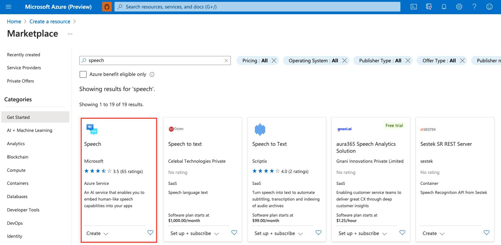

# Try the Speech service for free''

In this article, you choose an option to easily test the Speech service free of charge so you can discover what the service can do, and decide whether it's right for your needs. Choose one of the two following options depending on your situation and use-case:

- [Option 1](#no-card): Immediately get **free trial** API keys without providing any credit card info (you need to have an existing Azure account). The **free trial** lasts 30 days and data is deleted at the end. This option is best for quick experimentation with the service.
- [Option 2](#new-resource): Create a new Speech resource in Azure, at no charge using a **free subscription** (credit card information required). A **free subscription** mainly has stricter rate-limits than a paid subscription. This option is best if you want to test the service, but also plan to upgrade to a paid subscription in the future, and don't want to lose data.

## Try the Speech service without credit card info

Complete the following steps to activate a 30-day free trial and get API keys. Your trial period starts immediately once the following steps are complete.

1. Go to [Try Cognitive Service](https://azure.microsoft.com/try/cognitive-services/).
1. Select the **Speech APIs** tab.
1. Choose **Get API Key**.

You'll be presented with billing choices. Choose the free option and then read and approve the user agreement. You'll be presented with keys you can use to try the Speech service free for 30 days.

## Try the Speech service by creating an Azure resource

For the following steps, you need both a Microsoft account and an Azure account. If you do not have a Microsoft account, you can sign up for one free of charge at the [Microsoft account portal](https://account.microsoft.com/account). Select **Sign in with Microsoft** and then, when asked to sign in, select **Create a Microsoft account**. Follow the steps to create and verify your new Microsoft account.

Once you have a Microsoft account, go to the [Azure sign-up page](https://azure.microsoft.com/free/ai/), select **Start free**, and create a new Azure account using a Microsoft account.

> [!NOTE]
> The Speech service has two service tiers: free and subscription, which have different limitations and benefits. When you sign up for a free Azure account it comes with $200 in service credit that you can apply toward a paid Speech service subscription, valid for up to 30 days.
>
> If you use the free, low-volume Speech service tier you can keep this free subscription even after your free trial or service credit expires.
>
> For more information, see [Cognitive Services pricing - Speech service](https://azure.microsoft.com/pricing/details/cognitive-services/speech-services/).

### Create the resource

To add a Speech service resource (free or paid tier) to your Azure account:

1. Sign in to the [Azure portal](https://portal.azure.com/) using your Microsoft account.

1. Select **Create a resource** at the top left of the portal. If you do not see **Create a resource**, you can always find it by selecting the collapsed menu in the upper left:

   

1. In the **New** window, type "speech" in the search box and press ENTER.

1. In the search results, select **Speech**.

   

1. Select **Create**,  then:

   - Give a unique name for your new resource. The name helps you distinguish among multiple subscriptions tied to the same service.
   - Choose the Azure subscription that the new resource is associated with to determine how the fees are billed.
   - Choose the [region](regions.md) where the resource will be used.
   - Choose either a free (F0) or paid (S0) pricing tier. For complete information about pricing and usage quotas for each tier, select **View full pricing details**.
   - Create a new resource group for this Speech subscription or assign the subscription to an existing resource group. Resource groups help you keep your various Azure subscriptions organized.
   - Select **Create**. This will take you to the deployment overview and display deployment progress messages.

> [!NOTE]
> You can create an unlimited number of standard-tier subscriptions in one or multiple regions. However, you can create only one free-tier subscription. Model deployments on the free tier that remain unused for 7 days will be decommissioned automatically.

It takes a few moments to deploy your new Speech resource. Once deployment is complete, select **Go to resource** and in the left navigation pane select **Keys** to display your Speech service subscription keys. Each subscription has two keys; you can use either key in your application. To quickly copy/paste a key to your code editor or other location, select the copy button next to each key, switch windows to paste the clipboard contents to the desired location.

> [!IMPORTANT]
> These subscription keys are used to access your Cognitive Service API. Do not share your keys. Store them securely– for example, using Azure Key Vault. We also recommend regenerating these keys regularly. Only one key is necessary to make an API call. When regenerating the first key, you can use the second key for continued access to the service.

## Switch to a new subscription

To switch from one subscription to another, for example when your free trial expires or when you publish your application, replace the region and subscription key in your code with the region and subscription key of the new Azure resource.

## About regions

- If your application uses a [Speech SDK](speech-sdk.md), you provide the region code, such as `westus`, when creating a speech configuration.
- If your application uses one of the Speech service's [REST APIs](rest-apis.md), the region is part of the endpoint URI you use when making requests.
- Keys created for a region are valid only in that region. Attempting to use them with other regions will result in authentication errors.

## Next steps

Complete one of our 10-minute quickstarts or check out our SDK samples:

> [!div class="nextstepaction"]
> [Quickstart: Recognize speech in C#](~/articles/cognitive-services/Speech-Service/quickstarts/speech-to-text-from-microphone.md?pivots=programming-language-csharp&tabs=dotnet)
> [Speech SDK samples](speech-sdk.md#sample-source-code)
