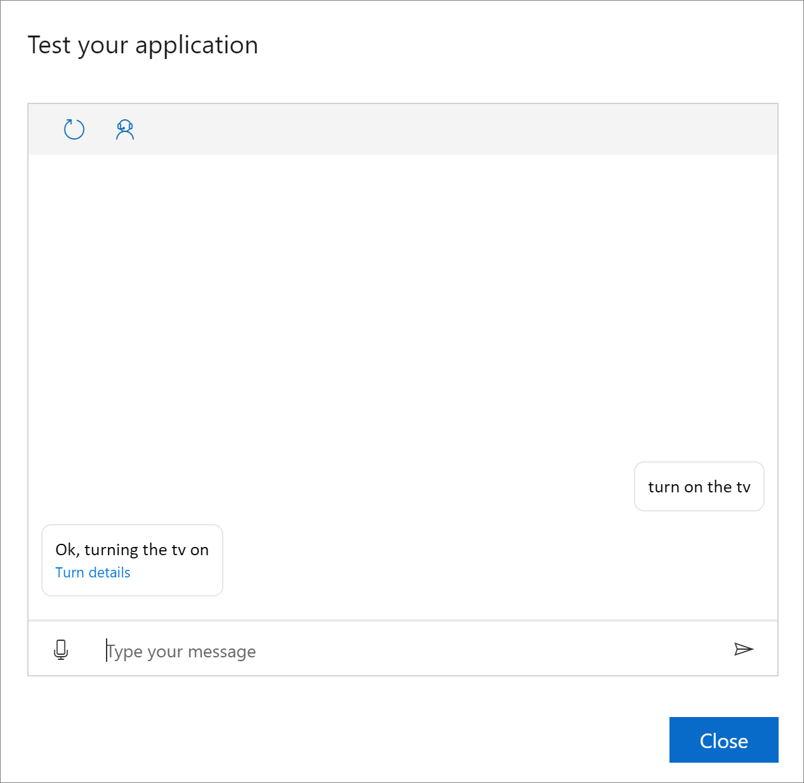

# Create application with simple commands
In this article, you'll learn how to:
 - Create an empty application
 - Update LUIS resources
 - Add some basic commands to your Custom Commands application

## Create empty application
Create an empty Custom Commands application. For details, refer to the [quickstart](quickstart-custom-commands-application.md). Only this time, instead of importing a project, you create a blank project.


   > [!div class="mx-imgBorder"]
   > 

## Update LUIS resources (optional)

You can update the authoring resource that you selected in the **New project** window, and set a prediction resource. Prediction resource is used for recognition when your Custom Commands application is published. You don't need a prediction resource during the development and testing phases.

## Add TurnOn Command
### Create Command
To the **smart room-lite** Custom Commands application, let's add a simple command that process an utterance, `turn on the tv`, and respond with the message `Ok, turning the tv on`.

1. Create a new Command by selecting **New command** at the top of the left pane. The **New command** window opens.
1. Provide value for the **Name** field as **TurnOn**.
1. Select **Create**.

The middle pane lists the different properties of the command. You will be configuring the following properties of the command. For explanation of all the configuration properties of a command, go to [references](./custom-commands-references.md).

| Configuration            | Description                                                                                                                 |
| ---------------- | --------------------------------------------------------------------------------------------------------------------------- |
| **Example sentences** | Example utterances the user can say to trigger this Command                                                                 |
| **Parameters**       | Information required to complete the Command                                                                                |
| **Completion rules** | The actions to be taken to fulfill the Command. For example, to respond to the user or communicate with another web service. |
| **Interaction rules**   | Additional rules to handle more specific or complex situations                                                              |


> [!div class="mx-imgBorder"]
> 


### Add example sentences

Let's start with **Example sentences** section, and provide an example of what the user can say.

1. Select **Example sentences** section in the middle pane.
1. In the right most pane, add examples:

    ```
    turn on the tv
    ```

1.  Select **Save** at the top of the pane.

For now, we don't have parameters, so we can move to the **Completion rules** section.

### Add a completion rule

Next, the command needs to have a completion rule. This rule tells the user that a fulfillment action is being taken. To read more about rules and completion rules, go to [references](./custom-commands-references.md).

1. Select default completion rule **Done** and edit it as follows: 

    
    | Setting    | Suggested value                          | Description                                        |
    | ---------- | ---------------------------------------- | -------------------------------------------------- |
    | **Name**       | ConfirmationResponse                  | A name describing the purpose of the rule          |
    | **Conditions** | None                                     | Conditions that determine when the rule can run    |
    | **Actions**    | Send speech response > Simple editor > First variation > `Ok, turning the tv on` | The action to take when the rule condition is true |
    

1. Alternatively, you can delete the existing default completion rule and create a new one by selecting the **Add** at the top of the middle pane.
1. Provide value in **Name** section.
1. Add an action.
   - Create an action by selecting **Add an action** in the **Actions** section.
   - In the **New Action** window, in the **Type** list, select **Send speech response**.
   - Under **Response**, select **Simple editor**.
       - In the **First variation** field, provide value for response as `Ok, turning the tv on`.

   > [!div class="mx-imgBorder"]
   > 

1. Select **Save** to save the action.
1. Back in the **Completion rules** section, select **Save** to save all changes. 


### Try it out

Test the behavior using the Test chat panel
1. Select **Train** icon present on top of the right pane.
1. Once, training completes, select **Test**. Try out the following utterance via voice/text:
    - Input: turn on the tv
    - Output: Ok, turning the tv on


> [!div class="mx-imgBorder"]
> 

> [!TIP]
> In the test panel, you can select **Turn details** for information as to how this voice/text input was processed.  

## Add SetTemperature command
Now, let's add one more command **SetTemperature** that will take a single utterance, `set the temperature to 40 degrees`, and respond with the message `Ok, setting temperature to 40 degrees`.

Follow the steps as illustrated for the **TurnOn** command to create a new command with the following configuration-

### Example sentences
    ```
    set the temperature to 40 degrees
    ```

### Completion rules
Edit the existing **Done** completion as follows:

| Setting    | Suggested value                          |
| ---------- | ---------------------------------------- |
| Name  | ConfirmationResponse                  |
| Conditions | None                                     |
| Actions    | Send speech response > Simple editor > First variation > `Ok, setting temperature to 40 degrees` |

Select **Save** to save all changes to the command.

## Add SetAlarm command
Create a new Command **SetAlarm** with configuration as defined below.
### Example sentences

   ```
    set an alarm for 9 am tomorrow
   ```

    
### Completion rules
Edit the existing **Done** completion as follows:

| Setting    | Suggested value                          |
| ---------- | ---------------------------------------- |
| Rule Name  | ConfirmationResponse                  |
| Conditions | None                                     |
| Actions    | Send speech response > Simple editor > First variation >`Ok, setting an alarm for 9 am tomorrow` |

Select **Save** to save all changes to the command.
## Try it out

Test the behavior using the Test chat panel
1. Select **Train**. After training success, select **Test** and try out:
    - You type: set the temperature to 40 degrees
    - Expected response: Ok, setting temperature to 40 degrees
    - You type: turn on the tv
    - Expected response: Ok, turning the tv on
    - You type: set an alarm for 9 am tomorrow
    - Expected response: Ok, setting an alarm for 9 am tomorrow

> [!div class="nextstepaction"]
> [How To: Add parameters to Commands](./how-to-custom-commands-add-parameters-to-commands.md)
