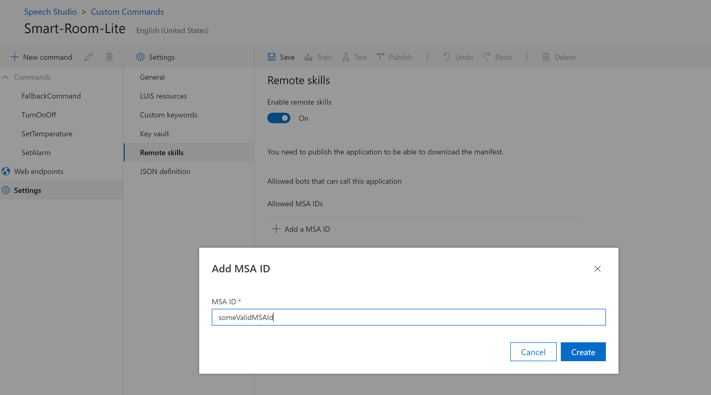
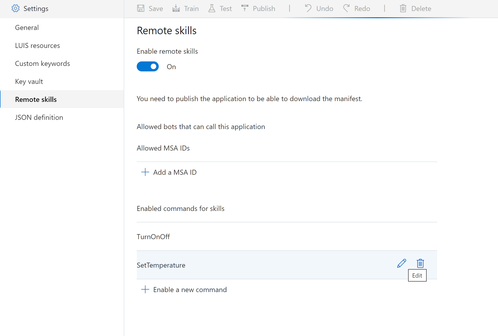
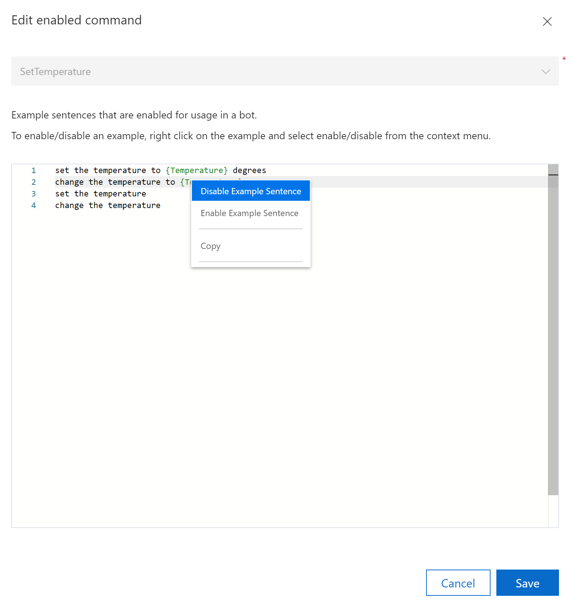

# Export Custom Commands application as a remote skill

In this article, you will learn how to export a Custom Commands application as a remote skill.

## Prerequisites
> [!div class="checklist"]
> * [Understanding of Bot Framework Skill](https://aka.ms/speech/cc-skill-overview)
> * [Understanding of Skill Manifest](https://aka.ms/speech/cc-skill-manifest)
> * [How to invoke a skill from a Bot Framework Bot](https://aka.ms/speech/cc-skill-consumer)
> * An exisiting Custom Commands application. In case you don't have any Custom Commands application, try out with - [Quickstart: Create a voice assistant using Custom Commands](quickstart-custom-commands-application.md)

## Custom Commands as remote skills
* Bot Framework Skills are re-usable conversational skill building-blocks covering conversational use-cases enabling you to add extensive functionality to a Bot within minutes. To read more on this, go to [Bot Framework Skill](https://microsoft.github.io/botframework-solutions/overview/skills/).
* A Custom Commands application can be exported as a skill. This skill can then be invoked over the remote skills protocol from a Bot Framework bot.

## Configure an application to be exposed as a remote skill

### Application level settings
1. In the left panel, select  **Settings** > **Remote skills**.
1. Set **Remote skills enabled** toggle to on.

### Authentication to skills
1. If you want to enable authentication, add Microsoft Application Ids of the Bot Framework Bots you want to configure to call the custom commands application.
      > [!div class="mx-imgBorder"]
      > 

1. If you have at least one entry added to the list, authentication will be enabled on the application, and only the allowed bots will be able to call the application.
> [!TIP]
>  To disable authentication, delete all the Microsoft Application Ids from the allowed list. 

 ### Enable/disable commands to be exposed as skills

You have the option to choose which commands you want to export over Remote Skills.

1. To expose a command over skills, select **Enable a new command** under the **Enable commands for skills**.
1. From the dropdown, select the command you intend to add.
1. Select **Save**.

### Configure triggering utterances for commands
Custom Commands uses the example sentences which are configured for the commands in order to generate the skills triggering utterances. These **triggering utterances** will be used to generate the **dispatcher** section [**skill manifest**](https://microsoft.github.io/botframework-solutions/skills/handbook/manifest/).

As an author, you might want to control which of your **example sentences** are used to generate the triggering utterances for skills.
1. By default, all the **Triggering examples** from a command will be included the manifest file.
1. If you want to explicitly eliminate any one example, select **Edit** icon on the command from **Enabled commands for skills** section.
    > [!div class="mx-imgBorder"]
    > 

1. Next, on the example sentences you want to omit, **right click** > **Disable Example Sentence**.
    > [!div class="mx-imgBorder"]
    > 

1. Select **Save**.
1. You will notice that you can't add a new example in this window. If there's a need to do so, proceed to the exit out of the settings section and select the relevant command from **Commands** accordion. At this point, you can add the new entry in the **Example sentences** section. This change will be automatically reflected in the remote skills settings value for the command.

> [!IMPORTANT]
> In case your existing example sentences have references to **String > Catalog** data-type, those sentences will be automatically omitted from the skills triggering utterances list. 

## Download skill manifest
1. After, you have **published** your application, you can download the skill manifest file.
1. Use the skill manifest to configure your Bot Framework consumer bot to call in to the Custom Commands skill.
> [!IMPORTANT]
> You must **publish** your Custom Commands application in order to download the skill manifest.  
> Additionally, if you made **any changes** to the application, you need to publish the application again for the latest changes to be reflected in the manifest file.

> [!NOTE]
> If you face any issues with publishing the application and the error directs to skills triggering utterances, please re-check the configuration for **Enabled commands for skills**. Each of the exposed commands must have at least one valid triggering utterance.

## Next steps

> [!div class="nextstepaction"]
> [Enable a CI/CD process for your Custom Commands application](./how-to-custom-commands-deploy-cicd.md)