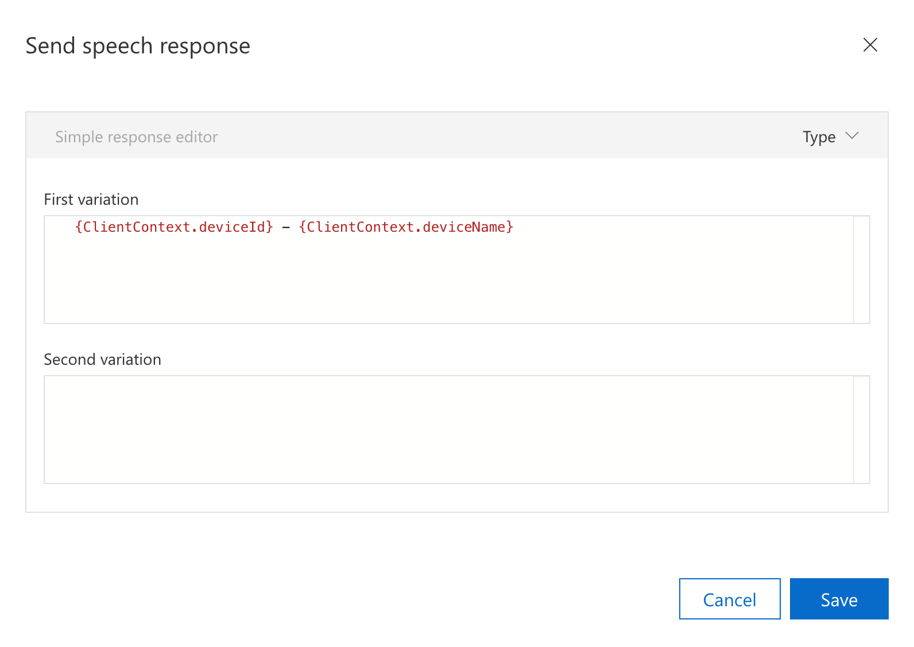
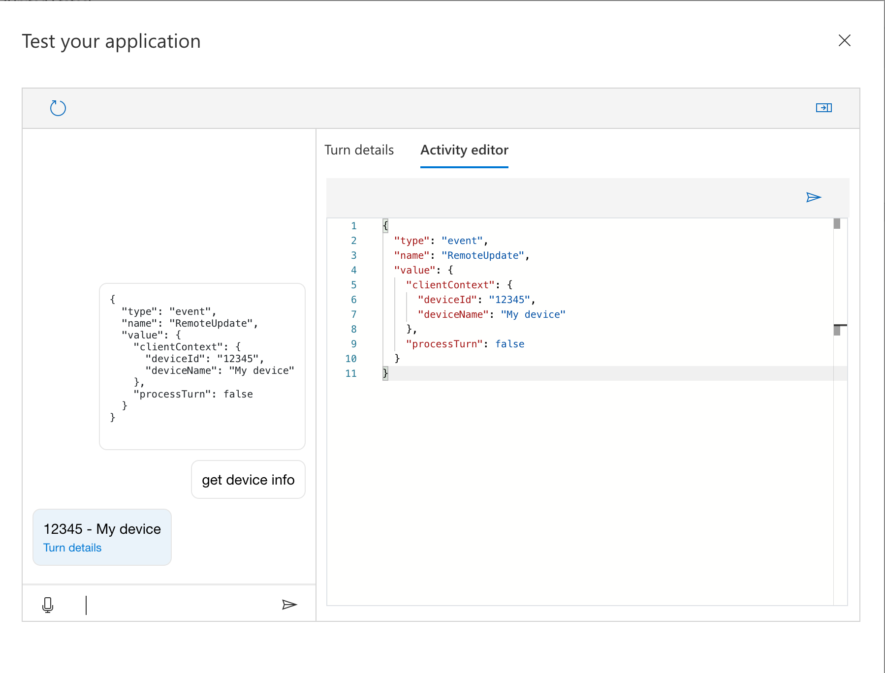

# Update a command from the client

In this article, you will learn how update an ongoing command from a client application.

## Prerequisites
> [!div class = "checklist"]
> * A previously [created Custom Commands app](quickstart-custom-commands-application.md)

## Update the state of a command

If your client application requires to update the state of an ongoing command without voice input you can send an event to update the command.

To illustrate this, if we want to update the state of an ongoing "TurnOnOff" command we can send an event activity with the following format.

```json
{
  "type": "event",
  "name": "RemoteUpdate",
  "value": {
    "updatedCommand": {
      "name": "TurnOnOff",
      "updatedParameters": {
        "OnOff": "on"
      },
      "cancel": false
    },
    "updatedGlobalParameters": {},
    "processTurn": true
  }
}
```

Lets review the key attributes of this activity.

| Attribute | Explanation |
| ---------------- | --------------------------------------------------------------------------------------------------------------------------- |
| **type** | The activity is of type "event", and the name of the event needs to be "RemoteUpdate". |
| **value** | The attribute "value" contains the attributes required to update the current command. |
| **updatedCommand** | The attribute "updatedCommand" contains the name of the command, "updatedParameters" is a map with the name of the parameters and their updated values. |
| **cancel** | If the ongoing command needs to be cancelled, set the attribute "cancel" to true. |
| **updatedGlobalParameters** | The attribute "updatedGlobalParameters" is also a map, just like "updatedParameters" but used for global parameters. |
| **processTurn** | If the turn needs to be processed after the activity is sent set the attribute "processTurn" to true. |

You can test this in the Custom Commands portal.

1. Open the Custom Commands application you previously created. 
1. Click Train and then Test.
1. Send "turn".
1. Open the side panel and click Activity editor.
1. Type and send the RemoteCommand event specified in the previous section.
    > [!div class="mx-imgBorder"]
    > 

Note how the value for the parameter "OnOff" was set to "on" using an activity from the client instead of speech or text.

## Update the catalog of the parameter for a command

When you configure the list of valid options for a parameter, these values are set per Custom Command's application, i.e. in our example the SubjectDevice parameters will always have a fixed list of supported values.

In case you require to add new entries to the parameter's catalog per conversation, you can send the following activity.

```json
{
  "type": "event",
  "name": "RemoteUpdate",
  "value": {
    "catalogUpdate": {
      "commandParameterCatalogs": {
        "TurnOnOff": [
          {
            "name": "SubjectDevice",
            "values": {
              "stereo": [
                "cd player"
              ]
            }
          }
        ]
      }
    },
    "processTurn": false
  }
}
```
With this activity we are adding an entry for "stereo" to the catalog of the parameter "SubjectDevice" in the command "TurnOnOff".

[!div class="mx-imgBorder"]


Please note a couple of things.
1. You only need to send this activity once (ideally right after you started a connection).
1. After you send this activity you should wait for the event ParameterCatalogsUpdated to be sent back to the client.

## Add additional context from the client application

You can set additional context from the client application per conversation that can later be used in your Custom Commands application. 

For example, think about the scenario where you want to send the id and name of the device connected to the Custom Commands application.

To test this, let's create a new command in our current application.
1. Create a new command called GetDeviceInfo.
1. Add an example sentence with "get device info".
1. In the completion rule "Done" add a Send Speech Response Action.
    > [!div class="mx-imgBorder"]
    > 
1. Save and Train your application.
1. Test your application.
    > [!div class="mx-imgBorder"]
    > 

Please note a couple of things.
1. You only need to send this activity once (ideally right after you started a connection).
1. You can use complex objects for ClientContext.
1. You can use ClientContext in speech responses, for sending activities and when calling web endpoints.


## Next steps

> [!div class="nextstepaction"]
> [Update a command from a web endpoint](./how-to-custom-commands-update-command-from-web-endpoint.md)